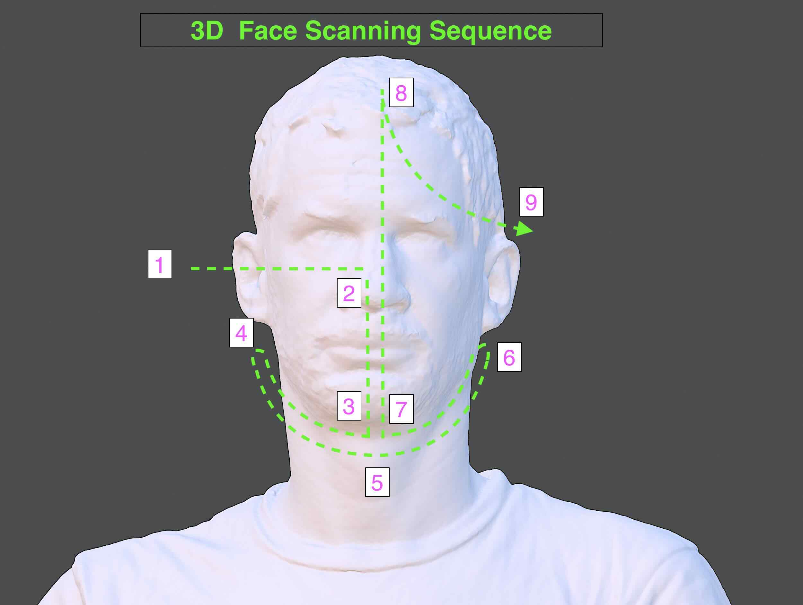

## Before 3D Head Scanning Checklist

The person being scanned should:

- remove glasses and shiny accessories
- sit comfortably and stay as still as possible
- keep a neutral facial expression
- keep lips gently closed
- look at one fixed point
- keep hair as smooth and still as practical

The scanner operator should have enough room to move completely around the person's head. Move tripping hazards out of the way and if using a tethered scanner, ensure there is enough slack in the data and power cables to move around the subject.

## Scanning Preparation

- If the subject is seated in a chair it is easier to scan the head from a birds eye view or raised angle. Make sure to include the shoulders in the scan for 3D tracking. Including the shoulders can also make it easier to align the head scan to a full body scan later
- Make sure the scan subject is in a comfortable position so they do not get tired or fatigued.
- The scan subject should choose a point just above their line of sight and focus on it for the duration of the scan. This helps the subject keep their eyes still and avoid blinking during the face and head scan
- Keep all lighting evenly spaced around the subject to avoid shadows. Adjust ambient light as needed to reduce and soften any shadows. Remember the inverse square law and keep all light sources approximately the same distance away from the scan subject.
- Remove glasses and any transparent objects. Glasses and jewelry can be scanned separately and added later.
- Avoid velvet, black leather, fur and other difficult to scan clothing items
- Adjust collars, jackets, shirts and other clothing to be even and lay straight before scanning to make capture easier and more consistent
- Hair should be arranged and potentially dampened to help with scanning. Hair can also be put in a wig cap to get a full scan of the head and face.

### Head Scanning Sequence

Subjects will inevitably move, breathe, and change their facial expressions during a scan. The following scan sequence helps mitigate these movements and changes. Right before scanning, remind the person to stay still, not laugh, and hold their breath while the scanner passes over their face. Try to scan as fast as possible without stopping and without missing any parts. The longer the scanner lingers on the face, the more likely the face will have moved and the less accurate the final scan will be.

**The goal is to scan each surface of the face only ONCE without going back since it will have changed position.**

1. Begin at the back of one ear. Capture the back ear and shoulders for a good tracking foundation.
2. Move to the side of the ear anc scan directly perpendicular to the ear.
3. Sweep straight across to the to the nose but do not cross the center plane of the face. This will capture the one eye, and the side of the nose.
4. Move down to the chin, sweep a bit back and forth on the underside of the neck and chin to ensure complete capture of the lower chin and under nose. It only takes one or two sweeps.
5. Move straight up to the top of the forehead, keeping the scanner perpendicular to the scanning surface.
6. Sweep out to the other ear. The scan can now continue around the back of the head, but the face should not be scanned again.
7. Use an up and down arc motion traveling around the back of the head.
8. Finish the face scan at the ear where it started making sure to capture the back of the ear.
9. Make sure to scan the top of the head with the scanner perpendicular to the head

### Move Around the Head

Once the face is captured, continue around one side of the head.

### If Tracking Is Lost

STOP moving forward.

Do not wave the scanner around.

Return slowly to an area that was already scanned.

Wait for tracking to recover, then continue.

## Peer Teaching - Learn it → do it → teach it

After scanning your partner:

1. Save the scan.
2. Show the next student how you operated the scanner.
3. The student you just scanned becomes the next scanner operator.

Floor texture helps with scan tracking when scanning feet and legs.

### 3D Body Scanning Tips

Artec webinar for 3D body scanning includes many tips, some of which are summarized below.[^body-scan-webinar] Refer to [Artec 3D's website](https://www.artec3d.com/)for more information

- Fabric types to avoid when 3D scanning people
  - black leather
  - velvet
  - shiny or glossy materials
  - gauze, tulle, or transparent or semi-transparent fabric
  - fur or fuzzy materials
  - fabric without pattern or texture can be difficult
- Small areas and crevices or thin areas can be difficult to scan but may be corrected by smoothing or flattening out surfaces, such as hoods, collars, or jacket facings before scanning
- Avoid glasses and shiny accessories
- Hair, like furry fabric, is difficult to scan. Straight hair is easier but curly or spiky hair can prove difficult. Keeping shoulders or other reference objects in the field of view of the scanner while capturing hair will help
- Chose body poses that avoid narrow spaces. For example, keep legs spread at shoulder distance, rather than with the feet together
- When scanning living subjects, do your best to not scan the same area multiple times since it will have moved from the previous scan

#### Scan the Body after the Head

- Rather than scanning all of the front of the body and then scanning all of the back of the body, move in a spiral down the body to avoid repeated scans of the same area
- Avoid including the face in the torso and body scans
- After scanning the head with the subject seated, the person should stand up with as little shoulder movement as possible.
- Begin scanning the front of the upper torso. Then wrap around the side and back.
- When returning to the front of the torso, capture the lower part of the front torso and then swing around the back
- Capture arms with 90 degree perpendicular the scanner from above and below. Extreme scanning angles help to capture the inside of underarms and inner elbows
- When scanning the legs, make sure to include the floor since the texture on the floor will help the scanner maintain tracking of the legs. It is best to keep both legs in view of the scanner
- Make sure to scan the inside of sleeve cuffs, skirts, and shorts so the fabric has texture and geometry on both sides
- To scan a hand, make sure the fingers are held rigid. Hold the hand in front of the body at a 45 degree angle so the scanner can use the body as a background for registration

#### Hard to Hold Poses

- Capture each major body part separately
- Scan Arms and legs in individual scans that can be aligned later
- use supports as needed so the subject can keep their pose or hold heavy objects
- When scanning subjects that will move with the Artec Leo, switching on `Record without registration` may help

## References

[^body-scan-webinar]: [Artec Webinar](https://youtu.be/o7VnnFLBE3M?si=532faIrkqTou6ZEX&t=1296)
