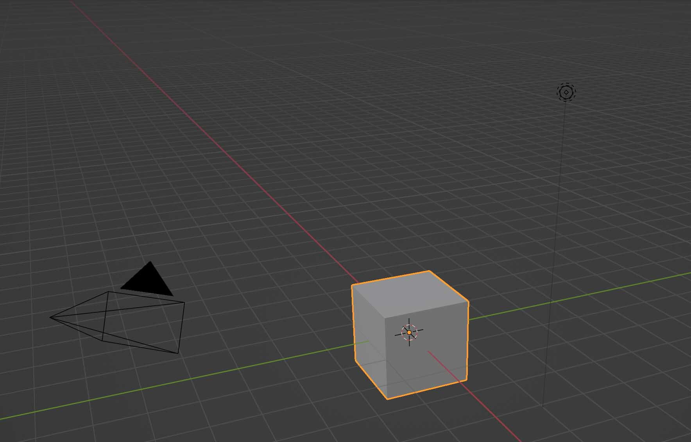

[Blender](blender.md) is a [3D modeling](../3d-modeling.md) program that can be overwhelming at the start but like any software, becomes much easier and understandable with a bit of use. The official online [Blender Reference Manual](https://docs.blender.org/manual/en/latest/index.html) is a good place to learn the basics and investigate advanced topics.

## Blender Keyboard Shortcuts

[Blender Default Keymap](https://docs.blender.org/manual/en/latest/interface/keymap/blender_default.html)

### Blender Essential Keyboard Shortcuts

| Blender Key                             | Action                    |
| --------------------------------------- | ------------------------- |
| B                                       | Select                    |
| G                                       | Move                      |
| R                                       | Rotate                    |
| S                                       | Scale                     |
| HOME                                    | Frame all                 |
| ~ tilde or NUMPAD . (can be customized) | Frame selected            |
| tab                                     | toggle edit / object mode |
| 1                                       | vertex mode               |
| 2                                       | edge mode                 |
| 3                                       | face mode                 |

### Blender Mouse Controls

| Mouse Control               | Action       |
| --------------------------- | ------------ |
| middle mouse button         | orbit camera |
| shift + middle mouse button | pan camera   |
| scroll wheel                | zoom camera  |

### Blender Default Cube

<figure>

<figcaption>

Blender Default Scene with cube

</figcaption>
</figure>

### Blender Basics

Start here if you are new to Blender. These videos cover the essential interface, navigation, object and edit modes, and the basic tools for moving, rotating, scaling, and duplicating objects. You do not need to memorize every command. Focus on becoming comfortable navigating the 3D viewport and manipulating objects.

- [Blender Polygon Modeling Tools](https://docs.blender.org/manual/en/latest/modeling/index.html)
- [Blender Extrude](https://docs.blender.org/manual/en/dev/modeling/meshes/editing/mesh/extrude.html)
- [Blender Apply All Transforms](https://docs.blender.org/manual/en/dev/scene_layout/object/editing/apply.html)

<!-- TODO: Add and Delete Objects Blender Tutorial Video -->
<!-- TODO: Select Objects, Vertices, Edges, and Faces Blender Tutorial Video -->
<!-- TODO: Extrude Blender Tutorial Blender Video -->
<!-- TODO: Loop Cut and Inset Faces Blender Video -->
<!-- TODO: Apply Scale and Transforms Blender Video -->

#### [Blender User Interface](https://youtu.be/d54uJufn1pA)

<iframe class="youTubeIframe" width="560" height="315" src="https://www.youtube.com/embed/d54uJufn1pA?rel=0" title="YouTube video player" frameborder="0" allow="accelerometer; autoplay; clipboard-write; encrypted-media; gyroscope; picture-in-picture; web-share" referrerpolicy="strict-origin-when-cross-origin" allowfullscreen></iframe>

### [Blender Object vs Edit Mode](object-mode-vs-edit-mode-blender.md)

<iframe class="youTubeIframe"  width="560" height="315" src="https://www.youtube.com/embed/w8DLBlx_jCE?rel=0" title="YouTube video player" frameborder="0" allow="accelerometer; autoplay; clipboard-write; encrypted-media; gyroscope; picture-in-picture; web-share" referrerpolicy="strict-origin-when-cross-origin" allowfullscreen></iframe>

### [Move Objects Blender](move-objects-blender.md)

<iframe class="youTubeIframe"  width="560" height="315" src="https://www.youtube.com/embed/t4MtOUyOkPM?rel=0" title="YouTube video player" frameborder="0" allow="accelerometer; autoplay; clipboard-write; encrypted-media; gyroscope; picture-in-picture; web-share" referrerpolicy="strict-origin-when-cross-origin" allowfullscreen></iframe>

### [Rotate Objects Blender](https://youtu.be/y6nwGRkL1k4)

<iframe class="youTubeIframe"  width="560" height="315" src="https://www.youtube.com/embed/y6nwGRkL1k4?rel=0" title="YouTube video player" frameborder="0" allow="accelerometer; autoplay; clipboard-write; encrypted-media; gyroscope; picture-in-picture; web-share" referrerpolicy="strict-origin-when-cross-origin" allowfullscreen></iframe>

### [Scale Objects Blender](https://youtu.be/EGn3BvyRVlY)

<iframe class="youTubeIframe"  width="560" height="315" src="https://www.youtube.com/embed/EGn3BvyRVlY?rel=0" title="YouTube video player" frameborder="0" allow="accelerometer; autoplay; clipboard-write; encrypted-media; gyroscope; picture-in-picture; web-share" referrerpolicy="strict-origin-when-cross-origin" allowfullscreen></iframe>

### [Duplicate Objects](https://youtu.be/XtumSUXtkHY)

<iframe class="youTubeIframe"  width="560" height="315" src="https://www.youtube.com/embed/XtumSUXtkHY?rel=0" title="YouTube video player" frameborder="0" allow="accelerometer; autoplay; clipboard-write; encrypted-media; gyroscope; picture-in-picture; web-share" referrerpolicy="strict-origin-when-cross-origin" allowfullscreen></iframe>

### [Show Textures](https://youtu.be/6j0aGrgFCcs)

<iframe class="youTubeIframe" width="560" height="315" src="https://www.youtube.com/embed/6j0aGrgFCcs?rel=0" title="YouTube video player" frameborder="0" allow="accelerometer; autoplay; clipboard-write; encrypted-media; gyroscope; picture-in-picture; web-share" referrerpolicy="strict-origin-when-cross-origin" allowfullscreen></iframe>

## Basic Mesh Modeling in Blender

Mesh modeling changes the actual geometry of a 3D object. These videos introduce common techniques for editing vertices, edges, and faces; joining and cutting geometry; and improving the appearance of modeled forms. Use these tutorials as needed when building or modifying your own 3D models.

### [Blender Beginner Polygon Modeling Tutorial](https://youtu.be/L5e7ysUUI7A)

<iframe class="youTubeIframe" width="560" height="315" src="https://www.youtube.com/embed/L5e7ysUUI7A?rel=0" title="YouTube video player" frameborder="0" allow="accelerometer; autoplay; clipboard-write; encrypted-media; gyroscope; picture-in-picture; web-share" referrerpolicy="strict-origin-when-cross-origin" allowfullscreen></iframe>

### [Blender Merge Vertices](https://youtu.be/Jipi8XjDwsc)

<iframe class="youTubeIframe" width="560" height="315" src="https://www.youtube.com/embed/Jipi8XjDwsc?rel=0" title="YouTube video player" frameborder="0" allow="accelerometer; autoplay; clipboard-write; encrypted-media; gyroscope; picture-in-picture; web-share" referrerpolicy="strict-origin-when-cross-origin" allowfullscreen></iframe>

### [Blender Hole in Cube](https://youtu.be/COyvicPBTSA)

<iframe class="youTubeIframe" width="560" height="315" src="https://www.youtube.com/embed/COyvicPBTSA?rel=0" title="YouTube video player" frameborder="0" allow="accelerometer; autoplay; clipboard-write; encrypted-media; gyroscope; picture-in-picture; web-share" referrerpolicy="strict-origin-when-cross-origin" allowfullscreen></iframe>

### [How to Bevel Sub D Blender](https://youtu.be/R73wtu1Ixnw)

<iframe class="youTubeIframe" width="560" height="315" src="https://www.youtube.com/embed/R73wtu1Ixnw?rel=0" title="YouTube video player" frameborder="0" allow="accelerometer; autoplay; clipboard-write; encrypted-media; gyroscope; picture-in-picture; web-share" referrerpolicy="strict-origin-when-cross-origin" allowfullscreen></iframe>

### [Realistic Edges Blender](https://youtu.be/qyMhNzq-HiY)

<iframe class="youTubeIframe" width="560" height="315" src="https://www.youtube.com/embed/qyMhNzq-HiY?rel=0" title="YouTube video player" frameborder="0" allow="accelerometer; autoplay; clipboard-write; encrypted-media; gyroscope; picture-in-picture; web-share" referrerpolicy="strict-origin-when-cross-origin" allowfullscreen></iframe>

### [Locate Model in Blender](https://youtu.be/bdErTcIZyZs)

<iframe class="youTubeIframe" width="560" height="315" src="https://www.youtube.com/embed/bdErTcIZyZs?rel=0" title="YouTube video player" frameborder="0" allow="accelerometer; autoplay; clipboard-write; encrypted-media; gyroscope; picture-in-picture; web-share" referrerpolicy="strict-origin-when-cross-origin" allowfullscreen></iframe>

### [Must Know 90 Degree Bend Blender Tutorial](https://youtu.be/9SCNEIp2Wp8)

<iframe class="youTubeIframe" width="560" height="315" src="https://www.youtube.com/embed/9SCNEIp2Wp8?rel=0" title="YouTube video player" frameborder="0" allow="accelerometer; autoplay; clipboard-write; encrypted-media; gyroscope; picture-in-picture; web-share" referrerpolicy="strict-origin-when-cross-origin" allowfullscreen></iframe>

## Modifiers and Faster Modeling

Blender modifiers can create repeated, symmetrical, or more complex geometry without manually modeling every part. These videos demonstrate several tools that can speed up the modeling process as well as techniques for using reference images when constructing objects.

### [Array Modifier Blender](https://youtu.be/VZYgIw0_QGQ)

<iframe class="youTubeIframe" width="560" height="315" src="https://www.youtube.com/embed/VZYgIw0_QGQ?rel=0" title="YouTube video player" frameborder="0" allow="accelerometer; autoplay; clipboard-write; encrypted-media; gyroscope; picture-in-picture; web-share" referrerpolicy="strict-origin-when-cross-origin" allowfullscreen></iframe>

### [Blender Auto Mirror](auto-mirror-blender.md)

<iframe class="youTubeIframe" width="560" height="315" src="https://www.youtube.com/embed/f7UeiFP0Gvc?rel=0" title="YouTube video player" frameborder="0" allow="accelerometer; autoplay; clipboard-write; encrypted-media; gyroscope; picture-in-picture; web-share" referrerpolicy="strict-origin-when-cross-origin" allowfullscreen></iframe>

### [Blender Model Hard Surface Plates](https://youtu.be/HGdw5ywWxQI)

<iframe class="youTubeIframe" width="560" height="315" src="https://www.youtube.com/embed/HGdw5ywWxQI?rel=0" title="YouTube video player" frameborder="0" allow="accelerometer; autoplay; clipboard-write; encrypted-media; gyroscope; picture-in-picture; web-share" referrerpolicy="strict-origin-when-cross-origin" allowfullscreen></iframe>

### [Only Move One Array Object BlenderTutorial](https://youtu.be/giJ822lv_dw)

<iframe class="youTubeIframe" width="560" height="315" src="https://www.youtube.com/embed/giJ822lv_dw?rel=0" title="YouTube video player" frameborder="0" allow="accelerometer; autoplay; clipboard-write; encrypted-media; gyroscope; picture-in-picture; web-share" referrerpolicy="strict-origin-when-cross-origin" allowfullscreen></iframe>

## Scene / Production Utilities Blender

These tutorials cover additional Blender tools that are useful when preparing models for fabrication, rendering, or larger scenes. Learn how to work with real-world units, bring in existing assets with BlenderKit, and create editable 3D text.

### [Change Units in Blender](change-units-blender.md)

<iframe class="youTubeIframe" width="560" height="315" src="https://www.youtube.com/embed/7S1p17VvFiA?rel=0" title="YouTube video player" frameborder="0" allow="accelerometer; autoplay; clipboard-write; encrypted-media; gyroscope; picture-in-picture; web-share" referrerpolicy="strict-origin-when-cross-origin" allowfullscreen></iframe>

### [Install BlenderKit](https://youtu.be/DM2eyg3dxP4)

<iframe class="youTubeIframe" width="560" height="315" src="https://www.youtube.com/embed/DM2eyg3dxP4?rel=0" title="YouTube video player" frameborder="0" allow="accelerometer; autoplay; clipboard-write; encrypted-media; gyroscope; picture-in-picture; web-share" referrerpolicy="strict-origin-when-cross-origin" allowfullscreen></iframe>

### [3D Text Blender](https://youtu.be/Wa6yMXE0RZk)

<iframe class="youTubeIframe" width="560" height="315" src="https://www.youtube.com/embed/Wa6yMXE0RZk?rel=0" title="YouTube video player" frameborder="0" allow="accelerometer; autoplay; clipboard-write; encrypted-media; gyroscope; picture-in-picture; web-share" referrerpolicy="strict-origin-when-cross-origin" allowfullscreen></iframe>

### [How to Scale a Floor Plan in Blender for Architectural Visualization](https://youtu.be/8iMWUsqeopQ)

<iframe class="youTubeIframe" width="560" height="315" src="https://www.youtube.com/embed/8iMWUsqeopQ?rel=0" title="YouTube video player" frameborder="0" allow="accelerometer; autoplay; clipboard-write; encrypted-media; gyroscope; picture-in-picture; web-share" referrerpolicy="strict-origin-when-cross-origin" allowfullscreen></iframe>

## Modeling From Reference

<!-- TODO: Set Orthographic Views Blender Tutorial Video -->
<!-- TODO: Model From Reference Image Blender Tutorial Video -->

### [Insert Reference Image Blender](https://youtu.be/t2Q8dX6djKk)

<iframe class="youTubeIframe" width="560" height="315" src="https://www.youtube.com/embed/t2Q8dX6djKk?rel=0" title="YouTube video player" frameborder="0" allow="accelerometer; autoplay; clipboard-write; encrypted-media; gyroscope; picture-in-picture; web-share" referrerpolicy="strict-origin-when-cross-origin" allowfullscreen></iframe>

## Working With Imported 3D Captured Models

<!-- TODO:  Import GLB / GLTF / FBX / OBJ Blender Tutorial Video -->

[Import 3D Head Scan Blender ](https://youtu.be/xaECwQMOOAw)
[How to Convert Epic Games Reality Scan GLB to OBJ in Blender (Photogrammetry Export)](https://youtu.be/Lj1Z2XmpOM0)
[How to Import a GLB into Blender](https://youtu.be/V1q5w6onuCE)
[How to Import an OBJ File into Blender](https://youtu.be/JG1msAX7PFo)
[Import 3D Scan Mesh into Blender - Artec LEO](https://youtu.be/-8Tvn8UFG0Y)

<!-- TODO:  Locate Model in Blender Blender Tutorial Video -->

<!-- TODO:  Show Missing / Imported Textures Blender Tutorial Video -->

[How to Fix Missing Textures in Blender Photogrammetry Scans](https://youtu.be/SwGwjaSoNIw)

<!-- TODO:  Set Object Origin / Origin to Geometry Blender Tutorial Video -->

[How to Change the Rotation Point in Blender - Set Object Origin](https://youtu.be/YqC7VpP98rU)

<!-- TODO:  Clean Up Photogrammetry Mesh Blender Tutorial Video -->

<!-- TODO:  Boolean Crop Photogrammetry Mesh Blender Tutorial Video -->

[Boolean Intersect Photogrammetry Scan Cleanup Blender](https://youtu.be/bnJud-sBrbA)

<!-- TODO:  Reduce Polygon Count / Decimate Blender Tutorial Video -->

[Blender 3D Printing: Reduce Triangles, Make Manifold, Export a Clean STL](https://youtu.be/xkMdZJDfE3o)
[Blender Triangle Count Fast: Statistics Overlay + Shift D vs Alt D](https://youtu.be/hR83_OUozhY)

<!-- TODO:  Separate or Join Meshes Blender Tutorial Video -->

[^1]: [Blender.org - About](https://www.blender.org/about/) [(Web Archive)](https://web.archive.org/web/20230228210621/https://www.blender.org/about/)
