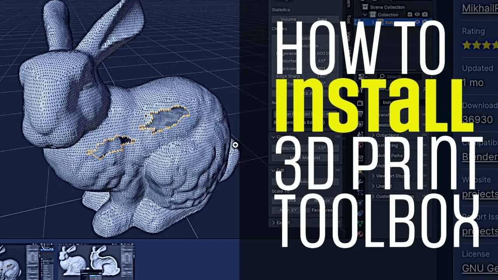

## Install 3D Print Toolbox Addon in Blender

<iframe class="youTubeIframe" width="560" height="315" src="https://www.youtube.com/embed/_E-b6CENHms" title="YouTube video player" frameborder="0" allow="accelerometer; autoplay; clipboard-write; encrypted-media; gyroscope; picture-in-picture; web-share" referrerpolicy="strict-origin-when-cross-origin" allowfullscreen></iframe>

This add-on has features for solid inspection, and repairing non-manifold geometry. It also can display statistics about the mesh that you want to [3D print](../../digital-fabrication/3d-printing/3d-printing.md), such as its volume and thickness for hollow parts, overhang angle, and edge sharpness. This add-on can be quite useful for making models for 3D printed output in [Blender](./blender.md). This add-on has an export feature, but it will use the default name of the mesh you are working on. Unless you renamed the mesh it likely has an unhelpful name such as Cube.001 or Sphere.004. Make sure you rename your mesh before exporting so you know which file is which. Enabling this add-on, adds a tab to the mesh modeling screen.

- [Install 3D Print Toolbox Addon in Blender](https://youtu.be/_E-b6CENHms)

