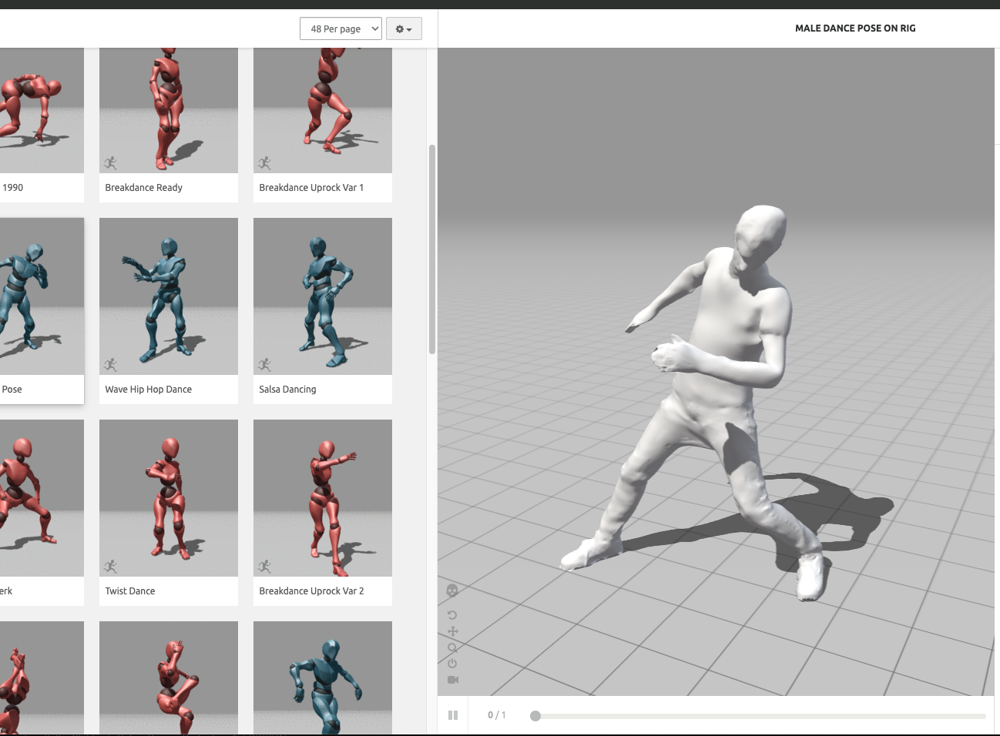

<iframe class="youTubeIframe" width="560" height="315" src="https://www.youtube.com/embed/0-FWVd6oCXg?si=9WM6_H1rvOE9dato" title="YouTube video player" frameborder="0" allow="accelerometer; autoplay; clipboard-write; encrypted-media; gyroscope; picture-in-picture; web-share" referrerpolicy="strict-origin-when-cross-origin" allowfullscreen></iframe>

## Guide to 3D Modeling and Animation with Adobe Mixamo

1. **Introduction to Mixamo**

   - Learn about Adobe's Mixamo and its capabilities in 3D character modeling and animation.

2. **Uploading Your Character Mesh**

   - Step 1: Select 'Upload Character' in Mixamo.
   - Step 2: Choose your character file (FBX or OBJ) for upload.
   - Step 3: Rotate your character as needed to ensure it faces forward.

3. **Auto-Rigging Process**

   - Step 4: Place rig markers accurately, starting with the chin and then the wrists.
   - Step 5: Adjust the position of wrists, elbows, and chin markers for asymmetrical models.
   - Step 6: Choose the type of skeleton for your character (e.g., with or without detailed fingers).

4. **Animating Your Character**

   - Step 7: Select from a variety of pre-animated scenes or apply your motion capture.
   - Step 8: Customize animations by adjusting height, duration, or mirroring them.

5. **Downloading and Using Animations in 3D Software**

   - Step 9: Download the animation with or without skin and keyframe reduction.
   - Step 10: Import the downloaded FBX file into 3D software like Blender or Maya.
   - Step 11: Blend and interact different animations in your 3D project.

6. **Final Steps**
   - Step 12: Explore advanced features and tools within Mixamo and your 3D software.
   - Step 13: Share your creations and experiences in the comments for community engagement.

## Additional Resources

- Links to:
- [Adobe Mixamo](https://www.mixamo.com/)
- [Blender](blender.md)
- [Maya](../maya/maya.md)
- [Embed Textures in FBX File in Blender](embed-textures-in-fbx-export-blender.md)

