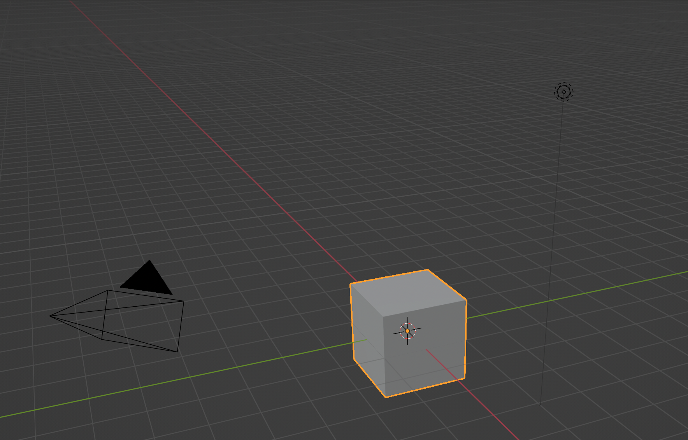

- [Blender User Interface](https://docs.blender.org/manual/en/dev/interface/index.html)
- [Blender Move Objects](https://youtu.be/t4MtOUyOkPM)

### Blender Move Objects

<iframe class="youTubeIframe"  width="560" height="315" src="https://www.youtube.com/embed/t4MtOUyOkPM?rel=0" title="YouTube video player" frameborder="0" allow="accelerometer; autoplay; clipboard-write; encrypted-media; gyroscope; picture-in-picture; web-share" allowfullscreen></iframe>

