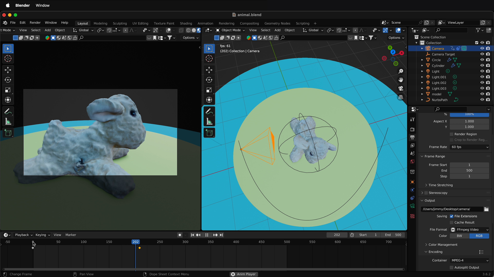
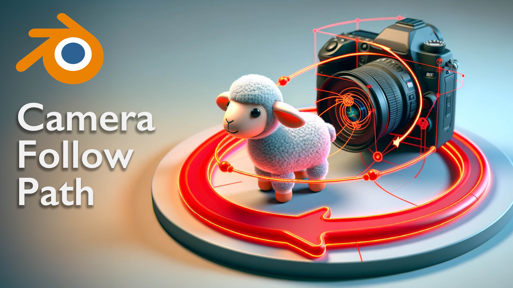

<iframe class="youTubeIframe" width="560" height="315" src="https://www.youtube.com/embed/5EQdQdtg-ao?si=MqSMSowpUwrmU2jx" title="YouTube video player" frameborder="0" allow="accelerometer; autoplay; clipboard-write; encrypted-media; gyroscope; picture-in-picture; web-share" referrerpolicy="strict-origin-when-cross-origin" allowfullscreen></iframe>

## Blender Camera Follow Path Tutorial: Step-by-Step Instructions

1. **Introduction to Camera Tracking in Blender:**

   - Start [Blender](blender.md) and open your scene.
   - Briefly understand the purpose of camera tracking: to create a dynamic, dolly-like shot that follows an object.

2. **Setting Up Your Scene:**

   - Ensure your scene in Blender includes an animal, a few lights, and a camera.
   - Familiarize yourself with the layout and basic tools of Blender.

3. **Preparing the Camera:**

   - Right-click at the top of the Blender screen and perform a vertical split for better view management.
   - In the left-hand panel, select View Cameras > Active Camera.
   - To improve visibility, adjust the viewport display settings: go to View Cameras > Frame Camera Bounds.

4. **Focusing the Camera:**

   - Select the camera in your scene.
   - In the camera settings (bottom right), under 'Viewport Display', adjust 'Passpartout' to darken the background, helping you focus on your subject.
   - Optimize focus by tweaking the overlays to minimize distractions.

5. **Moving the Camera:**

   - Press 'G' to grab and move the camera around, observing the changes in the left panel for a better sense of the scene.

6. **Creating a Camera Target:**

   - In Blender, select the camera.
   - Go to the Constraints section and add an 'Object Constraint'.
   - Choose 'Track To' and use the eyedropper tool to select your target object.

7. **Using an Empty as a Target:**

   - Create an empty by pressing Shift + A, selecting 'Empty', and choosing a sphere.
   - Rename the sphere to "Camera Target".
   - Replace the original target with the "Camera Target" in the camera's constraint settings.
   - Now, moving the target (press G) will change the camera’s focus accordingly.

8. **Adding a Path for the Camera:**

   - Press Shift + A, go to Curve, and select 'Path'.
   - Use 'G' and 'Z' to position the path in your scene.
   - Enter Edit mode (Tab), adjust the vertices of the path to shape it as desired.

9. **Applying Follow Path Constraint:**

   - Select the camera and add a 'Follow Path' constraint in the Constraints section.
   - Choose the curve as the target for the 'Follow Path' constraint.

10. **Adjusting the Path Movement:**

    - Use the 'Offset' setting in the Follow Path constraint to control the camera’s position along the path.
    - Ensure the camera aligns with the blue line on the path for accurate tracking.

11. **Fine-Tuning the Camera Path:**

    - Adjust the order of constraints if necessary (e.g., place 'Track To' below 'Follow Path').
    - Set up keyframes for the path movement by changing the offset at different frames.
    - To avoid ease-in and ease-out, select the keyframes and set interpolation to 'Linear'.

12. **Enhancing Camera Movement:**

    - Experiment with different frame rates and camera lenses (e.g., change from 50mm to 30mm for closer shots).
    - Adjust the curve's resolution for smoother animation.
    - Fine-tune the camera’s final position and framing by editing the path's vertices in Edit mode.

13. **Finalizing and Testing:**

    - Scrub through your timeline to preview the camera movement.
    - Make any final adjustments to ensure smooth and accurate camera tracking.

14. **Conclusion:**
    - Congratulate yourself on mastering the camera follow path in Blender.
    - Encourage practice and experimentation with different scenes and objects.

This step-by-step tutorial is designed to guide you through the process of setting up a camera to follow a path in Blender, ensuring you can create dynamic and visually appealing 3D animations. Remember, practice and experimentation are key to mastering these techniques. Happy 3D modeling!

- [How to make a camera follow a path in Blender](https://youtu.be/5EQdQdtg-ao)

## Blender Camera Follow Path Video Transcript

In this Blender tutorial I'm going to show you how you can quickly make a camera follow a path that way the camera tracks along a path just like a nice Dolly shot and then follows the object on screen.

So how do we get a camera to follow a path in Blender? First let's set up our scene. So here I have a simple scene inside Blender with an animal. I have a few lights and I have a camera. There's a few things we can do to make our animation of cameras inside blender easier the first thing is to right click at the top of the screen and then do a vertical split. I'll select somewhere in the middle and then over on the left hand side I'll select view cameras > active camera. Then to make this screen a bit bigger so I can see the camera better inside Blender I'll select view cameras > frame camera bounds. This is looking great already but what I can do is make sure I have the camera selected over here in the scene then select the camera down here on the bottom right, scroll down to viewport display make sure it's twirled out and then I can change passpartout and then this will darken the background. That way I can focus more on what's happening. I can even focus more by changing the overlays, so here I have these overlays and I can change this one so I don't see it as well as this one now I can really focus in on my scene.

So now if I come over to the right hand side of the screen and Blender press G to grab the camera and move the camera around I get a nice sense of what's happening over on the left hand side. But how do we get the camera to aim at an object? Well that's as simple as selecting the camera in Blender going to the constraints then adding an object constraint to the camera. This time I'm going to do a track to. It gives me an option for a Target, I'll select this eye dropper and select the target.I could also select this and select different items. So now if I press G and I move the camera you can see that no matter where I put the camera it tracks that object this is great but it can be limiting because I can't choose which part of the object the camera tracks inside Blender.

To do that I need to create an empty and use that as the target so I'll press shift A, come down here to empty and I'm going to make a sphere I can rename this sphere to "Camera Target" then if I select the camera I can come down here and delete the model and then select "Camera Target." Now I can select the target press G move it say to the eye right here and then I select the camera and if I press G notice that now it just goes along the eye, so no matter what, it's framing the eye of the figure. So that's pretty cool and I can animate this empty so I can have it pass around different places and the camera is always going to look in that direction. But then how do I get the camera to follow a nice curve around this circle?

Well to do that we need to have a path for the camera to follow inside Blender. To add a path in Blender press shift A, go up to curve and then select path press G then Z to move the path up. I'm going to select Z right here so I'm looking straight down and I'll tab into edit mode I'll select this vertex press X to delete it select this vertex X to delete it. Then I'm going to grab the center vertex G, shift Z to keep it in the Z plane I'll select this one G shift Z and I'll move it say over here somewhere and I'll select this one G shift Z and put it over here and then maybe I'll move this one back just a little bit G shift Z , okay. And of course I could select all of these and I can press G Z and move them down.

So now I have this path for my camera to follow, but how do I get it to follow? So I'm going to press tab to go back to object mode select the camera and down in constraints I'm going to add a new constraint. This time I'm going to add a follow path constraint to the camera inside Blender. It doesn't have anything to follow. What I need to do is select the Target under follow path and then select the curve. Right away we can see that it is following the curve but how do I get it to move along it?

We use the offset of the follow path command so I move this offset but that really isn't working how I expect. It's very important to follow the blue line so you see this blue line is here, that's the part of the path that the camera is attracted to. It's very easy to think that you can put this part of the camera anywhere on the curve but it has to be where this blue part is. So how do we do that?

Select the curve, tab into edit mode, select the vertex that the blue line is going to, press shift S, then cursor to selected, Tab out of edit mode, select the camera, then press shift S, selection the cursor. So now the camera is on there but wait now if you look on the left hand side of the screen everything's messed up! Well that's because we have to change the order.

So I'm going to twirl up track to and drag track to right below the follow path. Now the follow path command shows that this moves along the path. Pretty cool but how do I get the path to start over here? Well I need to offset to 00, so if I go to frame zero and then I offset my path by -100. If I click right here this will add a key frame, then I can move down to say frame 209 or 210 and I can type in zero and then I can select this again to add a key frame. So now if I drag my playhead you'll see that I have this animation. I can press play and we can see that's very nice. But a problem that this has that ease in and ease out. Often ease in and ease out is really great but sometimes with tracking camera motions we want it to be a steady shot.

So right now I have both these key frames selected in the bottom. I can press T for interpolation and I can make it linear. So now I should have this nice linear interpolation of the camera shot. So now that I have linear interpolation we can change a few more things. So right now I have this camera on 60 frames per second for a smooth animation but sometimes the curve isn't smooth enough. So if you select on the curve then select this right here we can change the resolution. If I lower this you can see it gets real chunky and looks strange but I can raise this up to 64 and then I get a much smoother animation. I can also click on the camera itself and instead of 50 mm I can make this 30mm so that way I can get a bit closer and then I can edit this curve. So if I select this curve I press Tab and then I press G shift Z and I move this in and then I press G shift Z and I move this part of the curve in and then G shift Z and move this part of the curve in now I can have this whipping shot. And what's nice is I can go ahead and select the camera again, Tab out select the camera, move to the first key frame and then I can just frame this shot by selecting the nurbs curb, tapping in the edit mode, G shift Z moving this around. And I can even press G Z, move up and down. So I can start here and then as I move along right here I can go ahead and G shift Z, decide which way I want that to be, so something like this, and then I can move all the way to the end and see how I want that to end. So right here maybe G shift Z,I want to move in a little bit closer to the object.

So hopefully this allows you to move your camera around on a path in Blender. Happy 3D modeling.
