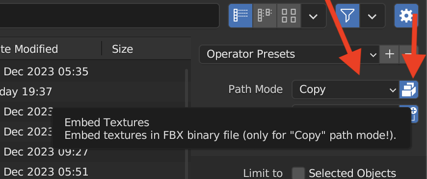

<iframe class="youTubeIframe" width="560" height="315" src="https://www.youtube.com/embed/cA2NO3riP8I" title="YouTube video player" frameborder="0" allow="accelerometer; autoplay; clipboard-write; encrypted-media; gyroscope; picture-in-picture; web-share" referrerpolicy="strict-origin-when-cross-origin" allowfullscreen></iframe>

[Embed Textures in FBX Export - Blender](https://youtu.be/cA2NO3riP8I)

To embed a texture file in a fbx export from Blender you need to change the file path from Auto to Copy and click the Embed Textures button. This will embed the texture in the fbx, or at least it should. As long as you have the texture files and you keep them labeled, you can just re-link as I show below. Embedding a large texture can change the fbx file from ~4mb to 65mb or more.

- [Automatically Pack External Resources in Blender](pack-external-resources-blender.md)
