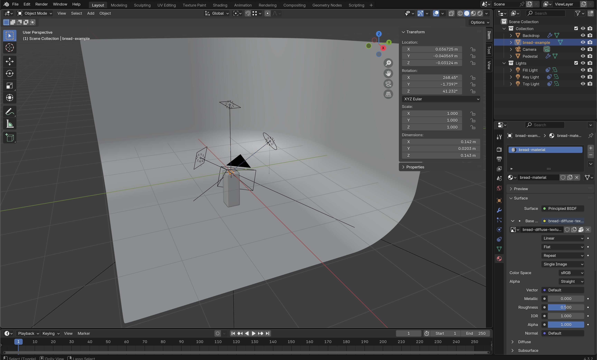
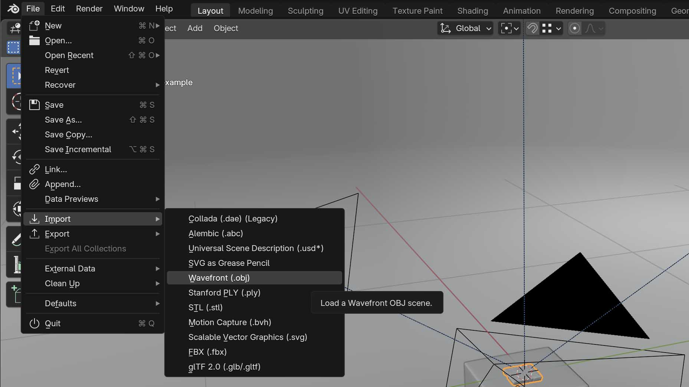
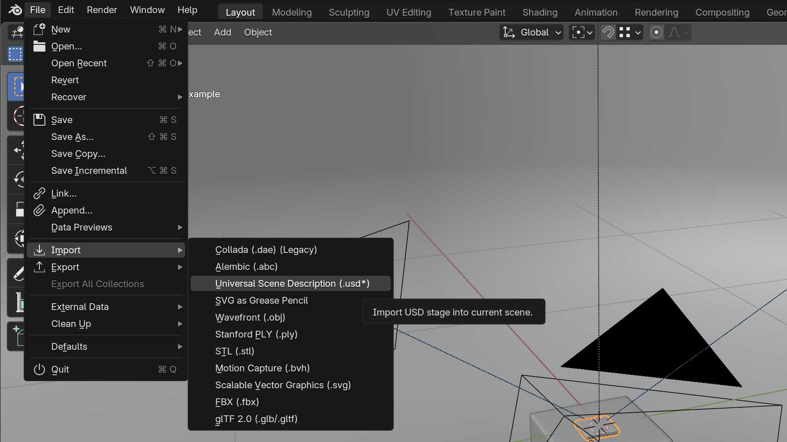

This [Blender](./blender.md) rendering exercise uses a [prebuilt Blender scene file](./attachments/2025-01-29-pedestal-render-setup.blend) containing a smooth backdrop, a pedestal, and lights. This removes much of the required setup to be able to create a rendered image of a 3D model.

- [Download Blender Pedestal Render Example Scene](./attachments/2025-01-29-pedestal-render-setup.blend)

<figure>

<figcaption>

[Blender Example Scene](./attachments/2025-01-29-pedestal-render-setup.blend) with a smooth backdrop, pedestal, and lights setup for rendering small objects or 3D models

</figcaption>
</figure>

## Instructions

1. If needed, download and install Blender from [Blender.org](https://www.blender.org/download/)
2. Download the [Blender scene file](./attachments/2025-01-29-pedestal-render-setup.blend)
3. Open the example scene file
4. Import your 3D model file. If the model was made with photogrammetry then the model file format is likely an .obj or a .usd

<figure>

<figcaption>

Import a USD file by going to File > Import > Wavefront (.obj)

</figcaption>
</figure>

<figure>

<figcaption>

Import a USD file by going to File > Import > Universal Scene Description (.usd\*)

</figcaption>
</figure>

5. Scale the model to an appropriate size. [Calibrate size of 3D Scanned Photogrammetry Mesh in Blender](https://youtu.be/MUb7I4lBSZs)
6. Rotate the model
7. Place the model on the pedestal
8. If desired, clean up the model to remove unwanted parts, such as the background from a photogrammetry scan
9. Adjust the lights
10. Adjust the camera
11. Render an image
12. Save the rendered image file
