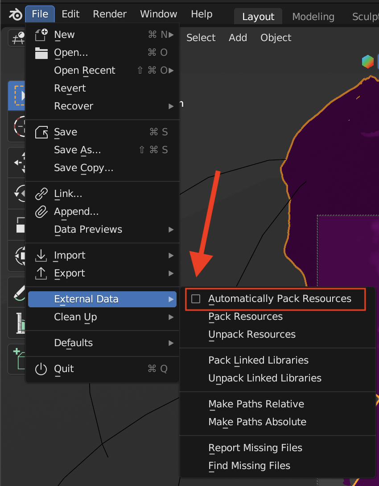

<iframe class="youTubeIframe" width="560" height="315" src="https://www.youtube.com/embed/x6H6HFBLRlU?si=Of41UorFVhAG-YBt" title="YouTube video player" frameborder="0" allow="accelerometer; autoplay; clipboard-write; encrypted-media; gyroscope; picture-in-picture; web-share" referrerpolicy="strict-origin-when-cross-origin" allowfullscreen></iframe>

[Pack External Resources in Blender](https://youtu.be/x6H6HFBLRlU)

