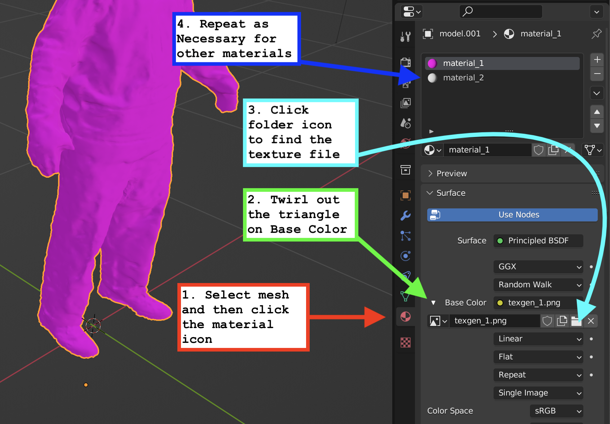

## Re-Link Texture Images in Blender

1. Select the mesh and then click the material icon
2. Twirl out the triangle on Base Color
3. Click on the folder icon to find the texture file
4. Repeat as necessary for other materials and textures

- [Automatically Pack External Resources](pack-external-resources-blender.md)
