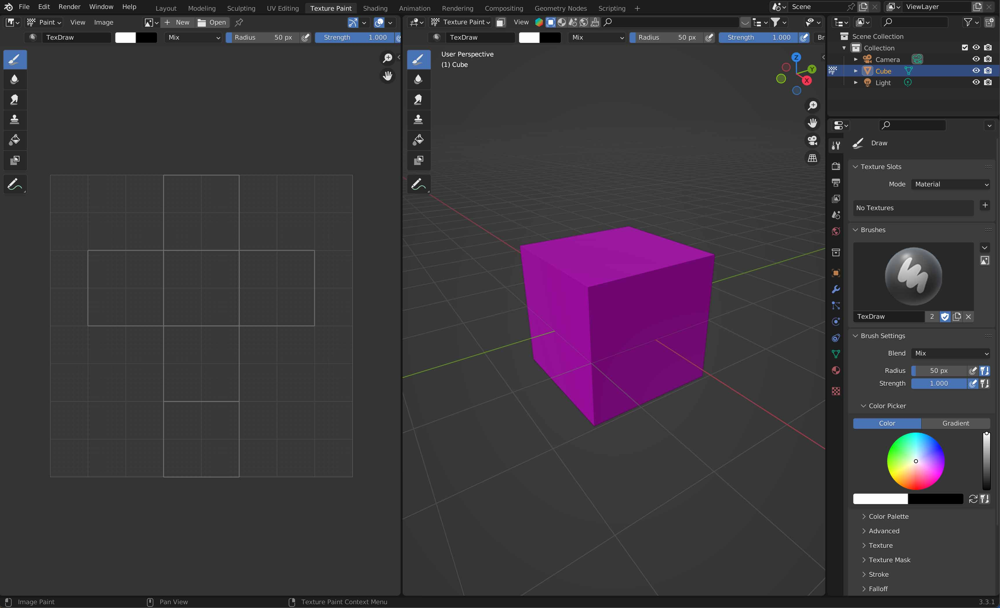

Texture painting in [Blender](blender.md) allows you to paint color and surface detail directly onto a 3D model. Instead of only editing a texture in a 2D image editor, you can brush directly onto the object and see the results on the model in real time. This can be much faster and more intuitive, especially for objects with irregular shapes or details that are difficult to place accurately in flat UV space.

Texture paint is useful for adding color, correcting seams, blending image textures, painting masks, and creating custom surface detail. It is often part of a larger texturing workflow.

Before texture painting, a 3D model should usually have:

- a UV unwrap
- an image texture assigned to the material
- an appropriate texture resolution
- a material setup so the painted image displays correctly

These tutorials introduce the basic Blender texture paint workflow and then show how to use it on more complex objects.

- [Blender Texture Paint Quick Start Guide](https://youtu.be/A0a-YndPpOM)
- [Blender Texture Paint Complex Objects](https://youtu.be/Oz4fiddcazI)

<figure>

<figcaption>

Blender Texture Paint Workspace

</figcaption>

</figure>

### Blender Texture Paint Quick Start

<iframe class="youTubeIframe" width="560" height="315" src="https://www.youtube.com/embed/A0a-YndPpOM?rel=0" title="YouTube video player" frameborder="0" allow="accelerometer; autoplay; clipboard-write; encrypted-media; gyroscope; picture-in-picture; web-share" referrerpolicy="strict-origin-when-cross-origin" allowfullscreen></iframe>

### Blender Texture Paint Complex Objects

<iframe class="youTubeIframe" width="560" height="315" src="https://www.youtube.com/embed/Oz4fiddcazI?rel=0" title="YouTube video player" frameborder="0" allow="accelerometer; autoplay; clipboard-write; encrypted-media; gyroscope; picture-in-picture; web-share" referrerpolicy="strict-origin-when-cross-origin" allowfullscreen></iframe>

### Blender Add Checker Texture

<iframe class="youTubeIframe" width="560" height="315" src="https://www.youtube.com/embed/gv8tQS9bSb8?rel=0" title="YouTube video player" frameborder="0" allow="accelerometer; autoplay; clipboard-write; encrypted-media; gyroscope; picture-in-picture; web-share" referrerpolicy="strict-origin-when-cross-origin" allowfullscreen></iframe>

## Basic Texture Paint Workflow

A typical Blender texture painting workflow looks like this:

1. Model or import the mesh
2. UV unwrap the object
3. Create or assign an image texture with at least 2048 x 2048 resolution
4. Label and save the Image Texture
5. Connect the image texture to the material
6. Enter Texture Paint mode
7. Paint directly on the 3D model or in the image editor
8. Save the painted texture image
9. Continue refining the material with additional maps if needed
10. Remember that Blender does not automatically save edited image textures so make sure to sae your work.

## Related Topics

- [UV Coordinates](../uv-coordinates.md)
- [Basic UV Mapping Blender](uv-mapping-blender.md)
