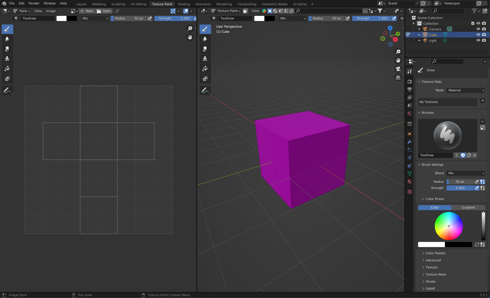

- [Blender Texture Paint Quick Start Guide](https://youtu.be/A0a-YndPpOM)
- [Blender Texture Paint Complex Objects](https://youtu.be/Oz4fiddcazI)
- [Add Checker Texture](https://youtu.be/gv8tQS9bSb8)

This [Blender](blender.md) tutorial shows the basics of using texture paint.

<figure>

<figcaption>

Blender Texture Paint Workspace

</figcaption>

</figure>

### Blender Texture Paint Quick Start

<iframe class="youTubeIframe" width="560" height="315" src="https://www.youtube.com/embed/A0a-YndPpOM?rel=0" title="YouTube video player" frameborder="0" allow="accelerometer; autoplay; clipboard-write; encrypted-media; gyroscope; picture-in-picture; web-share" allowfullscreen></iframe>

### Blender Texture Paint Complex Objects

<iframe class="youTubeIframe" width="560" height="315" src="https://www.youtube.com/embed/Oz4fiddcazI?rel=0" title="YouTube video player" frameborder="0" allow="accelerometer; autoplay; clipboard-write; encrypted-media; gyroscope; picture-in-picture; web-share" allowfullscreen></iframe>

### Blender Add Checker Texture

<iframe class="youTubeIframe" width="560" height="315" src="https://www.youtube.com/embed/gv8tQS9bSb8?rel=0" title="YouTube video player" frameborder="0" allow="accelerometer; autoplay; clipboard-write; encrypted-media; gyroscope; picture-in-picture; web-share" allowfullscreen></iframe>

