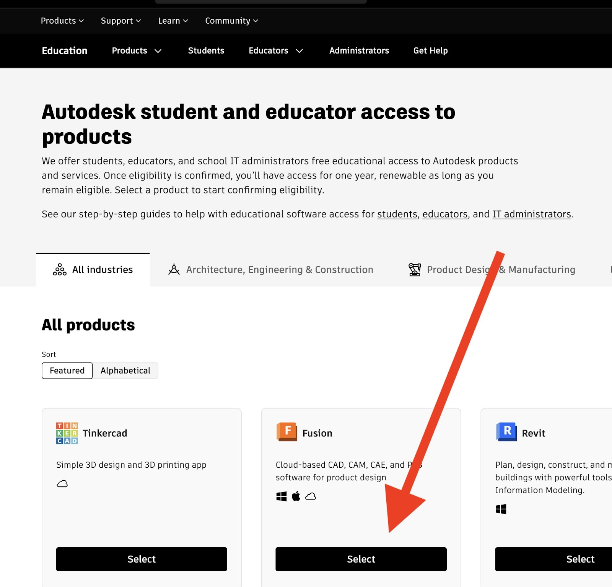
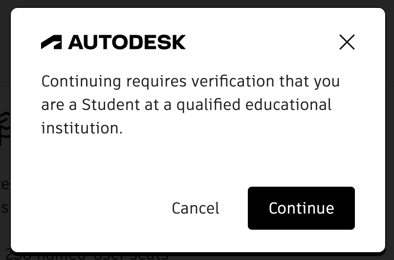
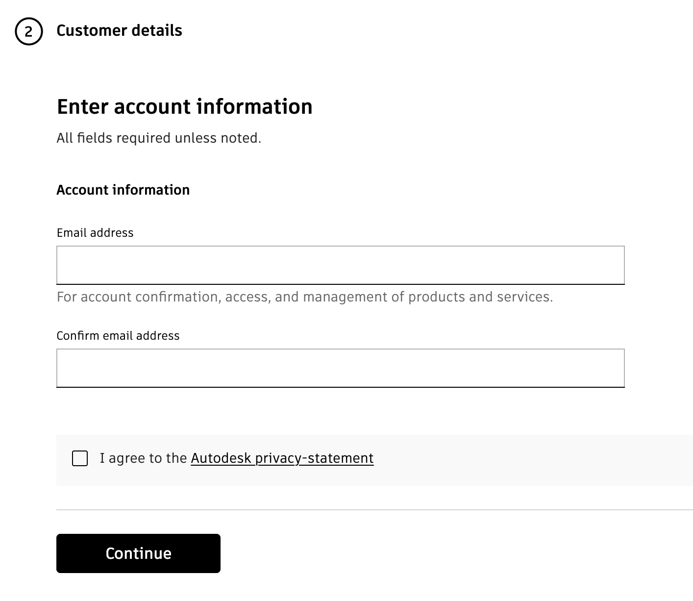
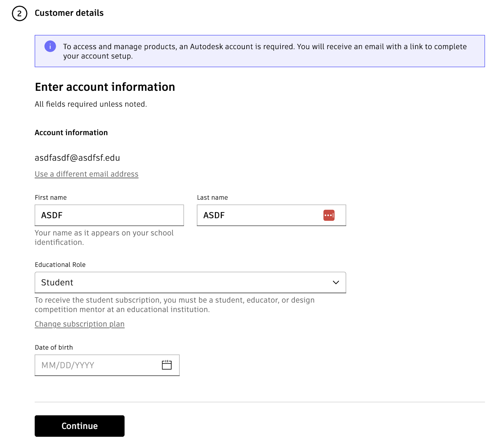
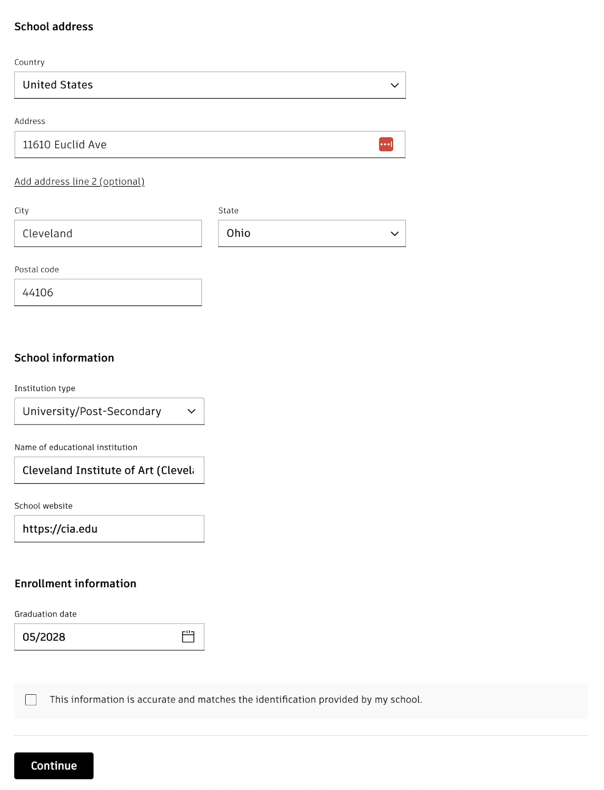
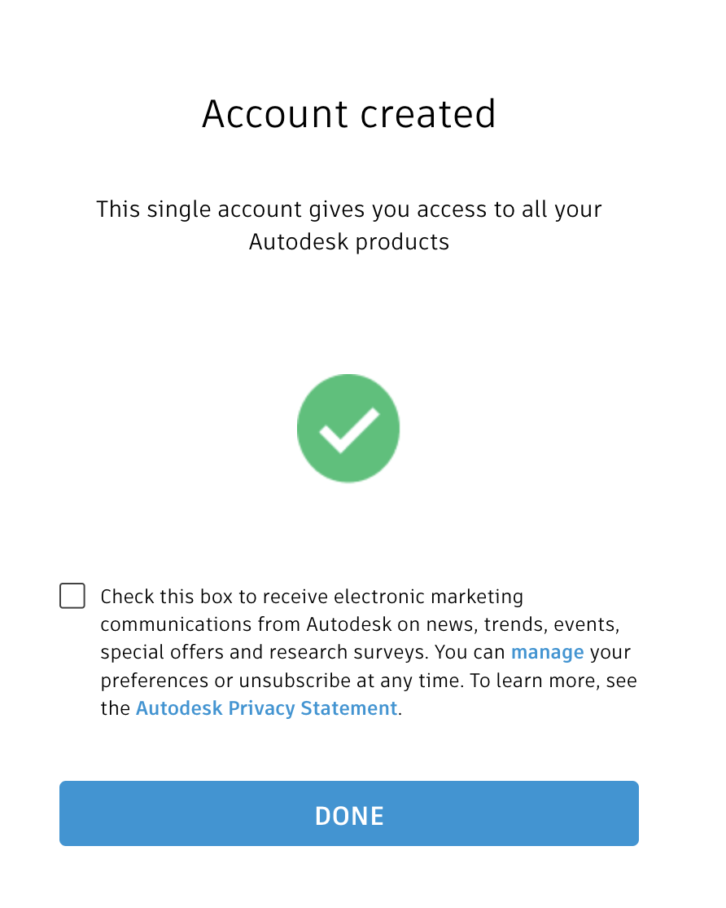
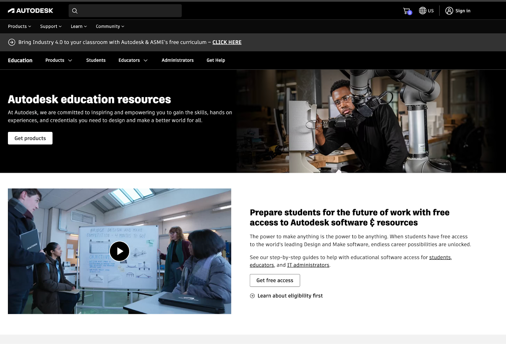
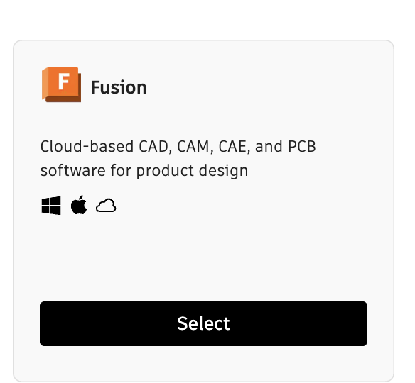
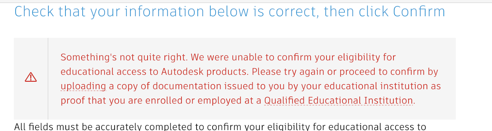

These instructions show how to register for and Autodesk for Education account and install [Fusion](fusion-360.md).

[Navigate to Autodesk for Education](https://www.autodesk.com/education/edu-software/overview)

[https://www.autodesk.com/education/edu-software/overview](https://www.autodesk.com/education/edu-software/overview)

Click on “Select” under Fusion

Select “Student” for your subscription Plan

Click “Continue” to move to account verification

Enter your student email. Do not use a personal email because Autodesk may not be able to verify your student access.

Fill out the “Customer Details” to create an Autodesk Education Account

- Name
- Education Role = Student
- DOB

Enter the information for your school. For example:

11610 Euclid Ave
Cleveland, Ohio 44106

Institution Type: University/Post Secondary

Name: Cleveland Institute of Art

School Website: cia.edu

Graduation Date: 05/2029

Success.

Make sure to click on any confirmation emails to confirm your account

[Navigate back to start page after creating account](https://www.autodesk.com/education/edu-software/overview)

[https://www.autodesk.com/education/edu-software/overview](https://www.autodesk.com/education/edu-software/overview)

Click on Get Products

Download and install Fusion 360

If Autodesk cannot automatically confirm your student status they may ask you to upload a copy of your student id or a confirmation letter or a transcript

Try to enter your info again for auto confirmation but if that doesn’t work, click on the link and upload identifying documentation.

Make sure to do this right away so you can use all the software in class.

Email any questions.

