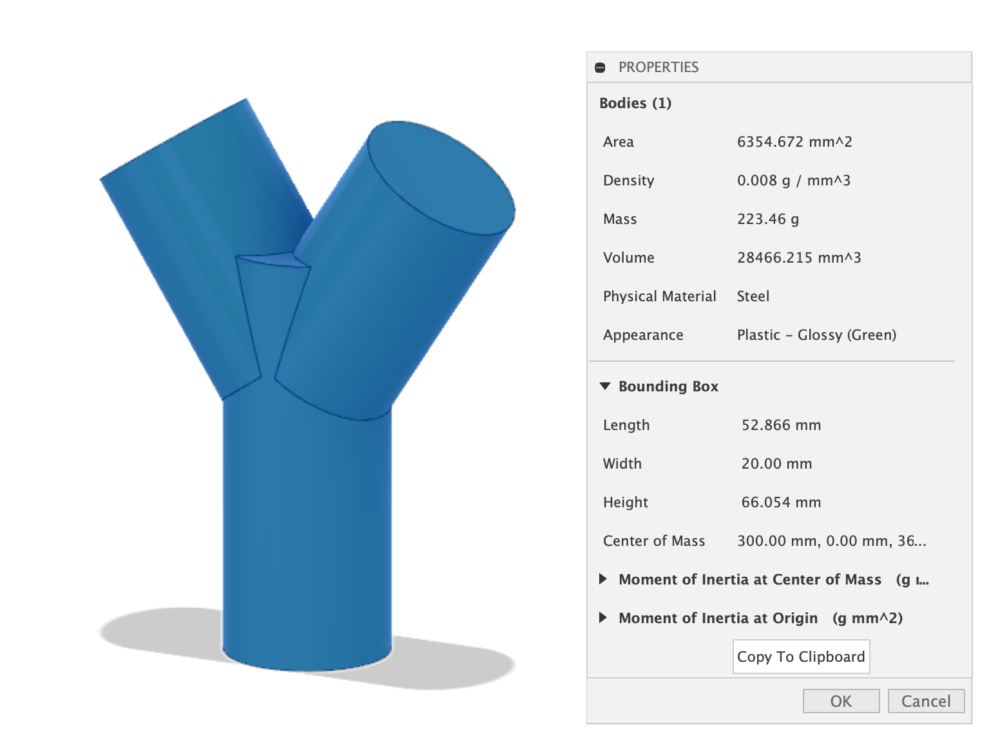

In order to check the model bounding box size in [Fusion 360](fusion-360.md):

- Make sure your file is set to millimeters.
- Check the properties of the component that you want to export to know the bounding box size.
- The total bounding box should be less than 50mm in all directions.

Right click on the body or component in the browser. Then select properties.

There is a small black triangle that needs to be clicked to show the bounding box information. Then you can see the bounding box dimensions. These should be below 50mm in all directions of x y and z.

## Scale a Model to Fit Desired Size

For the test 3D prints we want our models to be withing 50mm in all directions. How do you precisely scale an object to be as big as possible withing 50mm x 50mm x 50mm?

Once you see the size of the object in the bounding box section of the properties, note the largest dimension. It might be x, y, or z. For example, your object might measure 123mm x 78mm x 82mm. Write down the largest dimension on paper, in this case 123mm

Then use this ratio calculation:

| Largest Dimension | 100% | Desired Dimension | Scale Ratio |
| ----------------- | ---- | ----------------- | ----------- |
| 123 mm            | 1    | 50 mm             | ?           |

To get the scale ratio, cross multiply and divide. Therefore, in this case it is 50mm / 123mm = 0.406 scale ratio.

In Fusion 360, select the object in the browser, then under the Modify menu, select scale. It will ask for a scale ratio. Type in the number you calculated and Fusion will scale your model to fit within the 50mm bounding box. This works for models that are too small or too big.
