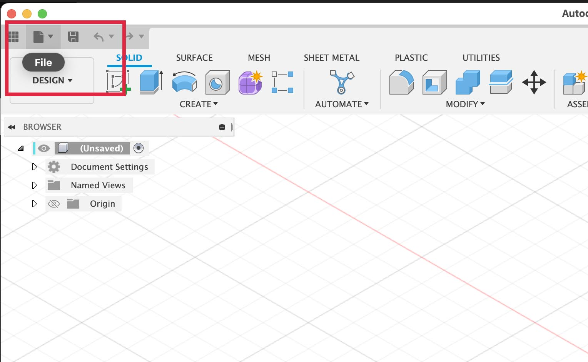
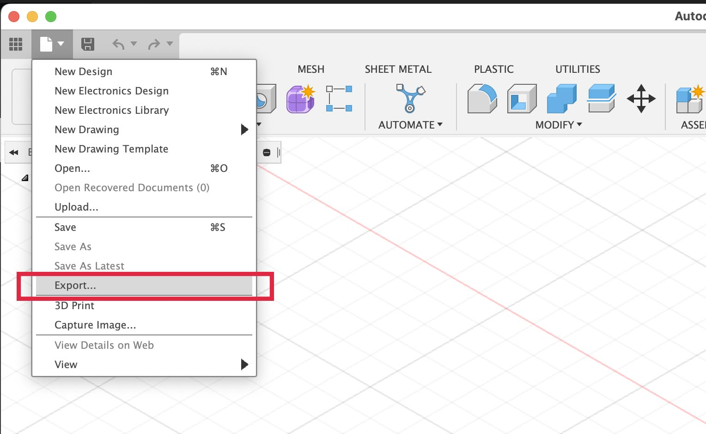
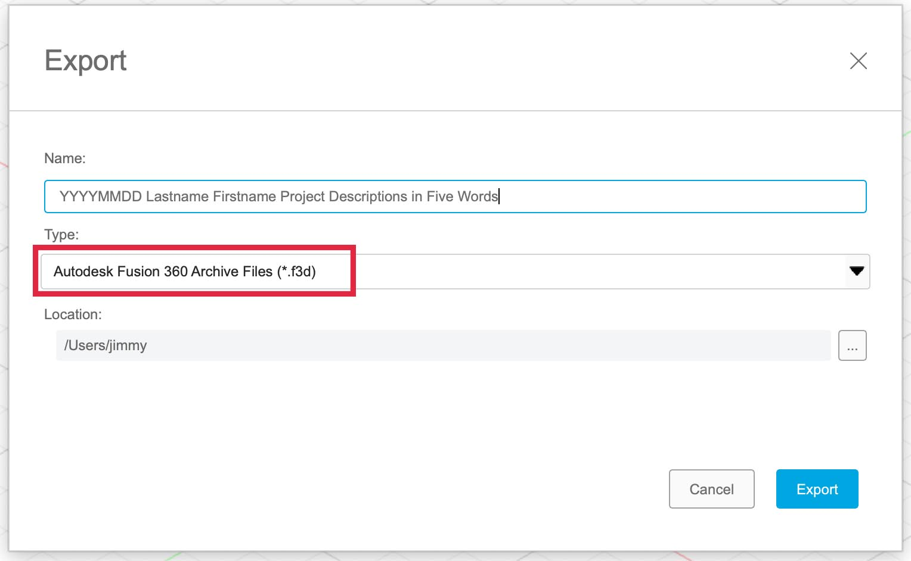

Click on file > Export > choose .f3d

Since [Fusion](fusion-360.md) data is stored in the cloud it is good practice to make local copies as well. Fusion supports the export of many [3D modeling](../3d-modeling.md) file types but for now we will focus on the `.f3d` Fusion native file format. This allows you to save a copy that can be opened on a computer without the internet and can be shared with another Fusion user without sharing any cloud information. The `.f3d` file can be uploaded to Fusion and then it will appear in the file browser with all the other models and designs.

[Export .f3d File from Fusion](https://youtu.be/8JkuSyMHgZY)

<iframe class="youTubeIframe" width="560" height="315" src="https://www.youtube.com/embed/8JkuSyMHgZY?rel=0" title="YouTube video player" frameborder="0" allow="accelerometer; autoplay; clipboard-write; encrypted-media; gyroscope; picture-in-picture; web-share" referrerpolicy="strict-origin-when-cross-origin" allowfullscreen></iframe>

| Export .f3d File from Fusion                                                            |                                                                                                                              |
| --------------------------------------------------------------------------------------- | ---------------------------------------------------------------------------------------------------------------------------- |
| 1. Select File from the disk icon in the top left                                       |                  |
| 2. Select Export... from the dropdown menu                                              |             |
| 3. Select `.f3d` for the filetype in the popup window                                   |  |
| 4. Label your file with YYYY-MM-DD Lastname Firstname Project Description in Five Words |                                                                                                                              |
| 5. Choose a location on your computer to save the `.f3d` file                           |                                                                                                                              |

