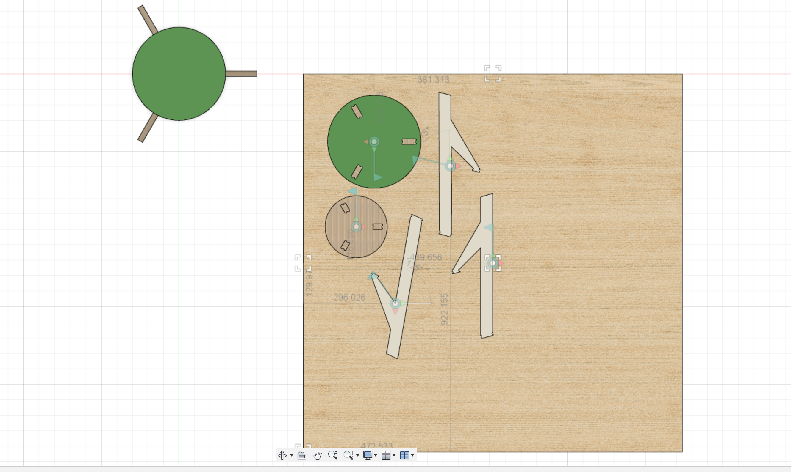
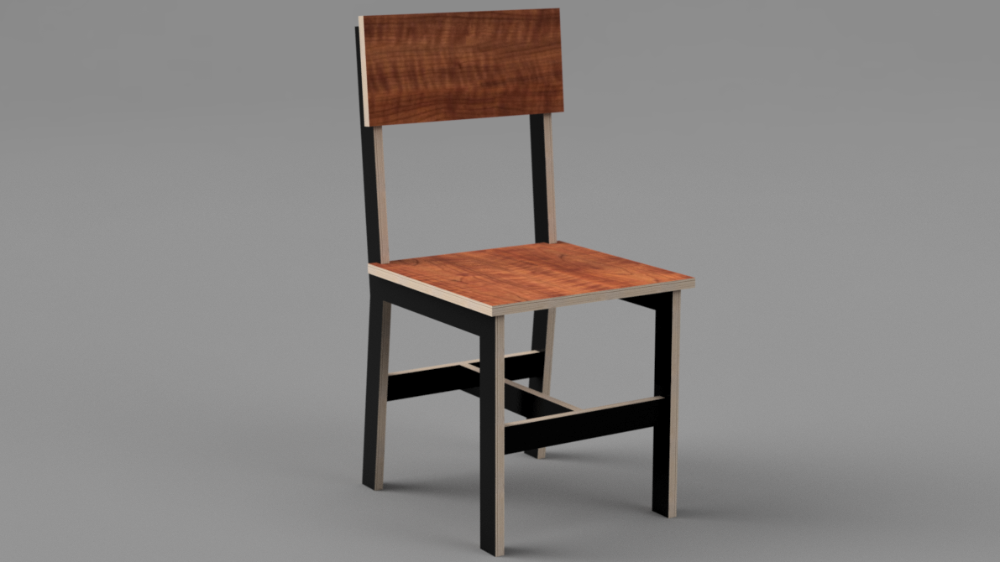

## Example CNC Models

### Hex Stool

This [video](https://youtu.be/9utpuieg5lI) shows the process of creating a simple hexagon stool in [Fusion 360](fusion-360.md). The video uses a previous method using joints to lay the parts flat. You should use the [arrange tool](https://youtu.be/GzknioA34F8) when you lay your parts flat.

### End Table

This [video](https://youtu.be/GzknioA34F8) shows the process of creating a simple end table. The video uses a previous method using joints to lay the parts flat. You should use the [arrange tool](https://youtu.be/GzknioA34F8) when you lay your parts flat.

### Circle Stool

This [video](https://youtu.be/I6FEMdtcrpI) shows the process of creating a simple circle stool. The video uses a previous method using joints to lay the parts flat. You should use the [arrange tool](https://youtu.be/GzknioA34F8) when you lay your parts flat.

### Plywood Chair

This [video](https://youtu.be/GqXQ8TdzYRE) shows the process of creating a simple plywood chair. The video uses a previous method using joints to lay the parts flat. You should use the [arrange tool](https://youtu.be/GzknioA34F8) when you lay your parts flat.

## Fusion 360 CNC Tutorial Videos

### CNC Hex Stool

<iframe class="youTubeIframe" src="https://www.youtube.com/embed/9utpuieg5lI?rel=0" width="560" height="315" frameborder="0" allowfullscreen="allowfullscreen"></iframe>

### CNC End Table

<iframe class="youTubeIframe" src="https://www.youtube.com/embed/GzknioA34F8?rel=0" width="560" height="315" frameborder="0" allowfullscreen="allowfullscreen"></iframe>

### CNC Two Level Table

<iframe class="youTubeIframe" src="https://www.youtube.com/embed/I6FEMdtcrpI?rel=0" width="560" height="315" frameborder="0" allowfullscreen="allowfullscreen"></iframe>

### CNC Plywood Chair

<iframe class="youTubeIframe" src="https://www.youtube.com/embed/GqXQ8TdzYRE?rel=0" width="560" height="315" frameborder="0" allowfullscreen="allowfullscreen"></iframe>

