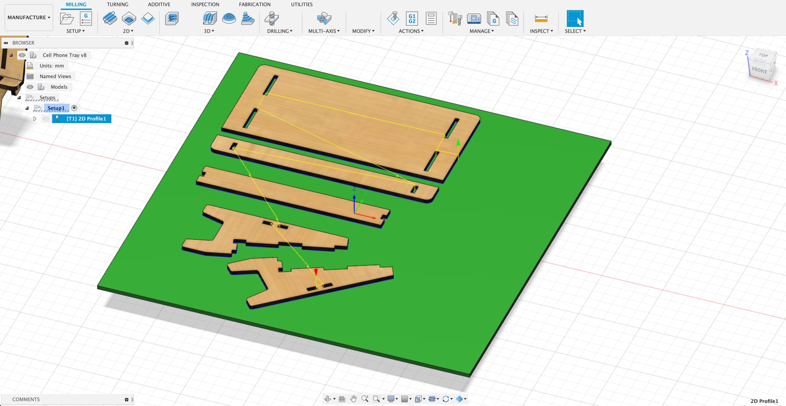

## Create Toolpaths in the Manufacture Workspace

Follow the steps in this tutorial video to create a new setup in Fusion 360\. This is done in the Manufacture Workspace. You need to create the laser cutter tool first. It is important to create a new "Cutting" setup so you can make a new 2D Profile to cut out.

## Save your Tool Paths as a DXF via Post Process

Select the tool path from your setup and then click on post process. Use the DXF post process that you installed earlier to export a DXF file. Make sure to add the .dxf file extension.

Example of each part of the stand as a separate component at the top level assembly in Fusion 360.

## Export Tool Paths

After you modified the ply thickness, re-generate and re-export your tool paths with the DXF post processor. In the manufacture workspace, right click on the process and click generate. Then click on post process to export a new DXF. Make sure you label the dxf exports so you know which one is the most recent.

If you have a complicated model with etching or interior pocket cuts, you can make these as different profile cuts in the Fusion 360 manufacture workspace. Then you can check the box to export each operation as a different layer. This can be helpful to select the paths in Illustrator and make them different colors. You can order the cuts on the laser cutter by dragging and dropping in the Epilog print menu. It is a good idea to do all etching and interior cutting before cutting the outside contours so you pieces do not move.

### Export DXF Toolpath with Kerf Compensation

<iframe class="youTubeIframe" style="position: absolute; top: 0; bottom: 0; left: 0; width: 100%; height: 100%; border: 0; z-index: 1;" src="https://www.youtube.com/embed/6JFHMV7A9TU?rel=0" width="560" height="315" frameborder="0" allowfullscreen="allowfullscreen"></iframe>

