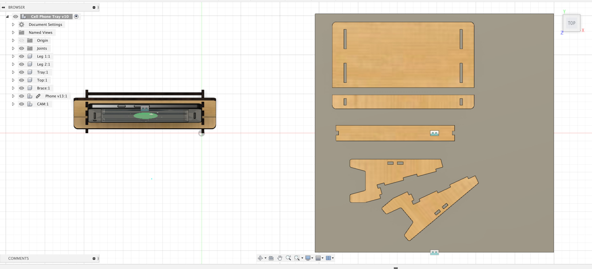

Once your model is complete and each piece is a separate and labeled component, you are ready to lay your pieces flat to create a DXF toolpath file for the laser cutter.

1. Change to the Manufacture Workspace.
2. Make sure you created a Manufacture Model. This model is like a linked copy of your Design Model. It allows you to lay your pieces flat with out moving your Design Model. This video shows [how to make a Manufacture Model](https://youtu.be/bhVPR4CUOUk).
3. Draw a sketch to represent your plywood or acrylic sheet. Make the dimensions of the sketch the size of your material. If you are using larger plywood or acrylic then draw a larger sketch. If you are using a "remnant" or cutoff piece then draw your sketch to that size.
4. Then use the Arrange command to lay your parts flat.
5. Follow the instructions in [the video](https://youtu.be/jeQPJHHwVN4) to arrange your parts flat.

<figure>

<figcaption>

Top view of components of laser cut stand flat on plywood.

</figcaption>
<figure>

### Lay Parts Flat with Arrange for Laser Cutting

<iframe class="youTubeIframe" style="position: absolute; top: 0; bottom: 0; left: 0; width: 100%; height: 100%; border: 0; z-index: 1;" src="https://www.youtube.com/embed/jeQPJHHwVN4?rel=0" width="560" height="315" frameborder="0" allowfullscreen="allowfullscreen"></iframe>

