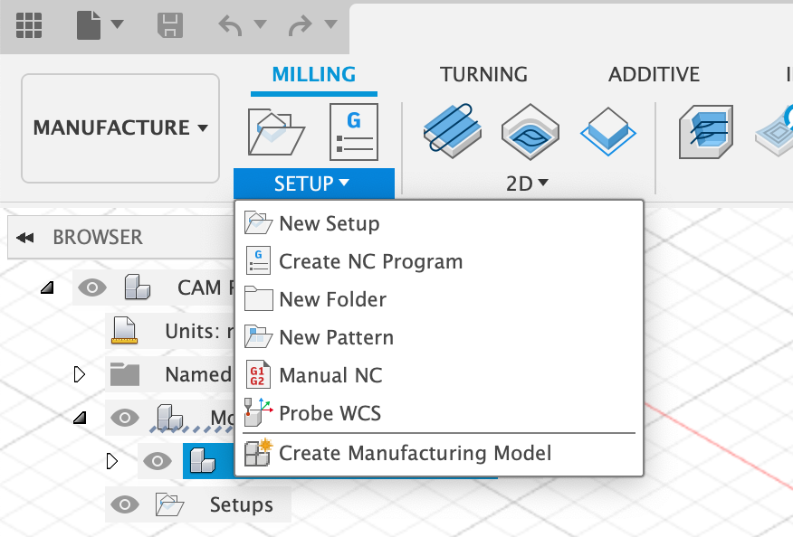

[Fusion 360](fusion-360.md) has multiple workspaces. We have used the Design and Render workspaces. Another workspace is the Manufacture workspace. This workspace is for preparing a model for fabrication and generating toolpaths.

While not required, by creating a manufacture model copy of your design model, you can move the parts around and lay them flat without changing your design model. If you change your design model then the manufacture model updates automatically. This can be helpful for making variations of [patterns](basic-pattern-tools-fusion-360.md) and designs.

If you make changes to the manufacture model, it does not update the design model. This can be helpful if for testing. Perhaps you want to add or remove a portion of a piece to see how it works but don't want to capture it in your design history. Then making the changes in your manufacture model is a good idea. Otherwise it is best to make changes in the design model.

You can have multiple manufacture models.

## Make a Manufacture Model Copy of Your Design

<iframe class="youTubeIframe" title="YouTube video player" src="https://www.youtube.com/embed/bhVPR4CUOUk?rel=0" width="560" height="315" frameborder="0" allow="accelerometer; autoplay; clipboard-write; encrypted-media; gyroscope; picture-in-picture; web-share" referrerpolicy="strict-origin-when-cross-origin" allowfullscreen></iframe>

