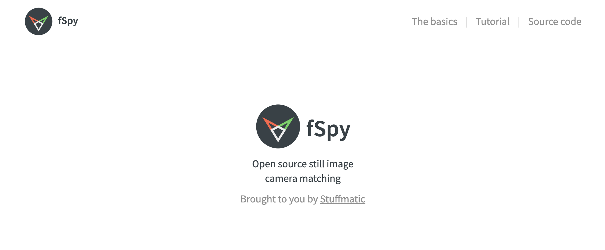

fSpy is an open source camera matching program made by [Stuffmatic](https://stuffmatic.com/). It can be downloaded from the [fSpy website](https://fspy.io/). After loading an image with obvious [perspective](../art-faq/perspective.md) lines into fSpy, the x and y axis can be lined up with objects in the photo to calculate the original placement of the camera and the field of view. This information can be saved and imported into 3D modeling programs such as [Blender](./blender/blender.md) or [Maya](../3d-modeling/maya/maya.md) for 3D scene visualization, rendering, and compositing.

## fSpy Resources and Guides

- [Perspective Match with fSpy](./photo-perspective-matching-with-fspy.md)
- [Place 3D Model into 2D Photo with fSpy and Blender](./blender/place-3d-model-in-2d-photo-blender-fspy.md)
- [Scale fSpy Camera to Existing 3D Model in Blender](./blender/scale-fspy-camera-to-existing-3d-model-in-blender.md)
- [Install Blender fSpy Add-on](./blender/install-fspy-blender-add-on.md)
