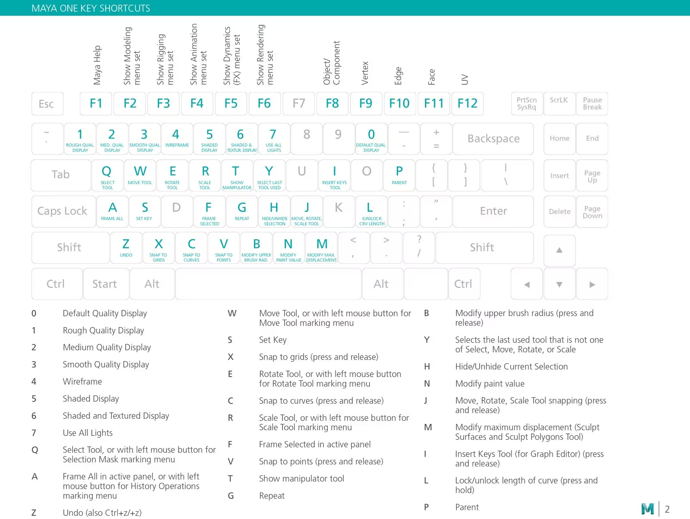
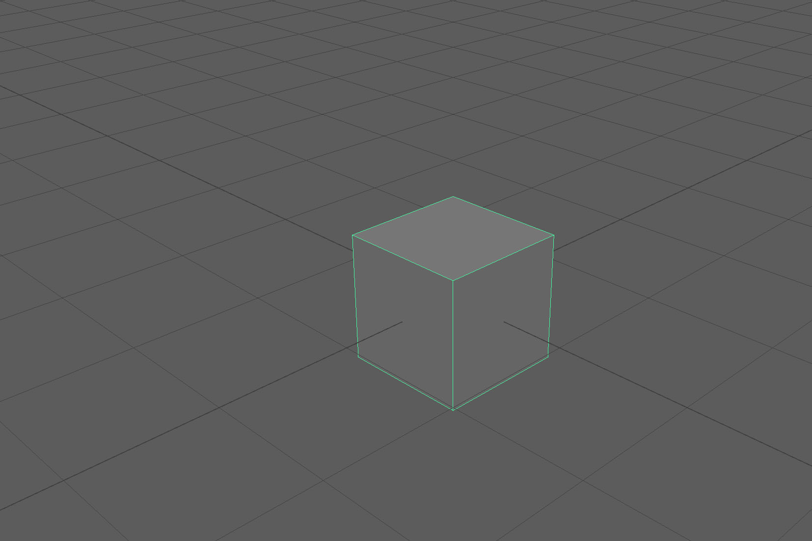

## Maya User Interface Quick Start

<iframe class="youTubeIframe" width="560" height="315" src="https://www.youtube.com/embed/-SpVNiRqeKY?si=-UGVKSDZk_-JlTDa" title="YouTube video player" frameborder="0" allow="accelerometer; autoplay; clipboard-write; encrypted-media; gyroscope; picture-in-picture; web-share" allowfullscreen></iframe>

[Maya](./maya.md) is a [3D modeling](../3d-modeling.md) program that can be overwhelming at the start but like any software, becomes much easier and understandable with a bit of use. The official [Maya Help Documentation](https://help.autodesk.com/view/MAYAUL/2025/ENU/) is a great place to get started with the basics of Maya as well as explore advanced topics.

## Maya Keyboard Shortcuts [^1]

### Essential Maya Keyboard Shortcuts

| Maya Key | Action         |
| -------- | -------------- |
| Q        | Select         |
| W        | Move           |
| E        | Rotate         |
| R        | Scale          |
| a        | Frame all      |
| f        | Frame selected |
| f8       | object mode    |
| f9       | vertex mode    |
| f10      | edge mode      |
| f11      | face mode      |

### Maya Mouse Controls

| Mouse Control                                      | Action        |
| -------------------------------------------------- | ------------- |
| alt (option) + left mouse Button                   | rotate camera |
| alt (option) + middle mouse Button                 | pan camera    |
| alt (option ) + right mouse button or scroll wheel | zoom camera   |

## Maya Introduction

<figure>

<figcaption>

Maya Default Scene with cube

</figcaption>
</figure>

- [Maya User Interface](https://youtu.be/-SpVNiRqeKY)
- [Change Units in Maya](./change-units-maya.md)
- [Maya Polygon Modeling Tools](https://youtu.be/eBEitxaRYQs)
- [Maya Hole in a Cube](https://youtu.be/EIKiJUmUH7A)
- [Maya Beginner Polygon Modeling Tutorial](https://youtu.be/lLItO9mBwxM)

## Maya Basic Modeling

- Maya Move Objects
- Maya Merge Vertices
- Maya Mirror
- Maya Object vs Face vs Edge vs Vertex Mode
- [Maya Extrude](https://youtu.be/yyExyA67log)
- [Maya Freeze Transformations](https://youtu.be/1SXvWTiMkjs)

### Maya User Interface

<iframe class="youTubeIframe" width="560" height="315" src="https://www.youtube.com/embed/-SpVNiRqeKY?rel=0" title="YouTube video player" frameborder="0" allow="accelerometer; autoplay; clipboard-write; encrypted-media; gyroscope; picture-in-picture; web-share" allowfullscreen></iframe>

### Maya Polygon Modeling Tools

<iframe class="youTubeIframe" width="560" height="315" src="https://www.youtube.com/embed/eBEitxaRYQs?rel=0" title="YouTube video player" frameborder="0" allow="accelerometer; autoplay; clipboard-write; encrypted-media; gyroscope; picture-in-picture; web-share" allowfullscreen></iframe>

### Maya Hole in Cube

<iframe class="youTubeIframe" width="560" height="315" src="https://www.youtube.com/embed/EIKiJUmUH7A?rel=0" title="YouTube video player" frameborder="0" allow="accelerometer; autoplay; clipboard-write; encrypted-media; gyroscope; picture-in-picture; web-share" allowfullscreen></iframe>

### Maya Beginner Polygon Modeling Tutorial

<iframe class="youTubeIframe" width="560" height="315" src="https://www.youtube.com/embed/lLItO9mBwxM?rel=0" title="YouTube video player" frameborder="0" allow="accelerometer; autoplay; clipboard-write; encrypted-media; gyroscope; picture-in-picture; web-share" allowfullscreen></iframe>

[^1]: [Maya Keyboard Shortcuts](https://www.autodesk.com/shortcuts/maya) [(Web Archive)](https://web.archive.org/web/20220524190210/https://www.autodesk.com/shortcuts/maya)
