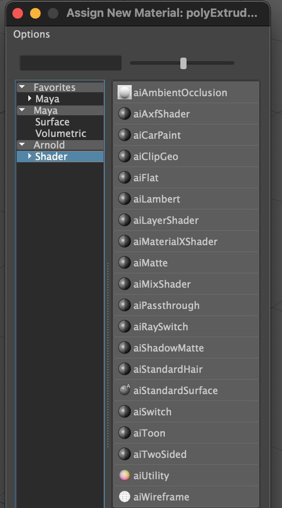
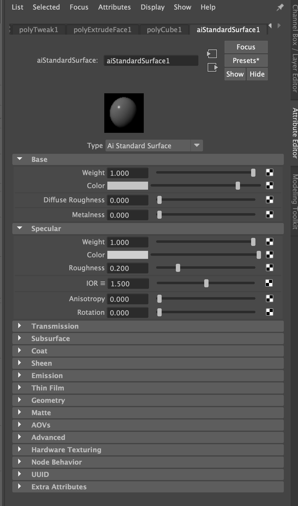

[Maya](./maya.md) objects have a default Lambert shader applied by default. The base color of the Lambert shader can be customized to create different colors on objects.

Right Click on a mesh to get the "Assign New Material" menu. Then you can choose from a number of different shaders. A good place to start is the aiStandardSurface.

In the far right tab of the Attribute Editor there are settings for the shader assigned to the mesh. In this case an aiStandardSurface is assigned. It has options for the base Color, Diffuse Roughness and Metalness. TOry experimenting with these three options first.

Maya has a number of presets for the [aiStandardSurface shader](./aistandardsurface-maya.md). These presets will work for many basic materials and can form a good foundation for creating custom materials and textures.
