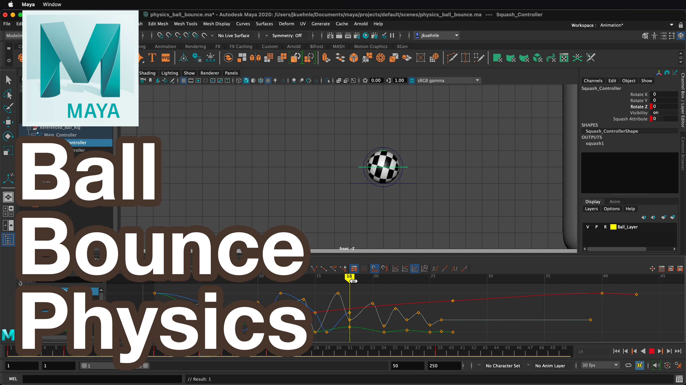

<iframe class="youTubeIframe"  width="560" height="315" src="https://www.youtube.com/embed/v7qQTfDQ3Ac?rel=0" title="Ball Bounce Animation in Maya Tutorial" frameborder="0" allow="accelerometer; autoplay; clipboard-write; encrypted-media; gyroscope; picture-in-picture; web-share" allowfullscreen></iframe>

