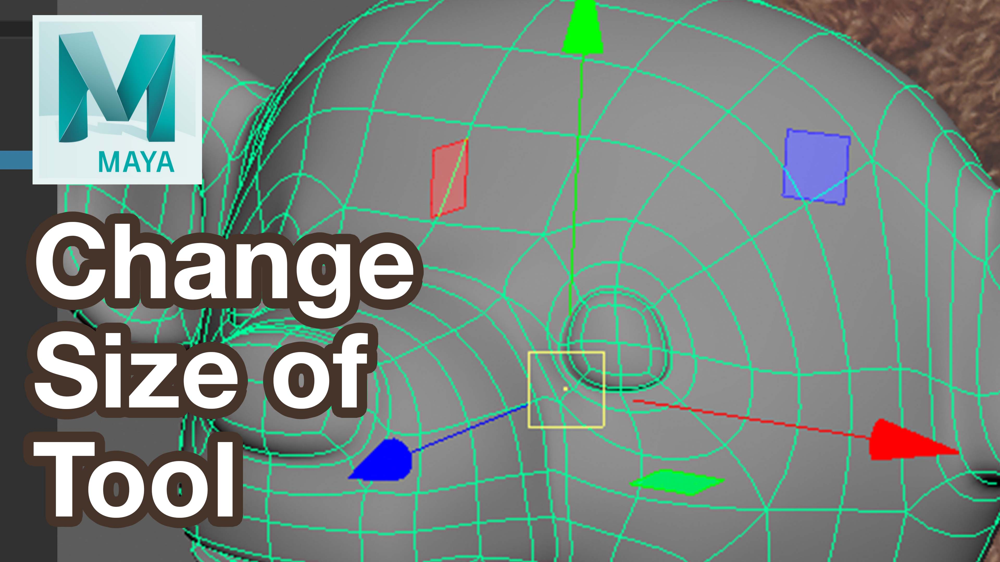

<iframe class="youTubeIframe" width="560" height="315" src="https://www.youtube.com/embed/66X6WzHkhq8?rel=0" title="YouTube video player" frameborder="0" allow="accelerometer; autoplay; clipboard-write; encrypted-media; gyroscope; picture-in-picture; web-share" allowfullscreen></iframe>

Sometimes working in [Autodesk Maya](./maya.md) the Move tool cursor is super huge. Why does this happen? How can you make the move tool cursor smaller on the screen so you can grab the handles and move your 3D model? This tutorial shows you how.

## How to Fix Your Super Long Cursor in Autodesk Maya: A Step-by-Step Tutorial

### Introduction

Are you struggling with a super long cursor in Autodesk Maya, making it hard to see the edges and use the planar moves effectively? If yes, you're not alone. This common issue can hinder your 3D modeling process, but fortunately, there's an easy fix. In this blog post, we'll guide you through a simple tutorial based on a video transcript to adjust the size of your cursor for better control and efficiency in Maya.

#### Step 1: Identifying the Problem

First, let’s understand the issue. When modeling in Maya, you might find that the cursor becomes excessively long, making it challenging to use certain tools. This usually happens due to accidentally pressing different keys on the keyboard.

#### Step 2: Using Keyboard Shortcuts

The solution is straightforward. You can adjust the size of your cursor and transform controls in Maya using the plus (+) and minus (-) keys on your keyboard.

- **To Decrease the Cursor Size**: Press the minus (-) key. This is particularly useful for detailed work where you need a smaller cursor.
- **To Increase the Cursor Size**: Press the plus (+) key. This will make the cursor larger, which can be helpful for different modeling tasks.

#### Step 3: Enhancing Your Modeling Experience

By adjusting the cursor size, you can access the planar tools that were previously out of view. This simple yet effective method enhances your modeling experience, allowing you to work on 3D characters and other projects more quickly and efficiently, without the frustration of a misaligned cursor.

#### Conclusion: Happy 3D Modeling!

Remember, Autodesk Maya offers various tools to make your 3D modeling process smoother and more enjoyable. Adjusting your cursor size is just one of the many tricks you can use to improve your workflow. Happy 3D modeling, and here's to creating amazing characters with less annoyance and more precision!

## Maya Video Tutorial Transcript

Maya tutorial I’m going to show you how to fix your cursor when it's super long and you can't see the edges.

If you look at this model right here if I orbit around look how long these pieces are I can still use them if I click way on the edges or I get lucky and click these lines but it can be really annoying especially if I’m trying to move and I want to use the planar moves which I can't see because they're way far away so it can be very difficult to use. This happens accidentally all the time just because you're pressing different keys on the keyboard.

You use the plus and minus keys to change the size of this orbit tool. So here now I can use the planar tools that weren't available before. So, if you accidentally make it super small this can be great for when you're doing detail work and you want it nice and small and then you can make it very large by pressing the plus button.

So, in Autodesk Maya you can change the size of your cursor and your transform controls by using the plus and minus tools. Hopefully this helps you model and make 3D characters much quicker and faster and with less annoying things when you're modeling in Autodesk Maya.

Happy 3D modeling.

- 👍 [Support on Patreon](https://www.patreon.com/WhatMakeArt)
- 🟥 [Subscribe](https://www.youtube.com/)

