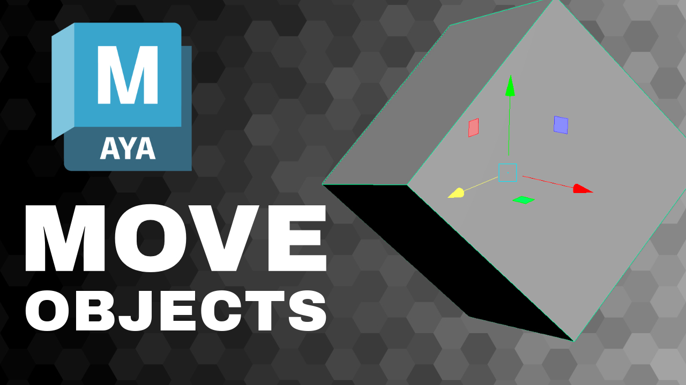

<iframe class="youTubeIframe" width="560" height="315" src="https://www.youtube.com/embed/fda8xMeOADI" title="YouTube video player" frameborder="0" allow="accelerometer; autoplay; clipboard-write; encrypted-media; gyroscope; picture-in-picture; web-share" referrerpolicy="strict-origin-when-cross-origin" allowfullscreen></iframe>

[Move Objects Maya](https://youtu.be/fda8xMeOADI)

## Video Transcript

In this [Autodesk Maya](maya.md) tutorial, I'm going to show you how you can move and manipulate objects in Maya.

When you see these green lines, that means you are in object mode. If you press w on your keyboard, that'll bring up the move tool. I can click on the move tool gizmo and move in different directions. So if I click on this axis then I move that way. This will move it back. This will move it up in the y axis.

So this is really convenient for moving it around.

We can also click these side axes. And this will lock it to that plane. is a little bit difficult to see in this view. But if I press spacebar. Now I can see multiple views.

You can see how it constrains to an axis or plane. If I can do it this way you can see it goes the other way. And then the same way. This does not go up and down, but can move from side to side.

So this is a really convenient way to manipulate things. I'm going to go back to the main viewport. Another way to move things is use the channel box. If you don't see the channel box the icon is in the top right.

Click the channel box, and if I click any of these axes so x and I use middle mouse button, it'll move on the x axis only
and I can click anywhere in the screen. This is pretty convenient because I can click here and move y.

Click here and move Z without having to come over and find the gizmo. That's not always the most convenient though.

Another nice way is if I deselect everything in the channel box, select the object, and if you're used to using [Blender](../blender/blender.md) in Blender, you can move quickly in the viewport in different axes.

I can also do that in Maya. If I use the middle mouse button and I hold the shift key and I move in this direction, it'll automatically lock to the y direction. If I move in this direction by holding the shift key, it will automatically move in Maya in the x axis.

And the same thing. If I hold the shift key and middle mouse button and I move this way, it will go in the z direction.

It generally works, so I like the fact that it doesn't need an extra key press like blender does, but sometimes I don't get the exact axes and I don't know a way that I can automatically move this plane with the middle mouse button.

Notice that the cube is only moving in the world axis.

What happens if I press E and somehow the cube is a rotated and I want it to move this way? If I double click on the move tool, then I can see how it is oriented with its axes.

Currently its on world. If I change this to object then I click the object. Now I can move it along the normals of the object, the way it is pivoted and rotate it. So this can be really helpful if I just need to slide this box along something that's already rotated. Just don't forget to move this back to world whatever you need.

So there are many ways to move things around in Maya.

Hopefully this allows you to get moving in Maya and making all kinds of fun 3D models.

Happy 3D modeling!

