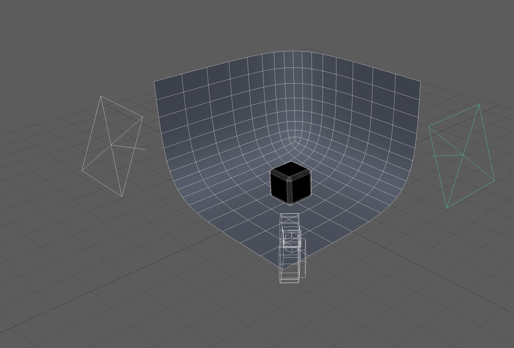

## Maya Rendering

### Lighting

To render an object there needs to be light. Add lights just as you would with a real scene in real life. A good way to light an object is with multiple lights pointed at the object at 45 degree angles.

Often the power of lights needs to be turned up tremendously to be able light the scene due to light fall off.

- [Maya Basic Render](https://youtu.be/9RHh4OSPKQQ)
- [Maya Infinite Photo Backdrop](https://youtu.be/y2ylWfbrC58)
- [3 Point Lighting](https://youtu.be/1nYSVw6-GxA)

### Maya Basic Render

<iframe class="youTubeIframe"  width="560" height="315" src="https://www.youtube.com/embed/9RHh4OSPKQQ?rel=0" title="YouTube video player" frameborder="0" allow="accelerometer; autoplay; clipboard-write; encrypted-media; gyroscope; picture-in-picture; web-share" allowfullscreen></iframe>

### Maya Infinite Photo Backdrop

<iframe class="youTubeIframe"  width="560" height="315" src="https://www.youtube.com/embed/y2ylWfbrC58?rel=0" title="YouTube video player" frameborder="0" allow="accelerometer; autoplay; clipboard-write; encrypted-media; gyroscope; picture-in-picture; web-share" allowfullscreen></iframe>

### 3 Point Lighting

<iframe class="youTubeIframe"  width="560" height="315" src="https://www.youtube.com/embed/1nYSVw6-GxA?rel=0" title="YouTube video player" frameborder="0" allow="accelerometer; autoplay; clipboard-write; encrypted-media; gyroscope; picture-in-picture; web-share" allowfullscreen></iframe>

