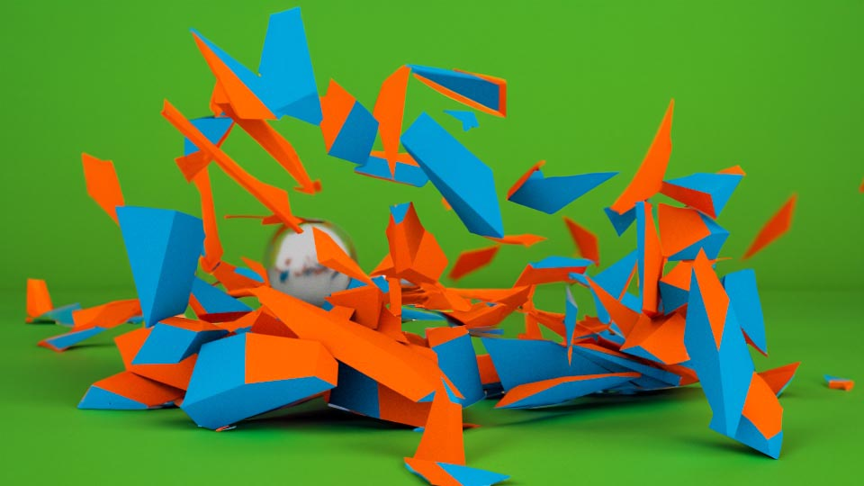

<iframe class="youTubeIframe" width="560" height="315" src="https://www.youtube.com/embed/37RCuAT9sEQ?si=GSgEiRe9WbRy4GYl" title="YouTube video player" frameborder="0" allow="accelerometer; autoplay; clipboard-write; encrypted-media; gyroscope; picture-in-picture; web-share" referrerpolicy="strict-origin-when-cross-origin" allowfullscreen></iframe>

This tutorial provides an in-depth guide on creating a dynamic simulation in Maya, specifically demonstrating how to make a wall shatter as if impacted by a ball using the Bullet physics solver. Here's a breakdown of the steps covered in the tutorial:

## Setting Up the Scene in Maya

1. Start by creating a cube in Maya, which will serve as the wall.
2. Scale the cube to resemble a wall by adjusting its dimensions in the attribute editor. Ensure the wall sits on the grid by adjusting its position.
3. Add a plane to serve as the floor, scaling it to cover the area beneath the wall and beyond to catch any debris from the shattering wall.

## Preparing for Bullet Simulation

1. With the wall selected, move to the Effects workspace to access the shatter options.
2. Choose the "solid shatter" method with a desired number of shards (e.g., 100) for more complexity.
3. Ensure to delete the wall's history before creating the shatter effect to avoid errors.

## Configuring the Bullet Solver

1. Activate the Bullet plugin through the plugin manager under Windows settings. This step is crucial for accessing the Bullet physics options in Maya.
2. Apply the Bullet solver to the shattered wall, making sure it's set to initially sleep to prevent it from collapsing without impact.
3. Adjust collision and margin settings to prepare for the simulation.

## Creating the Ball

1. Add a sphere to the scene, positioning it to act as the projectile.
2. Make the sphere an active rigid body within the Bullet solver to allow it to interact dynamically with the wall.
3. Convert the floor plane into a passive rigid body, ensuring it interacts with the ball and the debris without moving itself.

## Running the Simulation

1. Set the initial velocity and mass of the ball to ensure it moves towards and impacts the wall with sufficient force to cause the shattering effect.
2. Optionally, adjust the simulation by changing the ball to a kinematic rigid body for manual animation control, or adjust its mass and velocity for different impact results.
3. Add a passive cube behind the wall to serve as a backdrop or additional collision object, enhancing the realism and complexity of the simulation.

## Conclusion

This tutorial guides through the process of setting up, configuring, and executing a dynamic shattering simulation in Maya using the Bullet physics solver. It covers the initial setup, including creating the wall and floor, enabling the Bullet solver, preparing the objects for simulation, and running the simulation to achieve the desired effect of a wall shattering upon impact by a ball. This process showcases the capabilities of Maya's physics simulation tools for creating complex dynamic animations.

<sumamry>

## Video Transcript

In this Maya tutorial I'm going to show you how you can make a wall shatter with a ball smashing into it using the bullet solver in Maya Maya has many different physics simulation solvers and it also has the bullet solver as well as ways that you can shatter an object in advance and then apply the solver to those pieces to get started we need to make a cube you can click on the poly modeling shelf and Maya to create a cube then if we click on the attribute editor and if you don't see the attribute editor click in the top right this icon right here and then we can click on pcbe 1 pcbe 1 is a little hard to understand so if I come over here to my outliner and again if you don't see the outliner you can just click outliner I can press enter and then label this wall then we notice that over here it says wall wall shape and then poly Cube one this is part of the node history of Maya but if we click on this first tab wall we can go ahead and scale it we can scale in the X direction we can say 90 and if you don't want it to go that way we can press contrl Z and then we can scale in the y direction which will be up let's say 10 and then we can scale in the Z Direction maybe 13 so now we have a wall but notice it's below the grid here we can just go ahead and translate it half of the 10 by pressing five and then it's snapped right on the grid we also need to create a floor so I'm going to go ahead and create a plane then I'll press R to scale it up about this big and then over here it says P plane one in the outliner I'm going to press enter and label it ground now we're ready to get started with the bullet solver here I have the bullet tab but you probably don't see this because you may not have the bullet plug-in installed to do that go to Windows settings and preferences plug-in manager go ahead and look for the bullet bundle right here and then make sure you check loaded and autoloaded once you do that you should see the bullet plugin if I click on bullet plug-in we get these options but before we do anything with the bullet plug-in we need to make this wall shatter so the first thing to do is click on the wall and then instead of the modeling workspace we want to move to the effects panel that'll give us this field solvers and effects up at the Top If I click on effects we notice that we have shatter and anytime in Maya when you see a little box if you click on the box you get extra options so here we have the create shatter effect options in Maya we have surface shatter solid shatter and crack shatter for this we're going to use solid shatter and we want to have a lot more shards so let's do 100 shards then we can change the seed value this is just how it breaks up randomly we want to have shapes we can uncheck triangulate surface and then we want to hide the original model then we just click create it will give you an error this first time that's okay that's because we have to delete the history of this object so if this happens to you just go back to your object click on the modeling workspace then on the poly modeling shelf you'll see this icon right here delete history if you don't see that you can always go to edit delete by type history now if I click create it can create the shatter effect because the history has been deleted and here we can see the shatter effect all these are now a collection of different objects that are shattered apart but how do we make this actually crumble or even explode when we hit it with another ball the first thing to do is now go to the bullet solver while the wall is selected I can create a bullet solver by clicking the three bowling pins this will go ahead and create a collection that's bullet solved and then if I press play play everything just explodes so how do we stop everything from exploding when we press

play the first thing to do is click on the bullet solver one then there's a couple different tabs so we can see the bullet solver shape then the solid shatter initial State and the solid shatter set solve State we want solid shatter one set initial State and first we want to have it initially sleeping then we want to change Collision type to hole and reduce the margin to zero now it shouldn't explode and as we can see the object just sits there so the next thing to do is to create something to collide with it so I can go back to my poly modeling shelf in Maya and then create a sphere I can press W on my keyboard to move the sphere I'm going to move the sphere

back then on the bullet Shelf I can go ahead and click create active object and if I press play the ball falls to the ground and falls through the floor so let's first fix it going through the floor then we'll make it hit the wall at the first frame I'm going to go ahead and then click the ground and instead of making an active object I'm going to click this icon and create a passive rigid body object so this is now a bullet rigid body object that's passive we can also change this in the body type right here if you change your mind so now let's go ahead and play now we see the ball hits the ground but what we really want is the ball to smash into the wall so let's go ahead and do that if I click on the ball then I can click on Rigid body shape one and for the initial velocity in the X direction if I type 80 and then press play notice that the ball smashes into the wall and then the wall crumbles but it doesn't smash very hard and it doesn't even go through the wall That's because the mass of the ball is only one if I change this Mass to something like 75 it's going to smash through the wall more so now it goes all the way through the wall and the wall explodes but sometimes you may want to have actual control over the ball so if you want to animate the ball you can go back and then change this to a kinematic rigid body so now it just stays put it's still a rigid body meaning it can impact things but now we use the channel box Editor to key frame it so I'll click on the channel box editor and then on the first frame so if I rightclick on translate X key selected then I move forward say to frame 100 and I move the ball forward and then I rightclick he selected I go back to frame zero and I press play the ball will move and into the actual object this is a great feature if you need to have a certain animation happen with your ball that can't be easily made with physics the downside of animating this way is you can see the ball stops right at the end so you don't get that full physics action because we could put another passive collider in the background right here and have the ball bounce off it so I'm going to go back to the beginning I'll click on the ball and on the attribute editor I'm going to go back to Dynamic rigid body but I'm going to add another cube in the background for everything to hit into so I'll click on poly modeling I'll make a cube I'll move it backwards I'll move it up I'll press R to scale I'll scale it sideways and then I'll also scale it up here press W move it up to right about here and then on the bullet solver I'll go ahead and make this a passive body as well now if I press play notice that everything reacts a now I could of course animate all of that but the point of using a physics model is that I don't have to animate all those extra bounces of the ball and the bricks so most of the time you're going to want to use the bullet solver to solve everything and then create your animation based on its reactions to things in the world but of course we can always change that to a different type of rigid body so that way we can animate it manually happy 3D modeling

