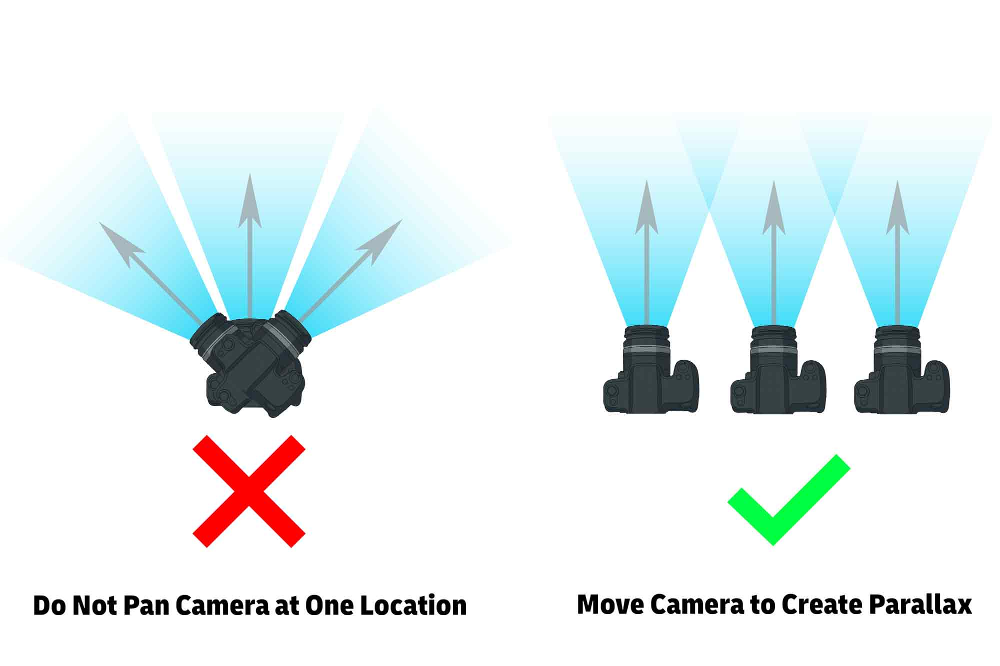
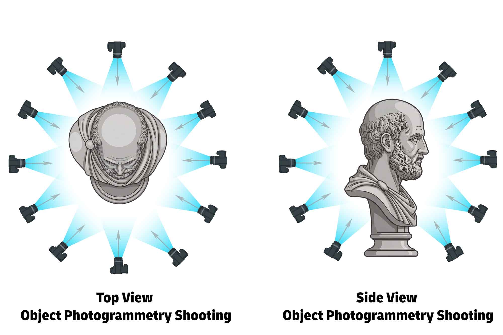
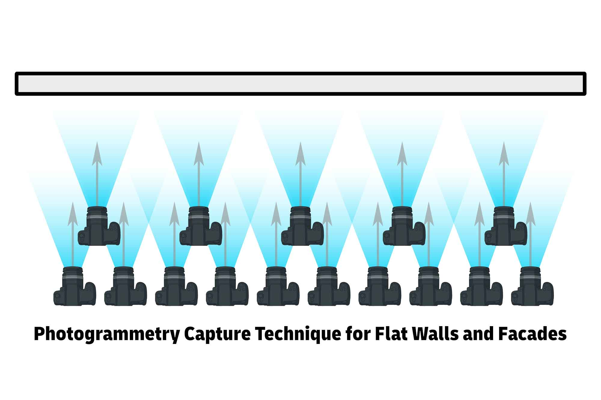
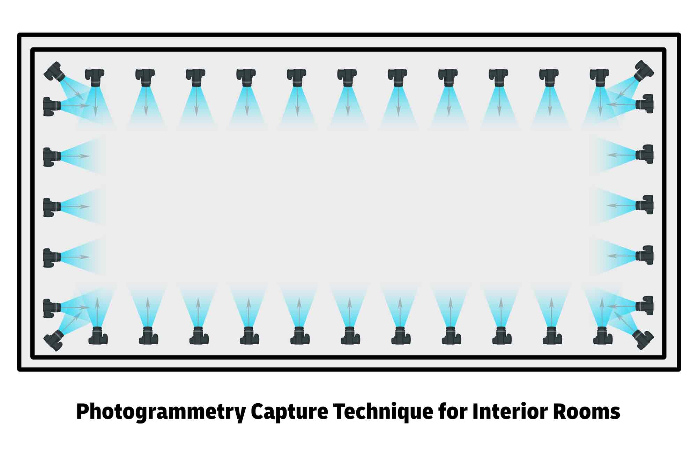

Photogrammetry is a useful tool for capturing 3D geometry and visual texture information from the real physical world. [Photogrammetry software](photogrammetry-software.md) identifies matching visual features in multiple 2D images taken from different but overlapping camera positions. The relative position of these features is used to calculate three-dimensional geometry and generate a textured 3D mesh.

Photogrammetry is accessible because compelling results can be produced with little more than a cell phone camera. Controlled professional photogrammetry systems can achieve very high levels of detail and accuracy, but general photogrammetry often produces more convincing visual texture than precise surface geometry. When highly accurate physical geometry or very fine surface detail is the primary goal, active [3D scanning](3d-scanning.md) methods such as structured-light or laser scanning may be more appropriate.

## Choosing Objects for Photogrammetry

Photogrammetry works best when an object or environment has visible surface texture, remains stationary during capture, and can be photographed from many different positions.

Matte surfaces with scratches, color variation, stains, printed graphics, natural texture, or other recognizable visual features are generally easy for photogrammetry software to reconstruct. Each visible feature gives the software another point that can be identified across multiple photographs and located in three-dimensional space.

Reflective, transparent, translucent, glossy, or featureless surfaces are much more difficult to reconstruct. Glass, mirrors, polished metal, glossy black plastic, solid white surfaces, and objects with large areas of uniform color may provide few reliable features for the software to track. Reflections and highlights can also move across a surface as the camera moves, making them appear to the software as if the surface itself is changing.

Repetitive patterns such as identical tiles, repeated windows, grids, or repeating textures can also create problems because several parts of the object may look nearly identical.

For objects that can safely be modified, removable scanning spray, temporary surface markings, or projected patterns can add recognizable surface features and reduce reflections. Do not apply coatings, powders, markers, tape, or other materials to artwork, historical artifacts, sensitive surfaces, or objects that could be damaged.

The subject should remain stationary throughout capture. Moving people, animals, foliage, water, flexible fabric, hair, or other objects that change position can produce incomplete or distorted reconstructions. Very thin wires, sharp edges, deep cavities, narrow gaps, and inaccessible undersides may also require substantially more photographs and may not reconstruct completely.

## Photogrammetry Best Practices

Fill as much of the camera frame with the subject as practical. This uses more of the available image resolution to describe the object rather than the surrounding environment.

Aim for approximately 70%–80% overlap between neighboring photographs. Complex objects, interiors, and surfaces with limited visual texture may benefit from even greater overlap. Every surface that needs to be reconstructed should appear clearly in several photographs taken from different camera positions.

Move gradually through the capture sequence. Large jumps in position or viewpoint may make it harder for the software to determine how photographs relate to one another.

Keep the object stationary and move the camera whenever possible. Turntable capture can also work, but the stationary background usually needs to be masked, removed, or otherwise prevented from influencing image alignment.

Preserve the original photographs. Avoid individually cropping, resizing, warping, perspective-correcting, or applying substantially different edits to images before reconstruction.

For dimensional work, include known scale references in the captured scene so the finished model can be calibrated to real-world measurements.

## Camera Settings

Sharp, consistent photographs provide the best information for photogrammetry.

Use an aperture that provides enough depth of field to keep important portions of the subject sharp. On many interchangeable-lens cameras, approximately f/8–f/16 is a useful starting range. Avoid using an unnecessarily small aperture because diffraction can soften fine image detail even though depth of field increases.

Use a shutter speed fast enough to prevent motion blur. A sharp photograph with slightly more image noise is generally more useful for feature matching than a blurred photograph.

Keep ISO as low as practical while maintaining an appropriate shutter speed and aperture.

Avoid changing focal length during the capture. If using a zoom lens, choose a focal length and leave it fixed throughout the image sequence. When using a phone, prefer the main camera and avoid switching between the wide, ultrawide, and telephoto cameras. Avoid digital zoom.

Keep focus consistent whenever possible, but maintaining sharp images is more important than never adjusting focus. If the camera-to-subject distance changes substantially, make sure the important surfaces remain sharply focused.

When possible, use manual exposure and a fixed white balance so the appearance of the object remains consistent. Automatic exposure and automatic white balance can cause the same surface to appear substantially different between photographs.

Disable unnecessary computational photography effects such as portrait-mode blur, beauty filters, artificial depth effects, and other processing that changes the geometry or appearance of individual images.

High-quality JPEG images are suitable for most photogrammetry workflows. RAW capture can provide additional control over exposure, highlights, shadows, and white balance when maximum image quality is required. If RAW photographs are processed before reconstruction, apply corrections consistently to the entire image set rather than editing individual photographs differently.

Use the highest useful image resolution available and preserve the original files. Avoid sending photographs through messaging or social media services that significantly resize or compress them.

Refer to [basic camera settings](../photography/basic-camera-settings.md) for more information about camera exposure and focus.

## Keep Lighting Consistent

Photogrammetry works best when the appearance of the subject remains consistent as the camera moves.

Soft, diffuse lighting is generally preferable because it reduces hard shadows and moving specular highlights. For outdoor photogrammetry, cloudy conditions often provide excellent lighting because clouds act as a large diffuse light source.

Avoid capturing across long periods when the sun moves substantially or when clouds repeatedly expose and cover the sun. Changing shadows and exposure can make the same surface look different from one photograph to another.

If diffuse outdoor conditions are unavailable, complete the capture efficiently so the direction and length of shadows change as little as possible during the image sequence.

For controlled indoor capture, keep lights stationary relative to the subject. Do not move a light with the camera unless the workflow specifically requires it.

Advanced workflows can use cross-polarized lighting to reduce reflections and separate surface color from specular highlights. This typically requires polarizing material over the light sources together with a polarizing filter on the camera lens, rotated so the polarizations are crossed.

## Create Parallax and Complete Coverage

Parallax is essential for calculating three-dimensional depth. Photogrammetry determines depth by comparing how visible features change position between photographs taken from different camera locations.

Do not simply stand in one location and rotate the camera toward different areas of the subject. Physically move the camera sideways, vertically, forward, backward, or around the object.

Photographs taken from the same camera position but pointed in different directions can create a panorama, but they provide little useful parallax for calculating depth.

Move around a freestanding object in circular or spiral paths and capture it from several heights. A single horizontal circle is rarely enough for a complex object. A useful approach is to make one complete pass around the middle, another from a lower position angled upward, and another from a higher position angled downward.

Complete each circular capture pass by continuing until the final photographs overlap with photographs taken at the beginning of the pass. This closes the loop and provides continuous overlapping information around the object.

Tall objects may require several overlapping rings at progressively higher camera positions.

Take additional photographs of recessed areas, undercuts, cavities, edges, thin projections, and other geometry hidden from the main capture path. Areas requiring additional detail can be photographed with closer passes as long as those photographs overlap with the wider capture sequence.

Elevating a small object on a narrow support can make it easier to photograph low angles and the underside.

<figure>

<figcaption>

Do not rotate the camera in position. Physically move the camera to the side or through space to create parallax.

</figcaption>
</figure>

### Small Objects

For a small freestanding object, make several complete passes at different heights. Capture a middle-height ring, a lower ring angled upward, and a higher ring angled downward.

Add photographs looking toward the top and additional close-range photographs of areas requiring more detail. If possible, elevate the object so the lower edges and underside can also be captured.

### Large Sculptures and Freestanding Objects

Walk completely around the object several times at different camera heights. Maintain a relatively consistent camera-to-object distance within each pass and make sure neighboring photographs and neighboring rings substantially overlap.

For very large objects, combine wider passes that establish the overall geometry with closer passes that record high-resolution surface detail.

Pay particular attention to undercuts, overlapping forms, deep recesses, and locations where one part of the sculpture blocks another.

<figure>

<figcaption>

Take photographs 360° around the object from multiple heights. Move the camera in small increments so neighboring photographs substantially overlap.

</figcaption>
</figure>

### Walls and Relief Surfaces

For walls and relatively flat surfaces, move the camera parallel to the surface rather than standing in one location and panning.

Keep the camera approximately perpendicular to the surface whenever practical. Make overlapping horizontal or vertical passes in a grid-like pattern, with substantial overlap both between neighboring photographs and between rows.

Additional passes at different distances can help connect overall geometry with high-resolution surface detail.

<figure>

<figcaption>

Keep the camera approximately perpendicular to a wall. Make multiple parallel passes at different heights and distances while maintaining substantial overlap.

</figcaption>
</figure>

### Rooms and Interior Spaces

Interior capture requires photographs that connect walls, corners, floors, ceilings, doorways, and architectural features into one continuous reconstruction.

Move physically through the room rather than standing in the center and creating a panorama. Make overlapping passes around the room while photographing the surrounding architectural surfaces.

Corners are especially useful because they visually connect multiple planes of the room. Maintain substantial overlap between neighboring walls and between walls, floors, and ceilings.

Take additional photographs around doors, windows, columns, stairs, furniture, and other transitions that help connect different areas of the reconstruction.

Large blank walls can be difficult because they contain few recognizable visual features.

<figure>

<figcaption>

Move around the perimeter of an interior space while photographing the surrounding walls, corners, floor, ceiling, and architectural features. Maintain substantial overlap between neighboring views.

</figcaption>
</figure>

## Check the Capture Before Leaving

Review photographs periodically at full resolution during capture. Confirm that important images are sharp and free of motion blur.

Before leaving a location, make sure every important surface has been photographed from several positions and that there are no obvious gaps between capture passes.

Look specifically for areas that were difficult to see while moving around the object, including undersides, recessed areas, narrow gaps, deep cavities, and surfaces hidden behind other geometry.

Photograph complex areas more than you think is necessary. It is much easier to discard unnecessary photographs later than to return to a site because a small section of the model could not be reconstructed.

If scale is important, verify that scale references are visible and readable before ending the capture.

## Scale and Photogrammetry Accuracy

A photogrammetry model can look visually convincing while still being dimensionally inaccurate. Photogrammetry software also does not automatically know the real-world size of a reconstructed object.

Place rulers, measuring sticks, scale bars, coded targets, or other known references near the subject or throughout the capture area. Make sure the references are clearly visible and sharply photographed from several camera positions.

Use the longest practical known distance when establishing scale. If a two-meter scale reference is available, using the full two meters generally provides a more useful reference than measuring only a few centimeters.

For architecture, large sculptures, or environments, distribute several scale references throughout the capture area rather than placing all measurements in one location.

Scale references establish the real-world size of a model, but they do not automatically make inaccurate geometry accurate. Whenever dimensional accuracy is important, check several independent measurements on the finished model.

Higher-accuracy photogrammetry workflows may use coded targets, surveyed control points, calibrated cameras, measured camera positions, or specialized software.

General-purpose photogrammetry is especially useful for visual reference, digital sculpture, texture capture, environmental documentation, visualization, and creating assets for rendering or interactive media. When highly accurate physical geometry is more important than photographic texture, structured-light or laser [3D scanning](3d-scanning.md) may be a better choice.

- [Calibrate Photogrammetry Scanned Object Scale in Blender](photogrammetry-with-photocatch.md)

## Specialized Photogrammetry Equipment

Equipment built specifically for photogrammetry can automate capture, improve repeatability, and produce extremely high-resolution scans. Multiple cameras, controlled camera movement, consistent lighting, and automated software can reduce capture time while improving geometric and texture detail.

### Photogrammetry Lightboxes

- [Ortery 3D Photobench 180](https://ortery.eu/photography-equipment/product-photography-systems/3d-photobench-180/)
- [Ortery 3D Multiarm 1000](https://ortery.eu/photography-equipment/3d-product-photography/3d-multiarm-1000/) - Useful for capturing highly detailed photogrammetry of small objects such as jewelry and small electronics.

## Photogrammetry Tutorials

### Photogrammetry Software Guides

- [Photogrammetry with Photocatch](../3d-modeling/photogrammetry-with-photocatch.md) - works with a video or a folder of images

#### Reality Scan Mobile

- [Object Masking Photogrammetry Capture - Reality Scan Tutorial](https://youtu.be/tBc4yoMWaSM)
- [Indoor Photogrammetry Capture - Reality Scan Tutorial](https://youtu.be/bI_ix3ZDGWI)
- [Outdoor Photogrammetry Capture - Reality Scan Tutorial](https://youtu.be/VmVBUGjP5CU)
- [Epic Games Reality Scan - Convert GLB to OBJ in Blender](https://youtu.be/Lj1Z2XmpOM0)

### Exporting Frames from Video for Use in Photogrammetry

Video is a convenient way to collect many overlapping views, but individual photographs generally provide higher image quality and greater control over exposure, focus, shutter speed, and compression.

When recording video for photogrammetry, move slowly and smoothly around the subject and avoid rapid camera movement. Use a sufficiently fast shutter speed so individual frames remain sharp.

Many cameras use rolling-shutter sensors that record different portions of a video frame at slightly different times. Rapid camera movement can therefore distort individual frames and reduce geometric accuracy. Video compression can also remove fine image detail and introduce artifacts that make feature matching less reliable.

Video can produce hundreds or thousands of nearly identical frames, and it is usually unnecessary to process all of them. Extract frames at intervals that maintain substantial visual overlap while also providing meaningful changes in camera position.

- [Export Video Frames with Adobe Media Encoder](../video/export-video-frames-as-images-adobe-media-encoder.md)
- [Export Image Sequence from Adobe Premiere](../video/adobe-premiere-pro/adobe-premiere.md)
- [Export only Keyframes with ffmpeg Video Tutorial](../video/export-only-keyframes-from-video-as-images-ffmpeg.md)
- [Export Frames from Video as Images with ffmpeg](../video/export-frames-from-video-as-images-ffmpeg.md)

### Working with Photogrammetry Created 3D Meshes

Photogrammetry software commonly produces meshes with irregular orientation, arbitrary scale, excessive polygons, disconnected geometry, holes, and unnecessary portions of the surrounding environment. The reconstructed model may therefore require cleanup before it is useful for modeling, fabrication, animation, or visualization.

Photogrammetry models may also import extremely small or large, rotated onto an unexpected axis, or positioned far from the world origin.

After importing a photogrammetry model into 3D software, first verify its real-world scale and orientation. Move the useful geometry to a convenient world origin, establish an appropriate object origin, and inspect the mesh for disconnected geometry, holes, surface-normal problems, unnecessary polygons, and missing texture files before beginning additional work.

- [Place 3D Models in 2D Photos with Blender](blender/place-3d-model-in-2d-photo-blender-fspy.md)
