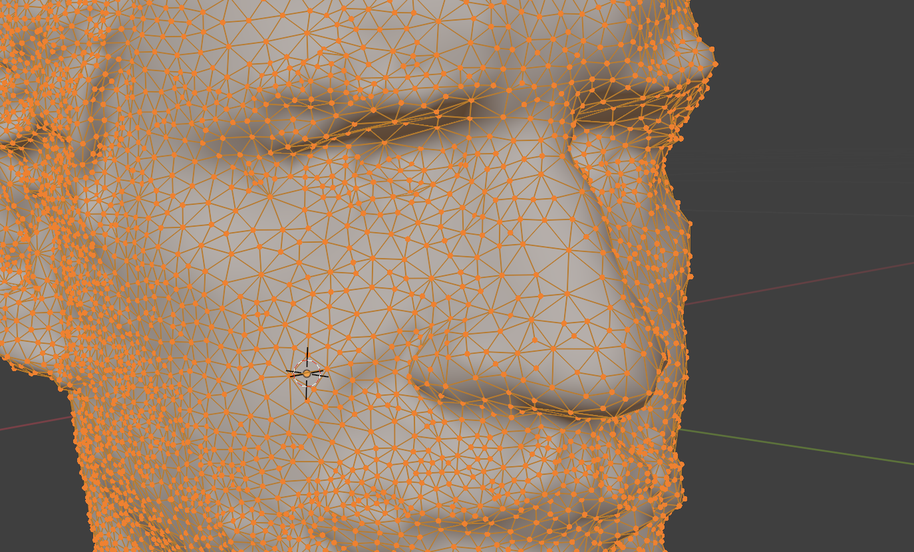
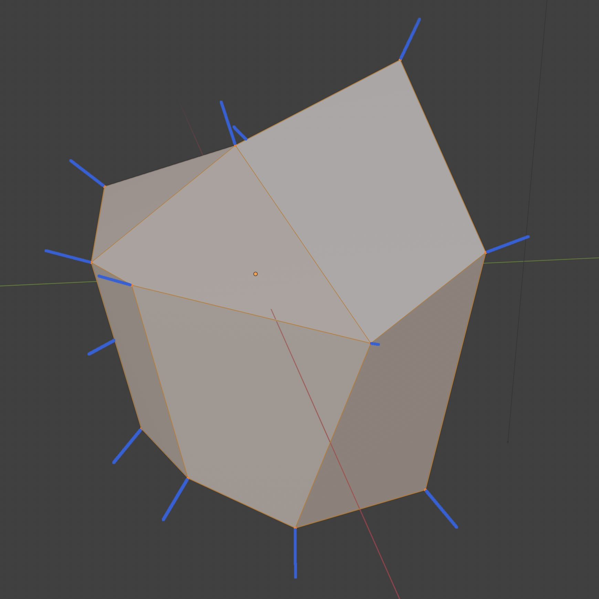
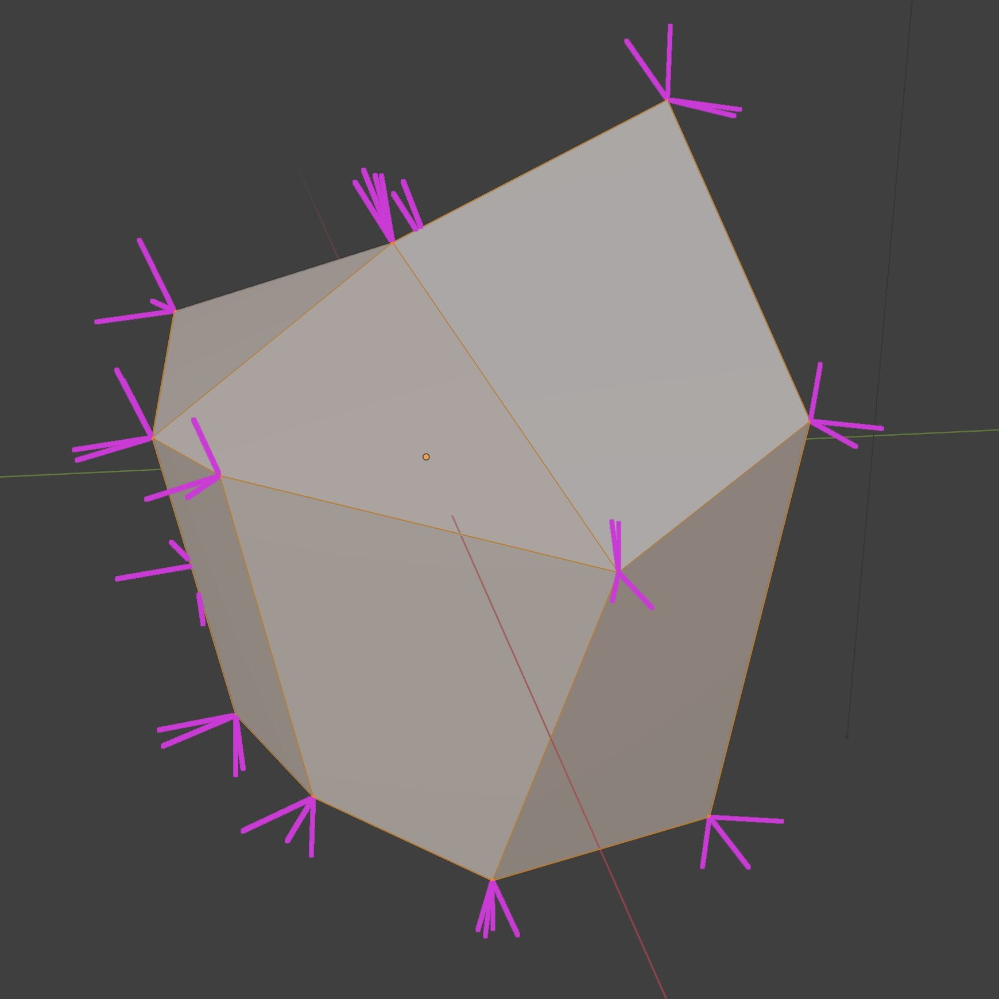
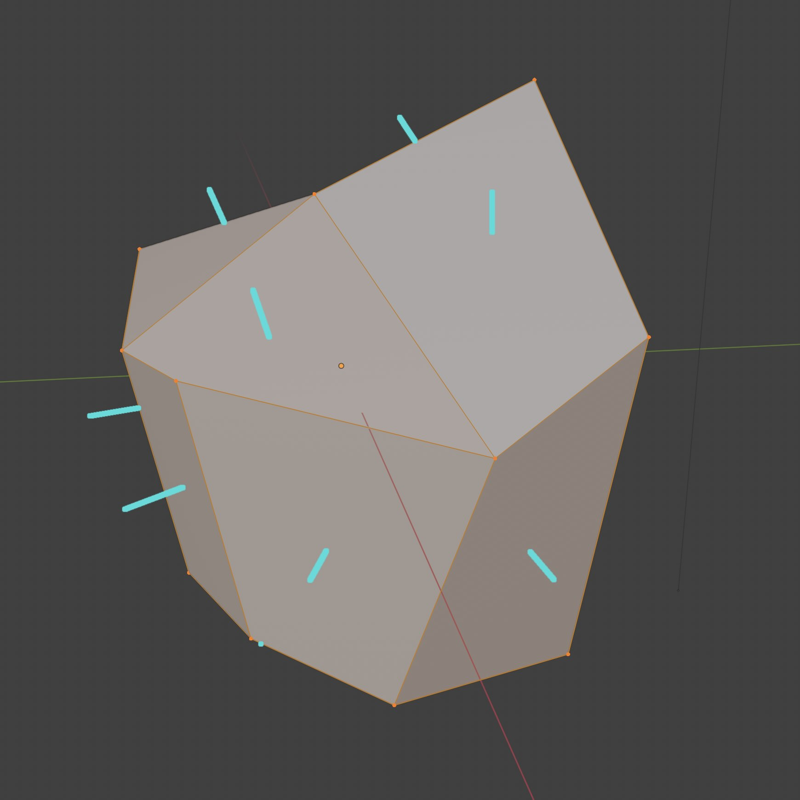

## Approaches to Making 3D Models

- Box Modeling
- Photogrammetry
- NURBS modeling
- Sculpting
- 3D Scanning

3D polygon meshes are similar to 2D raster images. Instead of the number of pixels determining the resolution, the number of polygons created by vertices and edges determine the resolution and level of detail of the 3D mesh.

## Polygon Mesh 3D Modeling Terms

[](./attachments/2024-02-21-polygon-mesh.png)

### Vertex

A vertex is a single point with a x, y, and z coordinate in space.

Below is part of the raw output of an OBJ file as viewed in a text editor. I lists the .mtl material file as well as the total number of vertices, 50,004 in this case. Then it starts to list the x, y, and z coordinates of each vertex one by one. When combined, these vertices represent a 3D object.

```obj
#
#  Wavefront OBJ
#
baked_mesh.mtl

# 50004 vertices
v -0.006574440282 -0.5206853151 -0.08385431767
v -0.05093718693 -0.3144668341 0.1083745509
v 0.0006316434592 -0.5294510722 -0.07813622802
v 0.1126134321 -0.3347152174 -0.06057931483
v 0.142641142 -0.5012384057 -0.1056081727
v 0.1589666903 -0.2815119028 -0.1055894122
v 0.02803074755 -0.5320419073 0.04221494123
```

- Edge

### Face

A face is a plane formed by connected edges. The most simple face is a triangle. Actually all faces in 3D models are triangles, even though for some modeling it can be helpful to think in "quads", or 4 sided faces, but all quads can be represented by 2 triangles.

Below is another section of the raw output of an OBJ file that lists the number of faces and then starts to identify the vertices that make of each point of the triangle for that face.

```obj

# 1 groups

# 100000 faces (triangles)

g g0
usemtl g0
f 15736/110/15736 6342/109/6342 9621/105/9621
f 6316/111/6316 6317/112/6317 21832/106/21832
f 22009/85/22009 12284/93/12284 15608/100/15608
f 15608/100/15608 12284/93/12284 21994/96/21994
f 21955/88/21955 15455/65/15455 21893/66/21893
f 21893/66/21893 30856/76/30856 21955/88/21955
f 21992/24/21992 21993/28/21993 47101/33/47101
f 9634/8/9634 14780/12/14780 21706/10/21706

```

### Surface

A surface can be thought of as a collection of faces that make a form. How the faces are arrange is dictated by the normal vectors of the faces or the vertices. The OBJ file lists the vertex normals with the prefix `vn`.

```obj
vn -0.5919778943 -0.7408031821 -0.3174472451
vn -0.5826607943 0.05327584594 0.8109673262
vn -0.6770005822 -0.6677457094 -0.3094928861
vn 0.7060845494 -0.6195512414 -0.3429298997
vn 0.6650727987 -0.2679548264 -0.6970498562
vn 0.7672684789 -0.4712825716 -0.434961915
vn -0.4610914886 -0.7889714837 0.4061018527
vn 0.6953703165 -0.4215616286 -0.5820189714
vn 0.3818239868 -0.8137655854 -0.4381735027
vn 0.3625639975 0.1427554488 -0.9209605455
vn 0.5434582233 -0.5887952447 -0.5983086824
vn -0.4960611463 0.1445593238 0.8561694026
vn 0.7074422836 -0.505739212 -0.4937137961
vn 0.7541692853 -0.4985180497 -0.4274439812
```

<div class="gallery-grid">

<figure>

[](./attachments/2024-02-21-vertex-normals.jpg)

<figcaption>

Vertex Normals

</figcaption>
</figure>

<figure>

[](./attachments/2024-02-21-vertex-per-face-normals.jpg)

<figcaption>

Vertex Per Face Normals

</figcaption>
</figure>

<figure>

[](./attachments/2024-02-21-face-normals.jpg)

<figcaption>

Face Normals

</figcaption>
</figure>
</div>

### UV Coordinates

UV coordinates describe the mesh and the triangles in a flat 2D coordinate space that contains the image or procedural texture information.

Below is the raw output of the `vt` or texture coordinates from the example OBJ file. Notice that each coordinate only has 2 numbers instead of 3 like the vertices. That is because the texture is a 2D image file that only has U and V coordinates.

```obj
# 55191 texcoords
vt 0.9954175353 0.336381495
vt 0.9925258756 0.3364934921
vt 0.9947189093 0.3333998322
vt 0.9917966723 0.3336414397
vt 0.9954175353 0.3406945765
vt 0.9877110124 0.333861202
vt 0.9930964708 0.3415887356
vt 0.9897233844 0.3398766518
vt 0.9954175353 0.345875293
vt 0.9874465466 0.3374119401
vt 0.9925649166 0.3487592936
vt 0.9860912561 0.3404420018
```

## Polygon Mesh 3D Modeling Software Guides

This [Blender vs Maya Polygon Modeling Comparison](./blender-vs-maya.md) show ways to accomplish the same tasks in Maya and Blender, two popular 3D Modeling programs.

- [Blender Modeling Basics](./blender/3d-modeling-basics-blender.md)
- [Maya Modeling Basics](./maya/3d-modeling-basics-maya.md)
- [Fusion 360 Modeling Basics](./fusion-360/organic-forms-with-t-splines-fusion-360.md)
