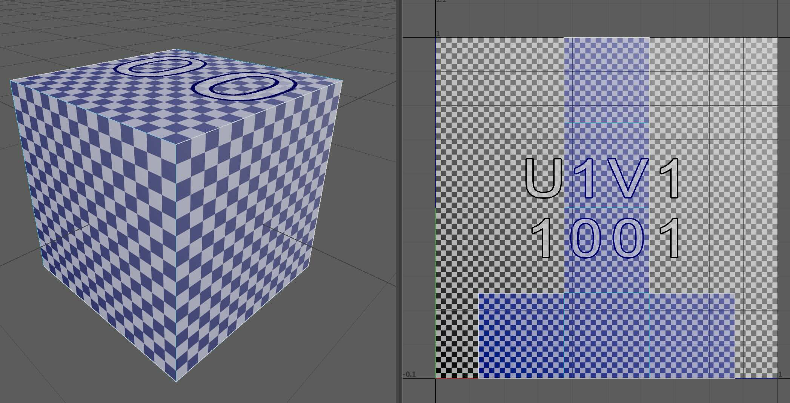
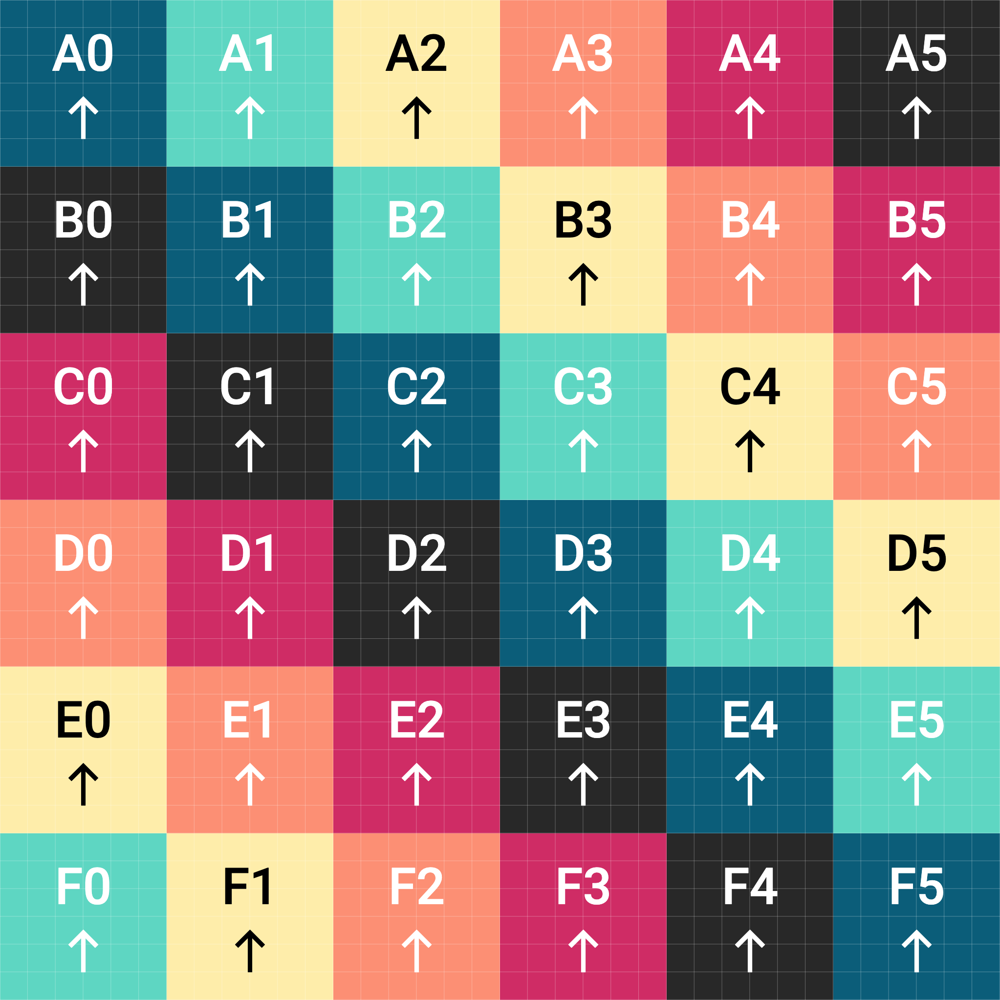

UV coordinates are arranged differently than the pixels on a computer screen. On a computer screen, often the coordinate (0,0) is the top left of the screen and then the numbers count right and down up to the number of pixels on the screen. In UV coordinates (0,0) represents the lower left of the coordinate space and (1,1) represents the top right. Notice that the max UV value is 1. This is true even if using a 4k or 8k texture image, the coordinates are normalized values between 0 and 1.

Since textures will appear distorted and stretched if not evenly UV unwraped, applying a temporary UV checker texture can help identify distorted points and check the UV mapping for consistant scale. If the scale of the UV shells is not consistant then parts of the displayed texure will be higher resolution that others and it will look off. [Maya](./maya/maya.md) and [Blender](./blender/blender.md) can both create a UV checker texture for examining UV unrapping. Sometimes it is helpfuly to have a more detailed UV checker texture with annotations and colors to help see which part of the UV space a UV shell is in. There are multiple online UV checker Map creation tools such as [UV Checker Map Maker](https://uvchecker.vinzi.xyz/).

<figure>

<figcaption>

Checker map created with [UV Checker Map Maker](https://uvchecker.vinzi.xyz/) developed by Jorge Valle Hurtado [^checker]

</figcaption>
</figure>

- [Basic UV Mapping Maya](./maya/uv-mapping-maya.md)
- [Basic UV Mapping Blender](./blender/uv-mapping-blender.md)

## References

[^checker]: [UV Checker Map Maker](https://uvchecker.vinzi.xyz/) developed by Jorge Valle Hurtado
