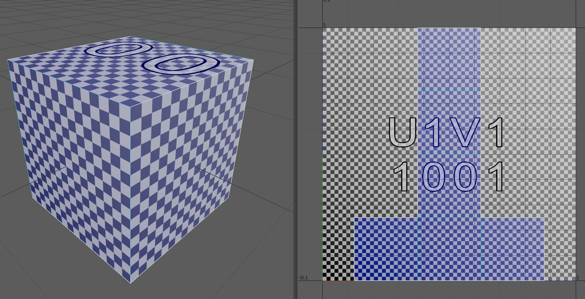
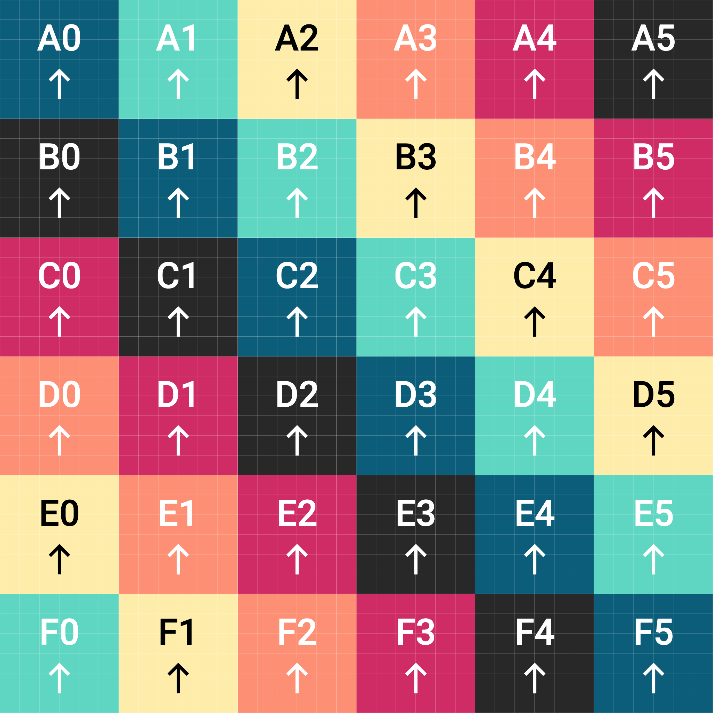

UV coordinates define how a 2D texture image is placed onto the surface of a 3D model. A 3D model exists in X, Y, and Z space, but textures are mapped using U and V coordinates. The letters U and V are used instead of X and Y so they are not confused with the 3D axes.

UV coordinates are arranged differently than the pixel coordinates on a computer screen. On a computer screen and in many image editing programs, the coordinate (0,0) is the top left of the screen and then values increase to the right and downward up to the number of pixels on the screen or the number of pixels in the image. In UV space, the coordinate (0,0) represents the lower left of the coordinate space and (1,1) represents the upper right.

In most basic texturing workflows, UVs are placed inside a normalized 0 to 1 UV space. This means the texture space is measured as a percentage of the image rather than by pixel dimensions. Whether a texture is 1024, 4096, or 8192 pixels wide, the UV coordinates still describe locations between 0 and 1 across that image.

### UV Mapping and UV Unwrapping

UV Mapping is the process of unwrapping the skin of a mesh model so it can be its surface points can be assigned to positions on the 2D texture. The surface of 3D forms cannot be laid flat without cutting or stretching. The UV unwrapping process is similar to cutting and unfolding a cardboard box. A 3D form usually cannot be laid flat without making cuts, so most meshes need seams in order to unwrap properly. These seams split the surface into separate UV shells that can then be arranged in UV space.

The goal of UV unwrapping is to flatten the model with as little stretching, squashing, or distortion as possible. If the UVs are distorted, the texture applied to the model will also look distorted.

- [Basic UV Mapping Maya](maya/uv-mapping-maya.md)
- [Basic UV Mapping Blender](blender/uv-mapping-blender.md)

### Why UVs Matter

Good UVs are important because they affect how clearly and evenly a texture appears on a model. Poor UVs can cause textures to look stretched or compressed or details may appear blurry in some areas and sharp in others. Bad UVs can warp patterns and make different parts of the model may display at inconsistent resolution

Even if a model is shaped well, bad UVs can make the final textured result look unconvincing or difficult to control.

### Using a UV Checker Texture

A common way to test a UV unwrap is to apply a temporary UV checker texture. This texture usually contains a grid of squares, colors, numbers, or letters. It helps reveal distortion because the checker pattern should appear evenly sized and evenly shaped across the surface of the model.

If the scale of the UV shells is not consistent then parts of the displayed texture will be higher resolution that others and it will look off. A checker map is also useful for checking texel density, which means how evenly texture resolution is distributed across the model. If one UV shell takes up much more space than another, that part of the model may display the texture in much higher resolution than another area.

[Maya](maya/maya.md) and [Blender](blender/blender.md) can both create a UV checker texture for examining UV unwrapping. Sometimes it is helpful to have a more detailed UV checker texture with annotations and colors to help see which part of the UV space a UV shell is in. There are multiple online UV checker Map creation tools such as [UV Checker Map Maker](https://uvchecker.vinzi.xyz/).

- [Add Checker Texture Blender](./blender/checker-texture-blender.md)

<figure>

<figcaption>

Checker map created with [UV Checker Map Maker](https://uvchecker.vinzi.xyz/) developed by Jorge Valle Hurtado [^checker]

</figcaption>
</figure>

### Key UV Terms

- UV Coordinates
- UV Space
- UV Mapping
- UV Unwrapping
- UV Seam
- UV Shell
- Distortion
- Checker Texture
- Texel Density
- Texture Map

## References

[^checker]: [UV Checker Map Maker](https://uvchecker.vinzi.xyz/) developed by Jorge Valle Hurtado
