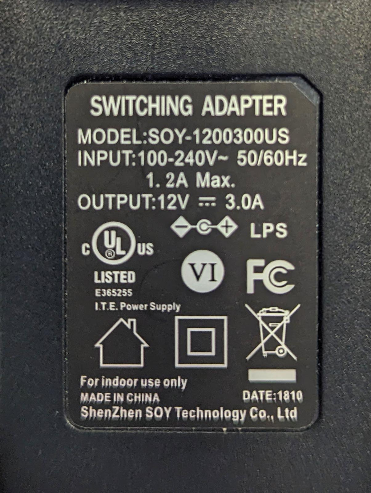

The [Arduino](arduino-introduction.md) UNO operates at 5V. The Arduino UNO accepts up to 5.5V from the USB B connector. It also has a DC barrel jack that accepts 6-20V maximum with 7-12V the recommended range. The voltage supplied is regulated with a voltage regulator to 5V and 3.3V. The input voltage passes through and is available at the Vin pin. Power can also be supplied via the Vin pin.

The basic Arduino Uno has 14 digital input / output (I/O) pins and 6 analog I/O pins. 6 of the digital pins can be used for pulse width modulation (PWM). Each of the I/O pins has 20 mA of DC current available for continuous operation and a maximum of 40mA before permanent damage occurs. There is a 3.3V pin for powering 3.3V accessories that has 50 mA of DC current. [^1]

## Not Much Power Per Pin

20 mA per pin is not a lot of power. It can control a small servo motor or a couple LEDs but to use stepper motors, larger servos, more LEDs and to do most things with the Arduino, additional power is required. Extra power can be supplied directly to the device and then the Arduino I/O pins do not send power to the device but send signals that control the device.

For example, a long strip of addressable LEDs would be powered by an external power supply. The data pin on the LED strip would connect to a pin on the Arduino to receive the single to determine which LEDs would be what color and brightness. Even though the LEDs do not receive power from the Arduino, the ground from the power supply, LEDs, and GND on the Arduino must all be connected so there is a common level for ground. Otherwise strange and unexpected behavior may occur.

## Supplying Power

A simple AC to DC wall power adapter is a quick and simple way to power external devices that are controlled with an Arduino. Eventually for large devices or a high number of LEDs, large switching DC power supplies may be needed. Portable batteries can also be used to supply power to the Arduino and devices.

Most devices have power input ratings written on them or in a data sheet. It is important to calculate the needed power and match it with the power ratings of the external power supply used.

The power label below has the following specifications.

| Specification  | Rating         |
| -------------- | -------------- |
| Input Voltage  | 100 - 240 V AC |
| Input Cycles   | 50/60 hz       |
| Input Current  | 1.2 A Max      |
| Output Voltage | 12 V DC        |
| Output Current | 3.0 A          |

[^1]: https://store-usa.arduino.cc/products/arduino-uno-rev3 [(Web Archive)](https://web.archive.org/web/20221227093254/https://store-usa.arduino.cc/products/arduino-uno-rev3)
