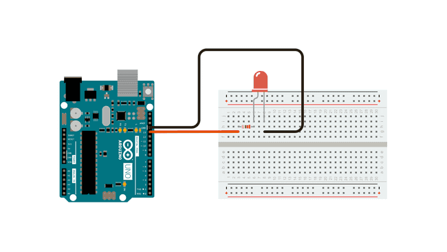

The example circuit and sketch below is one of the most basic programs for the Arduino. It uses the built in LED on the Arduino board so nothing more than an Arduino, USB cable, and computer is needed to run the code. Pin 13 on most Arduino boards is synced to the onboard LED. THis is used to test and debug boards to see if they work.

## Blink Example Circuit

<figure>

[](attachments/2023-arduino-blink-example-circuit-from-arduino-docs.png)

<figcaption>

[Circuit](https://docs.arduino.cc/built-in-examples/basics/Blink) by [Arduino](https://www.arduino.cc/) is licensed under [CC BY-SA 4.0](https://creativecommons.org/licenses/by-sa/4.0/) [^1]

</figcaption>
</figure>

## Blink Example Code

Let's break the code down into pieces.

### setup function

The comments in the code are quite helpful. The firs comment explains the setup function. This function is in all Arduino sketches and as the comment says, it only runs once. Inside the `{ }` curly braces is another function that has two parameters. The function `pinMode();` tells what pin to use, in this case the built in LED called `LED_BUILTIN` and then says what to do with it, in this case use it as `OUTPUT`. Then the function ends.

```C

// the setup function runs once when you press reset or power the board
void setup() {
  // initialize digital pin LED_BUILTIN as an output.
  pinMode(LED_BUILTIN, OUTPUT);
}

```

### loop function

The loop function is the heart of an Arduino sketch. It loops over and over and over and over again. It just keeps looping very fast unless you add a `delay` to your code or otherwise intentionally slow it down. The `loop();` function uses two functions, `digitalWrite();` and `delay();`. The `digitalWrite();` function tells the `LED_BUILTIN` or the LED on the Arduino to go `HIGH`. What does that mean?

The Arduino pins operate at 5V and can either send 0V or 5V. This is like sending a digital signal or 1s and 0s. When it sends 5V the Arduino pin is considered `HIGH` or on. When it sends 0V the Arduino pin is considered `LOW` or off.

Then the `delay();` function tells the Arduino to wait 1000 milliseconds or 1 second.

Then the `digitalWrite();` function tells the `LED_BUILTIN` to go `LOW` or turn off.

Then the `delay();` function tells the Arduino to wait 1000 milliseconds or 1 second.

Then since this is the `loop();` function it goes on until the end of time or if you remove power from the Arduino.

```C

// the loop function runs over and over again forever
void loop() {
  digitalWrite(LED_BUILTIN, HIGH);  // turn the LED on (HIGH is the voltage level)
  delay(1000);                      // wait for a second
  digitalWrite(LED_BUILTIN, LOW);   // turn the LED off by making the voltage LOW
  delay(1000);                      // wait for a second
}

```

### Full Blink Code

This is the full Blink example sketch below. This code is available in the Arduino IDE. Either copy the code below or open the example Blink Sketch in the Arduino IDE. Then select your Arduino Board, port, and upload the sketch to your Arduino. (Note your Arduino must be connected to your computer with the USB cable for this to work.) The onboard LED should start blinking on and off at 1 second intervals.

```C

/*
  Blink

  Turns an LED on for one second, then off for one second, repeatedly.

  Most Arduinos have an on-board LED you can control. On the UNO, MEGA and ZERO
  it is attached to digital pin 13, on MKR1000 on pin 6. LED_BUILTIN is set to
  the correct LED pin independent of which board is used.
  If you want to know what pin the on-board LED is connected to on your Arduino
  model, check the Technical Specs of your board at:
  https://www.arduino.cc/en/Main/Products

  modified 8 May 2014
  by Scott Fitzgerald
  modified 2 Sep 2016
  by Arturo Guadalupi
  modified 8 Sep 2016
  by Colby Newman

  This example code is in the public domain.

  https://www.arduino.cc/en/Tutorial/BuiltInExamples/Blink
*/

// the setup function runs once when you press reset or power the board
void setup() {
  // initialize digital pin LED_BUILTIN as an output.
  pinMode(LED_BUILTIN, OUTPUT);
}

// the loop function runs over and over again forever
void loop() {
  digitalWrite(LED_BUILTIN, HIGH);  // turn the LED on (HIGH is the voltage level)
  delay(1000);                      // wait for a second
  digitalWrite(LED_BUILTIN, LOW);   // turn the LED off by making the voltage LOW
  delay(1000);                      // wait for a second
}

```

More information about this example blink code from Arduino is available on the [Arduino Website](https://www.arduino.cc/en/Tutorial/BuiltInExamples/Blink)

## Let's Try

Try the next couple of code modifications on your own.

1. How can you make the LED blink faster? (Hint: Change the value in the `delay();` function.)
2. How can you make the LED blink slower? (Hint: Change the value in the `delay();` function.)
3. How can you make the LED blink on and off for different amounts of time? (Hint: Change the values in the `delay();` function to be different.)
4. How can you make the LED have a sequence of blinks of varying duration? (Hint: Add multiple `digitalWrite();` and `delay();` functions after the initial blink and change the values in the `delay();` functions.)

[^1]: https://docs.arduino.cc/built-in-examples/basics/Blink
