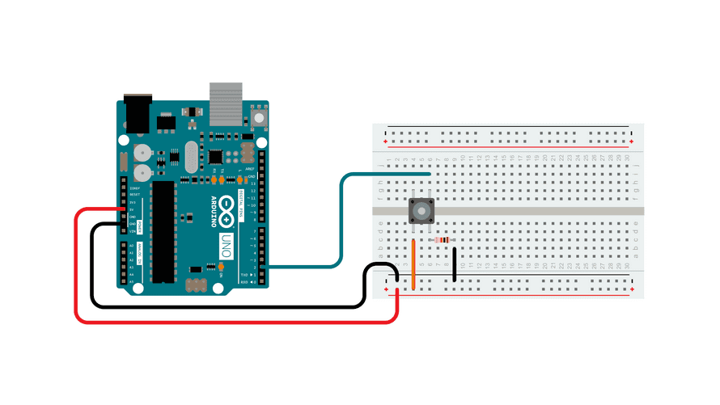

## Getting Information from the Arduino

We have sent information to the [Arduino](arduino-introduction.md) in the form of uploading a sketch and then letting it run to blink and LED or turn a servo motor, but how do we get or "read" information from the Arduino? One way is with the Serial Monitor. This example uses the serial monitor to "read" and then "print" whether or not a button is pressed.

## Example Circuit Setup

The Arduino documentation explains how the pins on the Arduino can randomly "float" around different voltages and seem to be `HIGH` or `LOW` without intentional action. This is bad if you want to get an accurate reading of what state an input pin is in. Fortunately the documentation recommends the simple solution of using a 10K resistor as a pull-down resistor to GND. This ensures that the pin reads as `LOW` when the button is not pressed.

<figure>

[](./attachments/2023-arduino-button-digital-read-serial-example-circuit-from-arduino-docs.png)

<figcaption>

[Circuit](https://www.arduino.cc/en/Tutorial/BuiltInExamples/DigitalReadSerial) by [Arduino](https://www.arduino.cc/) is licensed under [CC BY-SA 4.0](https://creativecommons.org/licenses/by-sa/4.0/) [^1]

</figcaption>
</figure>

## Example Sketch

### Variable

It sets up an integer variable `int pushButton = 2;` at the beginning of the sketch. This is the pin number that will be used to read the state of the button. It a good idea to use variables for pin assignment, that way if you need to change a pin number you only have to change it in one place instead of all over the code.

### Setup Function

The `setup();` function starts the serial communication protocol at 9600 bits per second. There are faster and slower serial communication speeds. It also sets an Arduino pin to `INPUT` rather than the `OUTPUT` that was used for the blink LED and servo sketches. This will get input from a device connected to `pushButton` which has a value of 2 referring to pin 2.

```C
// the setup routine runs once when you press reset:
void setup() {
  // initialize serial communication at 9600 bits per second:
  Serial.begin(9600);
  // make the pushbutton's pin an input:
  pinMode(pushButton, INPUT);
}
```

### Loop Function

The `loop();` function declares a new variable called `buttonState` and it uses the function `digitalRead` to get the value of `pushButton` also known as pin 2.

Then is uses `Serial.prinln();` to print the result. Then it waits for 1 millisecond before looping again.

Where does it print? It prints to the serial communication that was started in the `setup();` function.

How can we read it? In the Arduino IDE there is a "Serial Monitor" button. If you click that and make sure the speed settings match the 9600, then you will see a bunch of 0's indicating the button is not pressed or a bunch of 1's when the button is pressed.

Congratulations, now you are getting input from the the user and reading it with the Arduino. It is just 1's and 0's now but with a bit of tweaking this process and information can be used to do a near infinite number of tasks.

```C
// the loop routine runs over and over again forever:
void loop() {
  // read the input pin:
  int buttonState = digitalRead(pushButton);
  // print out the state of the button:
  Serial.println(buttonState);
  delay(1);  // delay in between reads for stability
}
```

## Full Example Sketch

```C

/*
  DigitalReadSerial

  Reads a digital input on pin 2, prints the result to the Serial Monitor

  This example code is in the public domain.

  https://www.arduino.cc/en/Tutorial/BuiltInExamples/DigitalReadSerial
*/

// digital pin 2 has a pushbutton attached to it. Give it a name:
int pushButton = 2;

// the setup routine runs once when you press reset:
void setup() {
  // initialize serial communication at 9600 bits per second:
  Serial.begin(9600);
  // make the pushbutton's pin an input:
  pinMode(pushButton, INPUT);
}

// the loop routine runs over and over again forever:
void loop() {
  // read the input pin:
  int buttonState = digitalRead(pushButton);
  // print out the state of the button:
  Serial.println(buttonState);
  delay(1);  // delay in between reads for stability
}
```

[^1]: [Arduino Digital Read Serial](https://www.arduino.cc/en/Tutorial/BuiltInExamples/DigitalReadSerial)
