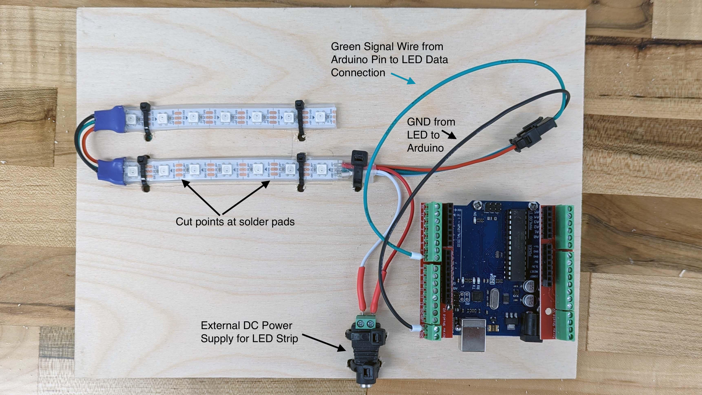
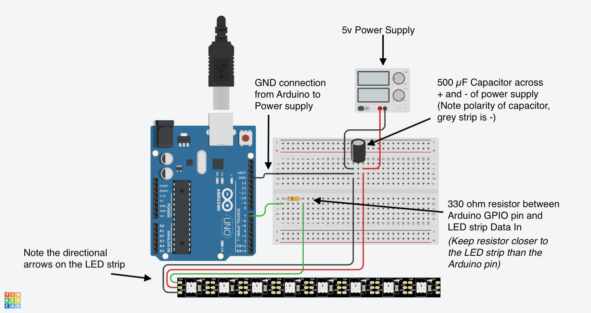

## Parts Needed

<div class="responsive-table-markdown">

| Part                | Quantity |
| ------------------- | -------- |
| Arduino             | 1        |
| 5v LED Strip        | 1        |
| 5v Power Supply     | 1        |
| Barrel Jack Adapter | 1        |
| Jumper Wires        | ~ 7      |
| Crimp Connectors    | 3-4      |

</div>

### Recommended Additional Parts

The capacitor and resistor added to the circuit follows the best practices for using a LED strip with an Arduino.

<div class="responsive-table-markdown">

| Part                  | Quantity |
| --------------------- | -------- |
| 500-1000 µF capacitor | 1        |
| 330 ohm Resistor      | 1        |

</div>

## Process

1. Solder 22AWG or 28 AWG stranded wire to the 3 solder pads on the start end of the LED strip. THis is the side that the arrows are pointing away from.
2. (Optional but recommended) Solder a 330 ohm resistor between the LED strip Data line and the pin of the Arduino.
3. (Optional but recommended) Solder a 500-1000 µF capacitor across the + positive and - negative solder pads on the LED strip. The grey stripe on the capacitor identifies the negative pin.
4. Attach a "Dupont" style pin terminal to the end of the Data In wire. This type of connector is attached with a crimper and looks like the end of the standard "jumper wires". You can also use a ferrule crimp terminal if you attach a screw terminal block to the Arduino. (The example uses a screw terminal block on the Arduino.) This will be the pin number for the Data line in the example sketches.
5. Strip ~ 1 cm of the opposite end of the wire coming from the DC+ solder pad of the LED strip. Attach a ferrule crimp to the stripped end. Connect this Ferrule crimp to the + positive screw terminal of the DC barrel jack adapter.
6. Cut the "innie" end off a black "outie to innie" jumper cable. Strip ~ 1cm of wire from the cut end. Strip ~ 1 cm of the opposite end of the wire coming from the DC- solder pad of the LED strip. Twist the striped jumper wire and the stripped LED strip wire together. Attach a ferrule crimp to the twisted together stripped ends. Connect this Ferrule crimp to the - negative screw terminal of the DC barrel jack adapter.
7. Attach the "outie" end of the black jumper wire to a GND pin of the Arduino.
8. Attach the barrel jack adapter to a 5v power source.
9. Use one of the example sketches from the FastLED library. (If you do not have the FastLED library installed, go to the library tab in the Arduino IDE and search for FastLED).
10. Take a short video of the LED demo lights.

### Wiring Example

This diagrams below show how to wire up an addressable LED strip to an Arduino.

<div class="gallery-grid">
<figure>

[](./attachments/2023-rgb-led-strip-arduino.jpg)

<figcaption>

Example wiring of and RGB LED strip to an Arduino

</figcaption>

</figure>

<figure>

[](./attachments/2023-rgb-led-strip-wiring-diagram-with-resistor-and-capacitor-tinkercad.png)

<figcaption>

Example wiring of and RGB LED strip to an Arduino with a 330 ohm Resistor and 500 µF Capacitor

</figcaption>

</figure>

</div>

### FastLED Demo Reel Sketch

Make sure to change the `DATA_PIN` value in the sketch to the pin you are using on the Arduino. The sketch below already updated the `LED_TYPE` to WS2811 and the `NUM_LEDS` to 7.

```C
#include <FastLED.h>

FASTLED_USING_NAMESPACE

// FastLED "100-lines-of-code" demo reel, showing just a few
// of the kinds of animation patterns you can quickly and easily
// compose using FastLED.
//
// This example also shows one easy way to define multiple
// animations patterns and have them automatically rotate.
//
// -Mark Kriegsman, December 2014


#define DATA_PIN    3
//#define CLK_PIN   4
#define LED_TYPE    WS2811
#define COLOR_ORDER GRB
#define NUM_LEDS    7
CRGB leds[NUM_LEDS];

#define BRIGHTNESS          96
#define FRAMES_PER_SECOND  120

void setup() {
  delay(3000); // 3 second delay for recovery

  // tell FastLED about the LED strip configuration
  FastLED.addLeds<LED_TYPE,DATA_PIN,COLOR_ORDER>(leds, NUM_LEDS).setCorrection(TypicalLEDStrip);
  //FastLED.addLeds<LED_TYPE,DATA_PIN,CLK_PIN,COLOR_ORDER>(leds, NUM_LEDS).setCorrection(TypicalLEDStrip);

  // set master brightness control
  FastLED.setBrightness(BRIGHTNESS);
}


// List of patterns to cycle through.  Each is defined as a separate function below.
typedef void (*SimplePatternList[])();
SimplePatternList gPatterns = { rainbow, rainbowWithGlitter, confetti, sinelon, juggle, bpm };

uint8_t gCurrentPatternNumber = 0; // Index number of which pattern is current
uint8_t gHue = 0; // rotating "base color" used by many of the patterns

void loop()
{
  // Call the current pattern function once, updating the 'leds' array
  gPatterns[gCurrentPatternNumber]();

  // send the 'leds' array out to the actual LED strip
  FastLED.show();
  // insert a delay to keep the framerate modest
  FastLED.delay(1000/FRAMES_PER_SECOND);

  // do some periodic updates
  EVERY_N_MILLISECONDS( 20 ) { gHue++; } // slowly cycle the "base color" through the rainbow
  EVERY_N_SECONDS( 10 ) { nextPattern(); } // change patterns periodically
}

#define ARRAY_SIZE(A) (sizeof(A) / sizeof((A)[0]))

void nextPattern()
{
  // add one to the current pattern number, and wrap around at the end
  gCurrentPatternNumber = (gCurrentPatternNumber + 1) % ARRAY_SIZE( gPatterns);
}

void rainbow()
{
  // FastLED's built-in rainbow generator
  fill_rainbow( leds, NUM_LEDS, gHue, 7);
}

void rainbowWithGlitter()
{
  // built-in FastLED rainbow, plus some random sparkly glitter
  rainbow();
  addGlitter(80);
}

void addGlitter( fract8 chanceOfGlitter)
{
  if( random8() < chanceOfGlitter) {
    leds[ random16(NUM_LEDS) ] += CRGB::White;
  }
}

void confetti()
{
  // random colored speckles that blink in and fade smoothly
  fadeToBlackBy( leds, NUM_LEDS, 10);
  int pos = random16(NUM_LEDS);
  leds[pos] += CHSV( gHue + random8(64), 200, 255);
}

void sinelon()
{
  // a colored dot sweeping back and forth, with fading trails
  fadeToBlackBy( leds, NUM_LEDS, 20);
  int pos = beatsin16( 13, 0, NUM_LEDS-1 );
  leds[pos] += CHSV( gHue, 255, 192);
}

void bpm()
{
  // colored stripes pulsing at a defined Beats-Per-Minute (BPM)
  uint8_t BeatsPerMinute = 62;
  CRGBPalette16 palette = PartyColors_p;
  uint8_t beat = beatsin8( BeatsPerMinute, 64, 255);
  for( int i = 0; i < NUM_LEDS; i++) { //9948
    leds[i] = ColorFromPalette(palette, gHue+(i*2), beat-gHue+(i*10));
  }
}

void juggle() {
  // eight colored dots, weaving in and out of sync with each other
  fadeToBlackBy( leds, NUM_LEDS, 20);
  uint8_t dothue = 0;
  for( int i = 0; i < 8; i++) {
    leds[beatsin16( i+7, 0, NUM_LEDS-1 )] |= CHSV(dothue, 200, 255);
    dothue += 32;
  }
}

```
