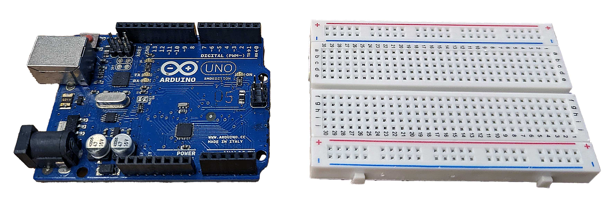

<figure>

<figcaption>

An Arduino Uno and a breadboard for electronics prototyping

</figcaption>

</figure>

Arduino is an open-source electronics platform. It consists of a physical programmable circuit board, often referred to as a microcontroller, and a piece of software, or IDE (Integrated Development Environment) that runs on your computer, used to write and upload computer code to the physical board.

The Arduino microcontroller is a small, low-cost computer used in [physical-computing](../electronics/physical-computing.md), programming a computer to "interact" with the world around it. Arduino boards have a number of input and output pins, which can be used to connect to sensors, motors, and other electronic devices. The Arduino can be programmed to read inputs from these devices and control the outputs based on the inputs.

## Download and Install the Arduino IDE 2

This [online guide](https://docs.arduino.cc/software/ide-v2/tutorials/getting-started/ide-v2-downloading-and-installing) on the Arduino website provides the Arduino Integrated Development Environment design specifically for working with the Arduino board. The new IDE 2 allows syncing sketches with the cloud. To use this feature, you will need to register for an Arduino account.

## Arduino Code and Circuit Simulators

## Arduino References

[Arduino UNO Data sheet](https://docs.arduino.cc/static/6c94080aaecc364dd9013ce042a27790/A000066-datasheet.pdf)

[Arduino Pinout PDF Download from Arduino](https://content.arduino.cc/assets/A000066-full-pinout.pdf)
