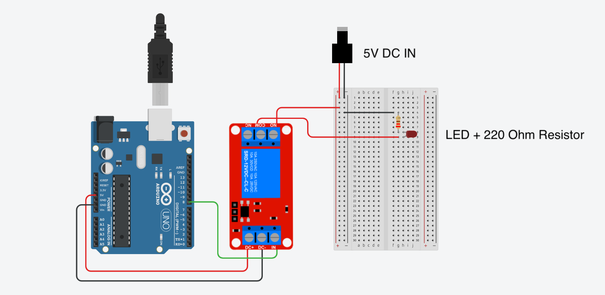

## Parts Needed

<div class="responsive-table-markdown">

| Part                | Quantity |
| ------------------- | -------- |
| Arduino             | 1        |
| Relay Module        | 1        |
| LED                 | 1        |
| 220 ohm Resistor    | 1        |
| 5v Power Supply     | 1        |
| Barrel Jack Adapter | 1        |
| Jumper Wires        | ~8       |

</div>

## Process

1. Use jumper wire to hook up 5v power from Arduino to DC+ Pin on low voltage side of relay module. (Low voltage side usually has terminals for IN / DC- / DC+)
2. Use jumper wire to hook up GND from Arduino to DC- terminal screw on low voltage side of relay module.
3. Use jumper wire to hook up control pin from Arduino to IN Pin on low voltage side of relay module.
4. Use a barrel jack adapter to connect to the output of a 5v wall adaptor power supply.
5. Connect a jumper wire to the + positive screw terminal of the barrel jack adapter. Then connect the other end of the jumper wire to the COM or common screw terminal on the high voltage side of the relay module.
6. Connect a jumper wire to the - negative screw terminal of the barrel jack adapter. Then connect the other end of the jumper wire to the negative end of the LED with the resistor inline.
7. Connect a jumper wire from the NO or normally open screw terminal of the high voltage side of the relay module. Connect the other end of this jumper wire to the positive end of the LED.
8. Use a simple sketch to blink the LED such as the blink without delay example.
9. Take a short video documenting the operation of the relay module.

### Wiring Example

This diagram shows how to wire up a relay module to a single LED using a separate 5v power supply than the Arduino. The Arduino does not need the relay module to power the LED but by using the relay module in this exercise, the wiring principles of a relay module can be understood without using high voltage or high current.

[](attachments/2023-relay-module-wire-led-5v.png)

### Example Blink Without Delay Sketch

This code uses the reusable timer function `checkTime();` to blink the LED connected to the relay module. Make sure to change the value of `ledPin` to the pin you are using on the Arduino.

```C
// Blink Without Delay Example Sketch
// Uses the checkTime(); function for millis timing

const byte ledPin = 8;  // change to the pin used for the relay in

int ledState = LOW;  // ledState used to set the LED

unsigned long blinkTimer = 0;    // will store last time LED timer was checked
unsigned long blinkRate = 1000;  // rate LED blinks in milliseconds
unsigned long currentMillis;     // keep track of current time in milliseconds

void setup() {
  Serial.begin(9600);                           // Start the serial communication
  Serial.println("Start Blink Without Delay");  // Send message that the sketch started
  pinMode(ledPin, OUTPUT);                      // set the ledPin pin as output:
}

void loop() {

  currentMillis = millis();

  if (checkTime(blinkTimer, blinkRate)) {
    // if the LED is off turn it on and vice-versa:
    if (ledState == LOW) {
      ledState = HIGH;
    } else {
      ledState = LOW;
    }
  }

  digitalWrite(ledPin, ledState);  // set the LED with the ledState of the variable:
}

// BEGIN CheckTime()
boolean checkTime(unsigned long &lastTimerExpiredTime, unsigned long timerLength) {
  // is the time up for this task?
  if (currentMillis - lastTimerExpiredTime >= timerLength) {
    lastTimerExpiredTime += timerLength;  //get ready for the next iteration
    return true;
  }
  return false;
}
//END CheckTime()
```
