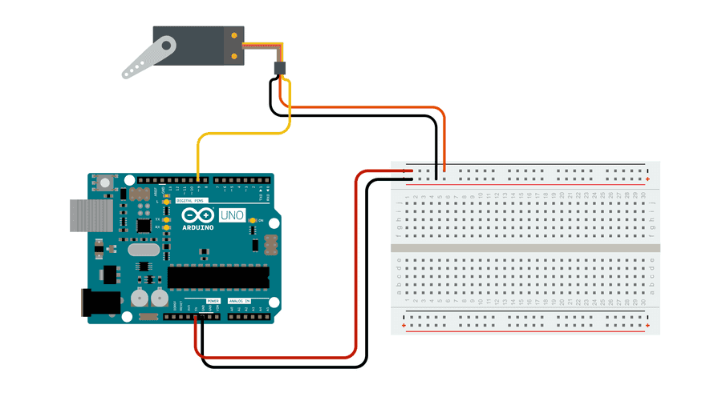

## Servo Example Circuit

<figure>

[](./2023-servo-sweep-circuit.png)

<figcaption>

[The Sweep Circuit](https://docs.arduino.cc/learn/electronics/servo-motors) by [Arduino](https://www.arduino.cc/) is licensed under [CC BY-SA 4.0](https://creativecommons.org/licenses/by-sa/4.0/) [^1]

</figcaption>
</figure>

### Hooking Up Servo to Arduino

The servo motor in this example has 3 wires.

- The yellow wire is the control wire. This goes to pin 9 on the Arduino.
- The red wire is the + wire and it goes to the positive rail on the breadboard or to 5V on the Arduino.
- The brown wire is the - wire and it goes to the negative rail on the breadboard or to GND on the Arduino.

## Servo Sweep Example Sketch

We will use the example Arduino Servo Sweep sketch by [BARRAGAN](http://barraganstudio.com). This code introduces a few new concepts that we will present briefly here but will investigate in more depth later in the semester.

```

#include <Servo.h>
```

The line at the top is including a library that has commands and functions for the servo motor. By using this include line we have access to code to control the servo that we do not have to write ourselves.

```C

Servo myservo;  // create servo object to control a servo
// twelve servo objects can be created on most boards

int pos = 0;    // variable to store the servo position
```

One of those new commands is `Servo`. This command is like declaring a variable. It creates a new object or a new servo motor to control called `myservo`. We could call the servo `superservo` the name is not important, but if the name changes then it needs to be changed everywhere in the code.

In the next line a integer variable `pos` to indicate position is declared with an initial value of 0. This is the variable that will decide what rotational position the servo will move to.

### setup function

```C

void setup() {
  myservo.attach(9);  // attaches the servo on pin 9 to the servo object
}
```

The next section of the code is the `setup();` function. This function runs only once and it tells the Arduino what pin the servo is attached to. In this case it uses pin 9.

### loop function

```C

void loop() {
  for (pos = 0; pos <= 180; pos += 1) { // goes from 0 degrees to 180 degrees
    // in steps of 1 degree
    myservo.write(pos);              // tell servo to go to position in variable 'pos'
    delay(15);                       // waits 15 ms for the servo to reach the position
  }
  for (pos = 180; pos >= 0; pos -= 1) { // goes from 180 degrees to 0 degrees
    myservo.write(pos);              // tell servo to go to position in variable 'pos'
    delay(15);                       // waits 15 ms for the servo to reach the position
  }
}
```

The next section of code is the `loop();` function. This function loops over and over again and controls the sweep of the servo motor arm. It uses two `for` loops. We will examine `for` loops later in the semester but basically they do something a certain amount of times or until some condition is met. In this case they move the servo arm one direction until it gets to 180 and then they move the servo arm the other direction until it gets to zero. Then the process repeats.

## Full Sweep Code

```C

#include <Servo.h>

Servo myservo;  // create servo object to control a servo
// twelve servo objects can be created on most boards

int pos = 0;    // variable to store the servo position

void setup() {
  myservo.attach(9);  // attaches the servo on pin 9 to the servo object
}

void loop() {
  for (pos = 0; pos <= 180; pos += 1) { // goes from 0 degrees to 180 degrees
    // in steps of 1 degree
    myservo.write(pos);              // tell servo to go to position in variable 'pos'
    delay(15);                       // waits 15 ms for the servo to reach the position
  }
  for (pos = 180; pos >= 0; pos -= 1) { // goes from 180 degrees to 0 degrees
    myservo.write(pos);              // tell servo to go to position in variable 'pos'
    delay(15);                       // waits 15 ms for the servo to reach the position
  }
}

```

## Modifying the Servo Behavior

There are a few parameters that you can change to control the servo.

### Range of Position

The first is the positional range. By default it runs from 0 - 180 but this could be changed to 0-50 or 66-98 or 45 - 176 or any other range. Make sure to change the range in both for loops. If the beginning and ending `pos` numbers don't match the servo will jump to the next position at the end of the loop.

### Speed of Sweep

The `delay();` function in both `for` loops controls the speed of the servo sweep. They default to 15 milliseconds. Decreasing these makes the servo sweep faster while increasing them makes it move slower. Since there are two `for` loops you can have different speeds for each direction.

### Arduino Servo Library Reference

The included [servo library](https://www.arduino.cc/reference/en/libraries/servo/) at the top of the sketch can do more than this example. Some additional functions to try are listed below. [^2]

- `attach()` - Attaches a servo to a pin on the Arduino. It is used in the `setup();` function of this example sketch.
- `write()` - Tells the servo a specific position to go to, for example `myservo.write(56);` tells the servo to go to 56 degrees. In the sketch above the variable `pos` is used instead of a hardcoded value but numbers can be used in this function as well.
- `writeMicroseconds()` - Some servos can be more precise that 0 - 180 degrees and can be written from 1000 - 2000 microseconds using this function.
- `read()` - "Reads" the last value the `write()` function sent to the servo.
- `attached()` - Check to see if an Arduino pin is being used by the servo.
- `detach()` - Removes the servo from the Arduino pin.

[^1]: https://docs.arduino.cc/learn/electronics/servo-motors
[^2]: https://www.arduino.cc/reference/en/libraries/servo/
