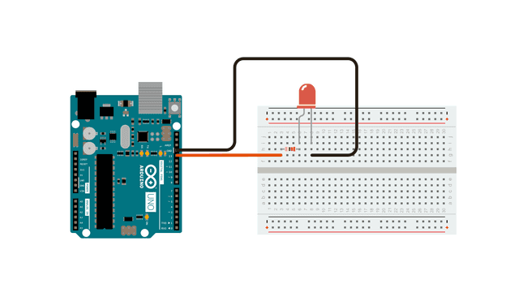

## What is Wrong with `delay();`?

The `delay();` function is considered "blocking". What does that mean? The Arduino loop is **very** fast. It runs at 16Mhz or 16 million cycles per second! [^1] The delay function runs in milliseconds. There are only 1000 milliseconds in a second. 1000 is **a lot** less than 16 million. That means even if you use `delay(1);` in your code, the Arduino is sitting around doing nothing for 16,000 cycles. All those cycles could be used to do so many more tasks. So how do you make an Arduino Program without using `delay();`?

The short answer is to use a timer.

Great that seems simple, let's do it. It is simple but it is also pretty complex and can take awhile to wrap your head around. We will study ways to make timers and multitask with the Arduino much more but for now we will introduce a millisecond timer. It is nothing more than a stopwatch that counts in milliseconds instead of seconds.

## Blink Without Delay Example Circuit

We will start with removing the `delay();` function from the original blink example. The original example had `delay(1000);` to pause the LED blinking for 1 second on and off. That is wasting 160,000 clock cycles for each LED blink. Yikes!

Wire up the circuit the same way as before. You can use the on-board LED or hook up an external LED like the example circuit diagram from Arduino.

<figure>

[](attachments/2023-blink-without-delay-circuit-image-from-arduino-docs.png)

<figcaption>

[Circuit](https://docs.arduino.cc/built-in-examples/digital/BlinkWithoutDelay) by [Arduino](https://www.arduino.cc/) is licensed under [CC BY-SA 4.0](https://creativecommons.org/licenses/by-sa/4.0/) [^2]

</figcaption>
</figure>

## Blink Without Delay Example Sketch

Let's look what is different than the original blink example.

### New Variables

At the top of the sketch, two new variables are introduced. One variable stores the time in milliseconds when the LED "state" (on or off) was updated. You could do the same with a clock and keep track of the time the clock read the last time you looked at your cellphone.

The sketch uses `previousMillis` to store the time in milliseconds with an initial value of 0. The next variable `interval` sets the duration of the LED blink. In this case it starts with 1000 milliseconds, so the LED will blink at a rate of 1 second on and off.

```C
// Generally, you should use "unsigned long" for variables that hold time
// The value will quickly become too large for an int to store
unsigned long previousMillis = 0;  // will store last time LED was updated

// constants won't change:
const long interval = 1000;  // interval at which to blink (milliseconds)
```

### Setup Function

The setup function remains the same.

### Loop Function

The `loop();` function does two new things.

1. At the beginning of each pass through the loop it updates the current time in milliseconds. It records this time value as `currentMillis`. You could do the same thing running laps on a track. Each time you pass the start line, you check the time on the stopwatch. The only difference is the loop runs much faster than you can run around a track.
2. The code then subtracts the `previousMillis` (last time LED was updated) from the value of `currentMillis`. If this result is greater than or equal to the value of the `interval` then the LED will blink. If it is not, then the loop runs again, checks the time, does the math, and sees if the interval has passed, over and over and over.

### What?

This seems confusing, but you do the same thing in your life all the time. Ever made toast, coffee, or microwave popcorn? Do you stop everything you are doing and wait for the toast to finish, or the coffee pot to stop, or the popcorn to stop popping? _(Well maybe the popcorn, because the smell of burnt popcorn can be kinda gross.)_

Of course not.

While the toast is toasting you might go to the fridge to get butter or jam. While the coffee is brewing you might get out a mug or pour creamer. While the popcorn is popping you might get out a bowl, look for the salt, or pick something to watch. And while doing all of these things while you wait you probably also check you cell phone infinity times and open the fridge two more times to stare at its contents.

While you get other things done or "multitask" the toaster, coffee maker, and microwave all have timers. When the time is up, **then** you can briefly pause getting your mug out to get the toast on a plate. Then you can get back to your other tasks until the next timer goes off.

### Still Confused?

Probably. `millis();` based timers can be confusing in the beginning but are essential to have an Arduino do even the most basic tasks at the same time. We will study it in multiple ways and it will begin to sink in over time and before you know it you will have lots of different timers to control your robot that makes your toast, brews your coffee, and pops your popcorn.

## Blink Without Delay Example Sketch

```C
/*
  Blink without Delay

  Turns on and off a light emitting diode (LED) connected to a digital pin,
  without using the delay() function. This means that other code can run at the
  same time without being interrupted by the LED code.

  The circuit:
  - Use the onboard LED.
  - Note: Most Arduinos have an on-board LED you can control. On the UNO, MEGA
    and ZERO it is attached to digital pin 13, on MKR1000 on pin 6. LED_BUILTIN
    is set to the correct LED pin independent of which board is used.
    If you want to know what pin the on-board LED is connected to on your
    Arduino model, check the Technical Specs of your board at:
    https://www.arduino.cc/en/Main/Products

  created 2005
  by David A. Mellis
  modified 8 Feb 2010
  by Paul Stoffregen
  modified 11 Nov 2013
  by Scott Fitzgerald
  modified 9 Jan 2017
  by Arturo Guadalupi

  This example code is in the public domain.

  https://www.arduino.cc/en/Tutorial/BuiltInExamples/BlinkWithoutDelay
*/

// constants won't change. Used here to set a pin number:
const int ledPin = LED_BUILTIN;  // the number of the LED pin

// Variables will change:
int ledState = LOW;  // ledState used to set the LED

// Generally, you should use "unsigned long" for variables that hold time
// The value will quickly become too large for an int to store
unsigned long previousMillis = 0;  // will store last time LED was updated

// constants won't change:
const long interval = 1000;  // interval at which to blink (milliseconds)

void setup() {
  // set the digital pin as output:
  pinMode(ledPin, OUTPUT);
}

void loop() {
  // here is where you'd put code that needs to be running all the time.

  // check to see if it's time to blink the LED; that is, if the difference
  // between the current time and last time you blinked the LED is bigger than
  // the interval at which you want to blink the LED.
  unsigned long currentMillis = millis();

  if (currentMillis - previousMillis >= interval) {
    // save the last time you blinked the LED
    previousMillis = currentMillis;

    // if the LED is off turn it on and vice-versa:
    if (ledState == LOW) {
      ledState = HIGH;
    } else {
      ledState = LOW;
    }

    // set the LED with the ledState of the variable:
    digitalWrite(ledPin, ledState);
  }
}

```

[^1]: https://docs.arduino.cc/hardware/uno-rev3
[^2]: https://docs.arduino.cc/built-in-examples/digital/BlinkWithoutDelay
