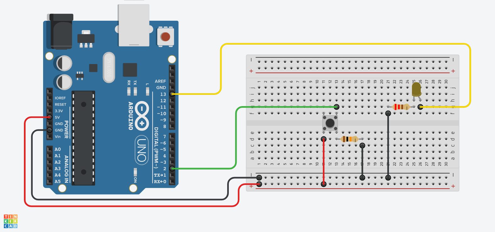
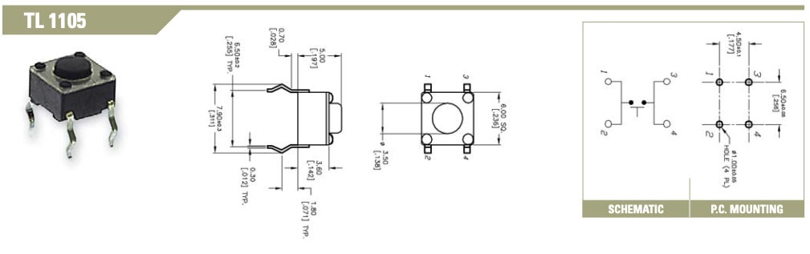

Buttons are one of the most common ways to capture user input. Buttons are used in video game controllers, microwaves, cars, heated toilet seats, gas station pumps, computer keyboards and so many more devices.

In the previous example we captured that input with the Serial Monitor as 1's and 0's. This can be thought of as on and off. We will use a button to control and LED by switching it on and off.

## Arduino Button Example Circuit [^1]

<figure>

[](attachments/2023-arduino-led-button-circuit-made-with-tinkercad.png)

<figcaption>

Image made with [Tinkercad Circuits](https://www.tinkercad.com/circuits) [^2]

</figcaption>
</figure>

The circuit above has a button, LED, and two resistors. The LED is connected to pin 13 and a 220 ohm resistor to GND just like the previous blink example. This time instead of the sketch controlling when the LED blinks, the button on the breadboard sends a signal to the Arduino to turn pin 13 on when pressed. The button has a 10K ohm resistor to GND and switches the 5V leg to pin 2 on the Arduino.

### Tactile Switches / Buttons

Many manufactures make tactile Single Pole Single Throw Switches (SPST) but most operate in the same way. There are four pins. The pins are connected inside the switch parallel to the pins. When the button is pressed, then the pins are connected in the direction perpendicular to the pins. The image below is of a common tactile switch made by [E-Switch](https://www.e-switch.com/). The datasheet shows how the pins contact each other when pressed. Although most of these switches operate the same way always double check with the manufacture's datasheet when in doubt.

<figure>

[](attachments/2023-e-switch-TL1105-from-datasheet.jpg)

<figcaption>

Image from [E-Switch](https://www.e-switch.com/) TL1105 [datasheet](https://www.e-switch.com/wp-content/uploads/2022/06/TL1105.pdf) [^3]

</figcaption>
</figure>

## Example Arduino LED Button Sketch

### Variables

The sketch declares three variables the first two `int` integer (number) variables and use `const` to indicate that their values should remain constant and never change. The third `int` variable `buttonState` records the "state" or "status" of the button. It starts with a value of `0` to keep the button off at the beginning of the sketch.

```C
// constants won't change. They're used here to set pin numbers:
const int buttonPin = 2;  // the number of the pushbutton pin
const int ledPin = 13;    // the number of the LED pin

// variables will change:
int buttonState = 0;  // variable for reading the pushbutton status

```

### Setup Function

The `setup();` function introduces an `OUTPUT` pin to control the LED just like the blink example sketch and an `INPUT` pin to record the button presses.

```C
void setup() {
  // initialize the LED pin as an output:
  pinMode(ledPin, OUTPUT);
  // initialize the pushbutton pin as an input:
  pinMode(buttonPin, INPUT);
}
```

### Loop Function

The `loop();` function uses the `digitalRead();` function to read the value of the `INPUT` on `buttonPin`. When the button is pressed it will be `HIGH` and when the button is not pressed it will be `LOW`. It sets this value to the variable `buttonState`

Then there is an `if` ... `else` statement that controls the LED based on the status of the `buttonState`. If it is `HIGH` then it uses the `digitalWrite();` function to turn the LED pin on. The next part `else` says "if that didn't happen, then do this", or turn the LED off.

```C
void loop() {
  // read the state of the pushbutton value:
  buttonState = digitalRead(buttonPin);

  // check if the pushbutton is pressed. If it is, the buttonState is HIGH:
  if (buttonState == HIGH) {
    // turn LED on:
    digitalWrite(ledPin, HIGH);
  } else {
    // turn LED off:
    digitalWrite(ledPin, LOW);
  }
}

```

### Full Button Sketch

This is the full sketch that you can copy and send to the Arduino once you set up the circuit. This example is also in the Arduino IDE.

```C++
/*
  Button

  Turns on and off a light emitting diode(LED) connected to digital pin 13,
  when pressing a pushbutton attached to pin 2.

  The circuit:
  - LED attached from pin 13 to ground through 220 ohm resistor
  - pushbutton attached to pin 2 from +5V
  - 10K resistor attached to pin 2 from ground

  - Note: on most Arduinos there is already an LED on the board
    attached to pin 13.

  created 2005
  by DojoDave <http://www.0j0.org>
  modified 30 Aug 2011
  by Tom Igoe

  This example code is in the public domain.

  https://www.arduino.cc/en/Tutorial/BuiltInExamples/Button
*/

// constants won't change. They're used here to set pin numbers:
const int buttonPin = 2;  // the number of the pushbutton pin
const int ledPin = 13;    // the number of the LED pin

// variables will change:
int buttonState = 0;  // variable for reading the pushbutton status

void setup() {
  // initialize the LED pin as an output:
  pinMode(ledPin, OUTPUT);
  // initialize the pushbutton pin as an input:
  pinMode(buttonPin, INPUT);
}

void loop() {
  // read the state of the pushbutton value:
  buttonState = digitalRead(buttonPin);

  // check if the pushbutton is pressed. If it is, the buttonState is HIGH:
  if (buttonState == HIGH) {
    // turn LED on:
    digitalWrite(ledPin, HIGH);
  } else {
    // turn LED off:
    digitalWrite(ledPin, LOW);
  }
}
```

[^1]: [Arduino Docs - Buttons](https://docs.arduino.cc/built-in-examples/digital/Buttons)
[^2]: [TinkerCad Circuits](https://www.tinkercad.com/circuits)
[^3]: [TL1105 Datasheet](https://www.e-switch.com/wp-content/uploads/2022/06/TL1105.pdf) [(Archive)](attachments/TL1105.pdf)
