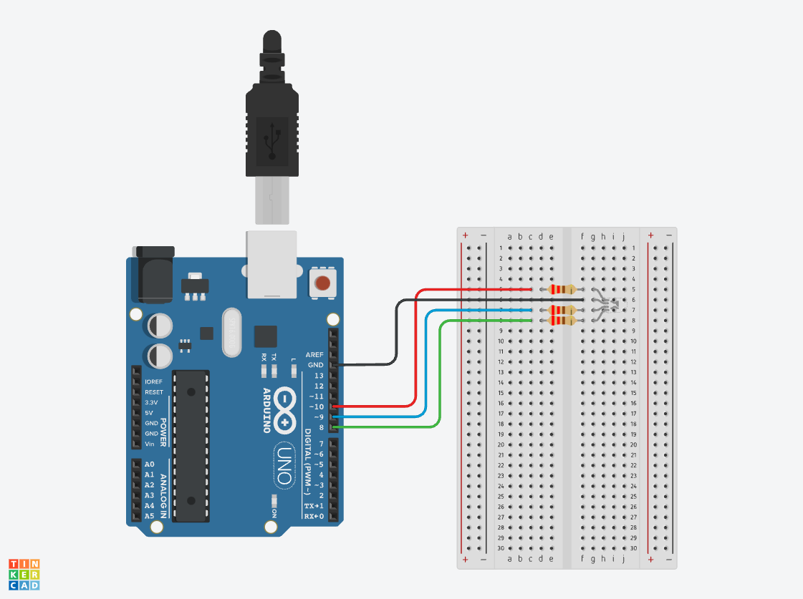

## Components Needed

<div class="responsive-table-markdown">

| Component      | Quantity |
| -------------- | -------- |
| Arduino        | 1        |
| 220 Ω Resistor | 3        |
| RGB LED        | 1        |
| Jumper Wires   | 4        |

</div>

## RGB LED Circuit

<figure>

[](./attachments/2023-rgb-led-cycle-colors-circuit.png)

<figcaption>

Image made with [Tinkercad Circuits](https://www.tinkercad.com/circuits) [^1]

</figcaption>
</figure>

## Cycle RGB LED Colors Sketch

```C
// RGB LED Arduino Example Sketch

const byte RED_LED = 10;   //set a variable for the red led
const byte GREEN_LED = 8;  //set a variable for the green led
const byte BLUE_LED = 9;   //set a variable for the blue led

unsigned long currentMillis;  // keeps track of current time in Milliseconds
unsigned long cycleRGBLEDTimer; //
unsigned long cycleDelay = 1;

void setup() {
  Serial.begin(9600);                         // start the serial port
  Serial.println("Starting RGB LED Sketch");  // Print a message to seraial monitor so we know it started

  pinMode(RED_LED, OUTPUT);    // set the red led pin as output
  pinMode(GREEN_LED, OUTPUT);  // set the green led pin as output
  pinMode(BLUE_LED, OUTPUT);   // set the blue led pin as output
  cycleRGBLEDTimer = millis();
  ledTimer = millis();
}

enum colorCycles { RED,
                   RED_GREEN,
                   GREEN,
                   GREEN_BLUE,
                   BLUE,
                   RED_BLUE };

colorCycles colorState = RED;

void loop() {
  currentMillis = millis();
  ledColorPicker(red, blue, green);
  cycleRGBLED();
}

void cycleRGBLED() {
  switch (colorState) {

    case RED:
      if (checkTime(cycleRGBLEDTimer, cycleDelay)) {
        green++;
      }
      if (green >= 255) {
        colorState = RED_GREEN;
      }
      break;

    case RED_GREEN:
      if (checkTime(cycleRGBLEDTimer, cycleDelay)) {
        red--;
        if (red <= 0) {
          colorState = GREEN;
        }
      }
      break;

    case GREEN:
      if (checkTime(cycleRGBLEDTimer, cycleDelay)) {
        blue++;
      }
      if (blue >= 255) {
        colorState = GREEN_BLUE;
      }
      break;

    case GREEN_BLUE:
      if (checkTime(cycleRGBLEDTimer, cycleDelay)) {
        green--;
      }
      if (green <= 0) {
        colorState = BLUE;
      }

      break;

    case BLUE:
      if (checkTime(cycleRGBLEDTimer, cycleDelay)) {
        red++;
        if (red >= 255) {
          colorState = RED_BLUE;
        }
      }
      break;

    case RED_BLUE:
      if (checkTime(cycleRGBLEDTimer, cycleDelay)) {
        blue--;
      }
      if (blue <= 0) {
        colorState = RED;
      }
      break;
  }
}

void ledColorPicker(int redValue, int greenValue, int blueValue) {
  analogWrite(RED_LED, redValue);
  analogWrite(GREEN_LED, greenValue);
  analogWrite(BLUE_LED, blueValue);
}

// variable names modified from original by Larry D for clarity
// timerLength is how long the timer is in Milliseconds
// lastTimerExpiredTime is the time in Milliseconds of the last time the timer expired
// BEGIN CheckTime()
boolean checkTime(unsigned long &lastTimerExpiredTime, unsigned long timerLength) {
  // is the time up for this task?
  if (currentMillis - lastTimerExpiredTime >= timerLength) {
    lastTimerExpiredTime += timerLength;  //get ready for the next iteration
    return true;
  }
  return false;
}
//END CheckTime()
```

## Cycle RGB LED Colors on TinkerCad

<!-- TinkerCad RGB LED -->
<div class="iframe-tinkercad-container">
<iframe class="responsiveIframe" width="725" height="453" src="https://www.tinkercad.com/embed/a7phEZOZgUO?editbtn=1" frameborder="0" marginwidth="0" marginheight="0" scrolling="no"></iframe>
</div>

[^1]: https://www.tinkercad.com/circuits
