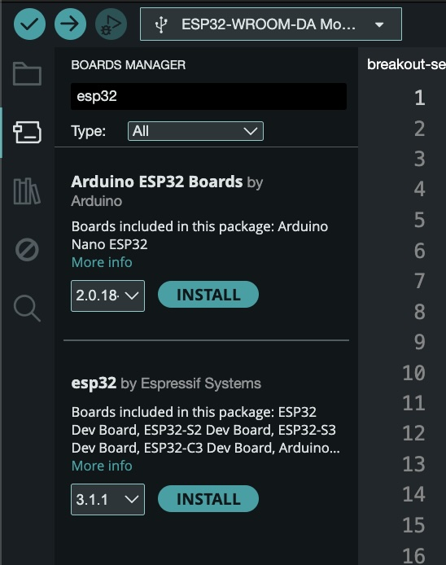
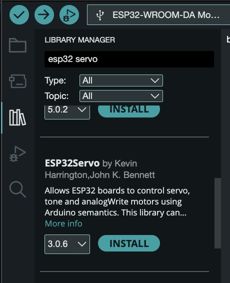

## Install Arduino IDE ESP32 Tools

<figure>

<figcaption>

Install ESP32 Board Manager tools in Arduino IDE

</figcaption>
</figure>

<figure>

<figcaption>

Install ESP32 Servo Library

</figcaption>
</figure>

## Install ESP32 Core
