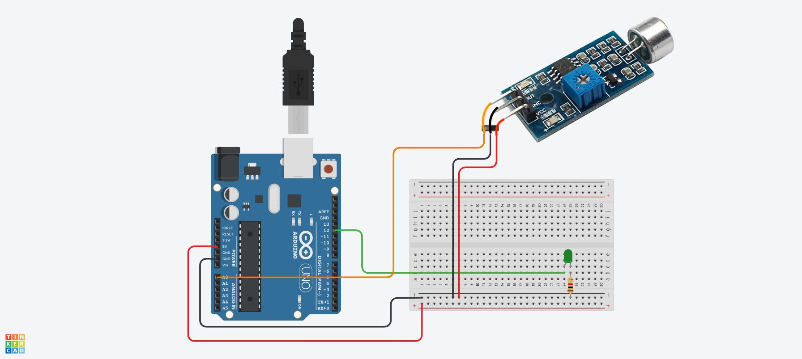

This example uses an electret condenser microphone module to control the blinking of a LED. With the addition of an external power supply, this code could control a strip of LEDs for a large display.

## Basic Mic Module Circuit Hook Up

[](./attachments/2023-basic-microphone-circuit.jpg)

## Basic Mic Code

```C
const int micPin = A0;  // pin for the microphone
int micVolume;          // value of the microphone
int micThreshold = 200; // mic threshold

const int soundActivatedLEDs = 13; // pin for the LEDs

unsigned long currentMilliseconds = 0;      // current time in milliseconds
unsigned long previousMillisecondsPot = 0;  // Time track for potentiometer

void setup() {
  Serial.begin(9600);  // start serial monitor
  pinMode(soundActivatedLEDs, OUTPUT); // make LED pin as output
}

void loop() {
  currentMilliseconds = millis();
  readMic(); // reads the microphone
}

void readMic() {
  micVolume = analogRead(micPin);  // Reads the value from the microphone

    if (micVolume >= micThreshold) {
      digitalWrite(soundActivatedLEDs, HIGH);  // Turn ON Led
    } else {
      digitalWrite(soundActivatedLEDs, LOW);  // Turn OFF Led
    }
}
```

## Circuit Setup

You need a microphone module, a potentiometer, a LED, and a resistor for the LED. The potentiometer middle pin is hooked up to A0, the microphone is hooked up to A3 and the LED is hooked up to 12.

This code uses a potentiometer to turn off the LED when the potentiometer reads 100 or under. Then if it is above 100 it uses that level as the threshold to activate the LED. This allows the program to both be shut off and adjusted to different environments, loud and quiet.

### Serial Monitor

It also prints the value of the potentiometer from 0 - 1023 in the Serial Monitor of the Arduino IDE for testing the threshold. Go to Tools > Serial Monitor and match the 9600 speed and you will see the value of the potentiometer printed out every quarter second.

[](./attachments/2023-microphone-control-led.jpg)

## Code to Mic Threshold Controlled by Potentiometer

```C

/*
Make a LED blink with  sound, speech, or music.
Adjust the blink threshold or turn LED off with the potentiometer.
*/

const int potPin = A3;  // pin for the potentiometer
int potValue = 0;       // value of the potentiometer

const int micPin = A0;  // pin for the microphone
int micVolume;          // value of the microphone

const int soundActivatedLEDs = 13; // pin for the LEDs

long samplePotInterval = 250; // sample the potentiometer every 250 milliseconds or 1/4 second
unsigned long currentMilliseconds = 0;      // current time in milliseconds
unsigned long previousMillisecondsPot = 0;  // Time track for potentiometer

void setup() {
  Serial.begin(9600);  // start serial monitor
  pinMode(soundActivatedLEDs, OUTPUT); // make LED pin as output
}

void loop() {
  currentMilliseconds = millis();
  readMic(); // reads the microphone
  printPot(); // prints the potentiometer value to serial monitor
}

void readMic() {
  micVolume = analogRead(micPin);  // Reads the value from the microphone
  potValue = analogRead(potPin);   // Reads the value from the potentiometer

  if (potValue <= 100) {           // if potentiometer is less than or equal to 100 turn off LEDs
    digitalWrite(soundActivatedLEDs, LOW);  // Turn OFF Led
  }

  else if (potValue >= 101) {      // if greater than or equal to 101 then the mic controls the LEDs

    if (micVolume >= potValue) {
      digitalWrite(soundActivatedLEDs, HIGH);  // Turn ON Led
    } else {
      digitalWrite(soundActivatedLEDs, LOW);  // Turn OFF Led
    }
  }
}

void printPot() {
  if (currentMilliseconds - previousMillisecondsPot >= samplePotInterval) {
    // save the last time you printed the potentiometer
    previousMillisecondsPot = currentMilliseconds; // set the previous check time to current time
    Serial.print("Potentiometer: ");
    Serial.println(potValue);  // serial print the voltage output from the analog read of the potentiometer pin
  }
}
```
