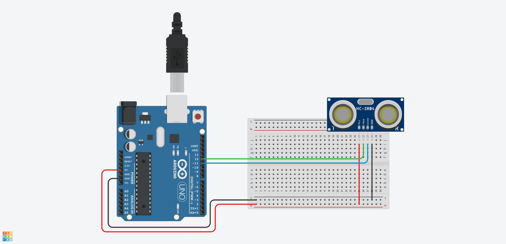

The previous ultrasonic sensor code example uses a state machine to control the timing of the pings and echos that determine an object's distance. This works but can be alot to include in your sketch, especially if you want to do other things and keep things tidy.

Fortunately there are many libraries available for the Arduino platform that perform basic functions such as pinging an ultrasonic sensor. One such library is the NewPing library. We will use many Arduino Libraries.

To use a library, you need to make sure it is installed on your computer and that you include it at the top of your sketch. You include a library by using `#include`. So to include the NewPing library, you install it in the IDE and then put `#include <NewPing.h>` at the top of your sketch.

## Installing the New Ping Library by Tim Eckel [^1]

<div class="two-column-instructions-grid">

- Click on the library icon
- Type newping into the search bar
- Install the NewPing library by Tim Eckel

[](attachments/2023-newping-library-install.jpg)

</div>

## Basic Ultrasonic Sensor Circuit for Testing NewPing Library

[](attachments/2023-ultrasonic-sensor-circuit.png)

### NewPing Example Sketch from the Documentation

This sketch starts the serial monitor and prints the distance from the sensor. There are variables to change the max distance that the sensor reads.

NOTE: If you do not see anything when you turn the serial monitor on make sure you set the speed in the serial monitor to 115200.

NOTE: This basic example sketch uses `delay(30);` in the code, so it is blocking code and would not work with other sketches unless modified. The 2nd example below with an LED uses the libraries supplied timer example without `delay();`.

```C
// ---------------------------------------------------------------------------
// Example NewPing library sketch that does a ping about 20 times per second.
// ---------------------------------------------------------------------------

#include <NewPing.h>

#define TRIGGER_PIN  12  // Arduino pin tied to trigger pin on the ultrasonic sensor.
#define ECHO_PIN     11  // Arduino pin tied to echo pin on the ultrasonic sensor.
#define MAX_DISTANCE 200 // Maximum distance we want to ping for (in centimeters). Maximum sensor distance is rated at 400-500cm.

NewPing sonar(TRIGGER_PIN, ECHO_PIN, MAX_DISTANCE); // NewPing setup of pins and maximum distance.

void setup() {
  Serial.begin(115200); // Open serial monitor at 115200 baud to see ping results.
}

void loop() {
  delay(50);                     // Wait 50ms between pings (about 20 pings/sec). 29ms should be the shortest delay between pings.
  Serial.print("Ping: ");
  Serial.print(sonar.ping_cm()); // Send ping, get distance in cm and print result (0 = outside set distance range)
  Serial.println("cm");
}
```

## Ultrasonic Sensor Circuit with LED Added

This is the same ultrasonic sensor circuit with LED from the previous example with the state machine. Now we will blink the LED using the NewPing library. This also removes the 50 millisecond delay from the original example NewPing sketch.

[](attachments/2023-ultrasonic-sensor-circuit-with-led.png)

### NewPing Example Sketch with Added LED without `delay();`

This sketch adds a blinking LED that activates when the ultrasonic sensor reads a specified distance. In the documentation for this NewPing without `delay();` example sketch, Tim Ekel notes that the sketch uses the Arduino Timer2. This has some limitations with using other functions that use Timer2 such as PWM on certain pin and the tone library. Read the [NewPing documentation](https://bitbucket.org/teckel12/arduino-new-ping/wiki/Home) for more information. [^2]

```C

#include <NewPing.h>

#define TRIGGER_PIN  12  // Arduino pin tied to trigger pin on ping sensor.
#define ECHO_PIN     11  // Arduino pin tied to echo pin on ping sensor.
#define MAX_DISTANCE 200 // Maximum distance we want to ping for (in centimeters). Maximum sensor distance is rated at 400-500cm.

NewPing sonar(TRIGGER_PIN, ECHO_PIN, MAX_DISTANCE); // NewPing setup of pins and maximum distance.

unsigned int pingSpeed = 50; // How frequently are we going to send out a ping (in milliseconds). 50ms would be 20 times a second.
unsigned long pingTimer;     // Holds the next ping time.

// Added LED Blink Code
const int ultraLEDPin = 13;  // pin of LED to turn on with Ultrasonic sensor
int distance;            // Distance calculated by ultrasonic sensor
int reactDistance = 40;  // Distance the sensor reacts to in centimeters
// End added LED Blink Code

void setup() {
  Serial.begin(115200); // Open serial monitor at 115200 baud to see ping results.
  pingTimer = millis(); // Start now.
  pinMode(ultraLEDPin, OUTPUT);  // sets the ultraLEDpin as output
} // end of setup()

void loop() {

  if (millis() >= pingTimer) {   // pingSpeed milliseconds since last ping, do another ping.
    pingTimer += pingSpeed;      // Set the next ping time.
    sonar.ping_timer(echoCheck); // Send out the ping, calls "echoCheck" function every 24uS where you can check the ping status.
  }
  if (distance <= reactDistance) { // check if distance is less than reactDistance
    digitalWrite(ultraLEDPin, HIGH); // turn on the LED pin
  } else {
    digitalWrite(ultraLEDPin, LOW);  // if distance is farther turn off LED pin
  }
} // end of loop()

void echoCheck() {
  // Timer2 interrupt calls this function every 24uS where you can check the ping status.
  // Don't do anything here!
  if (sonar.check_timer()) { // This is how you check to see if the ping was received.
    // Here's where you can add code.
    Serial.print("Ping: ");
    Serial.print(sonar.ping_result / US_ROUNDTRIP_CM); // Ping returned, uS result in ping_result, convert to cm with US_ROUNDTRIP_CM.
    Serial.println("cm");

    distance = sonar.ping_result / US_ROUNDTRIP_CM;  // sets the distance variable to the distance in cm
  }
  // Don't do anything here!
} // end of echoCheck()


```

[^1]: https://bitbucket.org/teckel12/arduino-new-ping/wiki/Home
[^2]: https://bitbucket.org/teckel12/arduino-new-ping/wiki/Home#!event-timer-sketch
