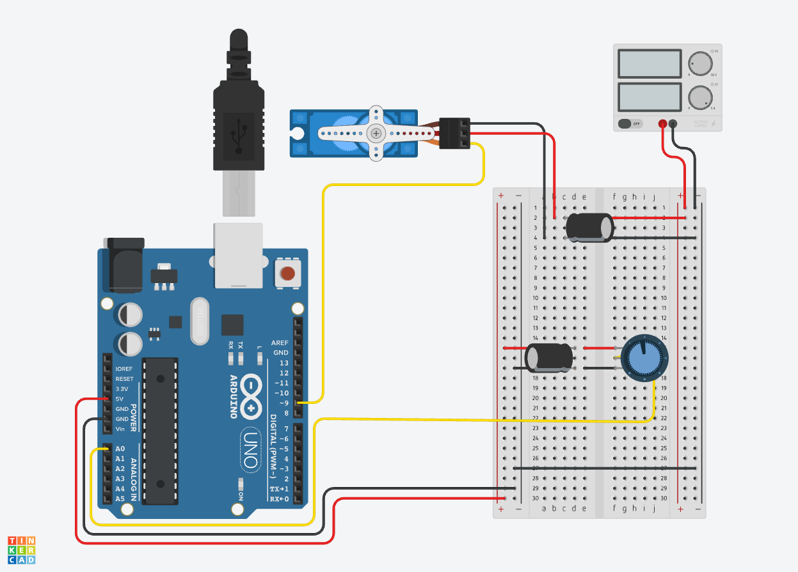
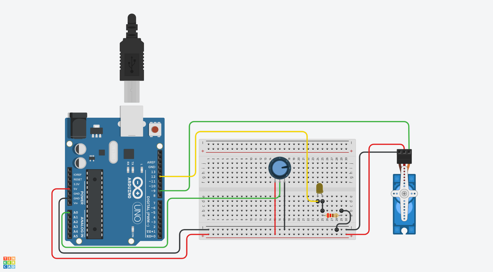

The first step to removing unecessary `delay();` from [Arduino](arduino-introduction.md) programs is to make a project with an LED that [can blink without a `delay();` function](./blink-led-without-delay-arduino.md). That example can be extended to add a button that works to debounce without `delay();`

The servo examples from the Arduino documentation, [sweep](./servo-sweep-arduino-example.md) and [knob](./servo-knob-arduino.md), both use `delay();`. This section shows how to remove the delay from the knob example but could be applied to sweep as well by following the principles of [how to remove `delay();` from an Arduino sketch](./how-to-remove-delay-from-arduino-sketch.md) instructions.

## Wrap the Task in a Millisecond Timer

This sketch simply takes the servo knob example from Arduino and wraps it inside the millisecond timer function from blink without delay. [^1] For simple functions and timers this will work to replace delay for most sketches.

Now that the micro controller is not blocked by the `delay();` other separate tasks such as playing a sound, reading a sensor (like a button), flashing an LED can happen on their own timers.

## Servo Knob Without Delay Circuit

[](attachments/2025-servo-knob-without-delay.png)

## Servo Know without Delay Sketch

```C
#include <Servo.h>

unsigned long previousMillis = 0;  // will store last time servo was updated

// constants won't change:
const long interval = 15;  // interval at which to update servo (milliseconds)


Servo myservo;  // create servo object to control a servo

int potpin = 0;  // analog pin used to connect the potentiometer
int val;    // variable to read the value from the analog pin

void setup() {
  myservo.attach(9);  // attaches the servo on pin 9 to the servo object
}

void loop() {
  unsigned long currentMillis = millis();


if (currentMillis - previousMillis >= interval) {

    previousMillis = currentMillis;      // save the last time you wrote to the servo

    val = analogRead(potpin);            // reads the value of the potentiometer (value between 0 and 1023)
    val = map(val, 0, 1023, 0, 180);     // scale it to use it with the servo (value between 0 and 180)
    myservo.write(val);                  // sets the servo position according to the scaled value
    }

}
```

## Add a Blink Without Delay LED

### Example Circuit Adding a Blinking LED

[](./attachments/2023-servo-knob-and-blink-without-delay.png)

### Example Code With Blinking LED and Servo

```C
#include <Servo.h>

unsigned long previousMillis = 0;  // will store last time servo was updated
unsigned long LEDpreviousMillis = 0;  // will store last time servo was updated

// constants won't change:
const long interval = 15;  // interval at which to update servo (milliseconds)
const long LEDinterval = 1000;  // interval at which to update servo (milliseconds)

const int potpin = 0;  // analog pin used to connect the potentiometer
const int ledPin = 13;  // Set LED Pin to 13

Servo myservo;  // create servo object to control a servo

// variables will change
int val;    // variable to read the value from the analog pin
int ledState = LOW;  // ledState used to set the LED

void setup() {
  myservo.attach(9);  // attaches the servo on pin 9 to the servo object
  pinMode(ledPin, OUTPUT); // sets LED pin as output
}

void loop() {
  unsigned long currentMillis = millis(); // update to current time in milliseconds

// Servo Timer If Conditional
  if (currentMillis - previousMillis >= interval) {

    previousMillis = currentMillis;      // save the last time you wrote to the servo

    val = analogRead(potpin);            // reads the value of the potentiometer (value between 0 and 1023)
    val = map(val, 0, 1023, 0, 180);     // scale it to use it with the servo (value between 0 and 180)
    myservo.write(val);                  // sets the servo position according to the scaled value
    }


// LED Timer If Conditional
  if (currentMillis - LEDpreviousMillis >= LEDinterval) {
    // save the last time you blinked the LED
    LEDpreviousMillis = currentMillis;

    // if the LED is off turn it on and vice-versa:
    if (ledState == LOW) {
      ledState = HIGH;
    } else {
      ledState = LOW;
    }
    // set the LED with the ledState of the variable:
    digitalWrite(ledPin, ledState);
  }
}
```

[^1]: https://docs.arduino.cc/learn/electronics/servo-motors
