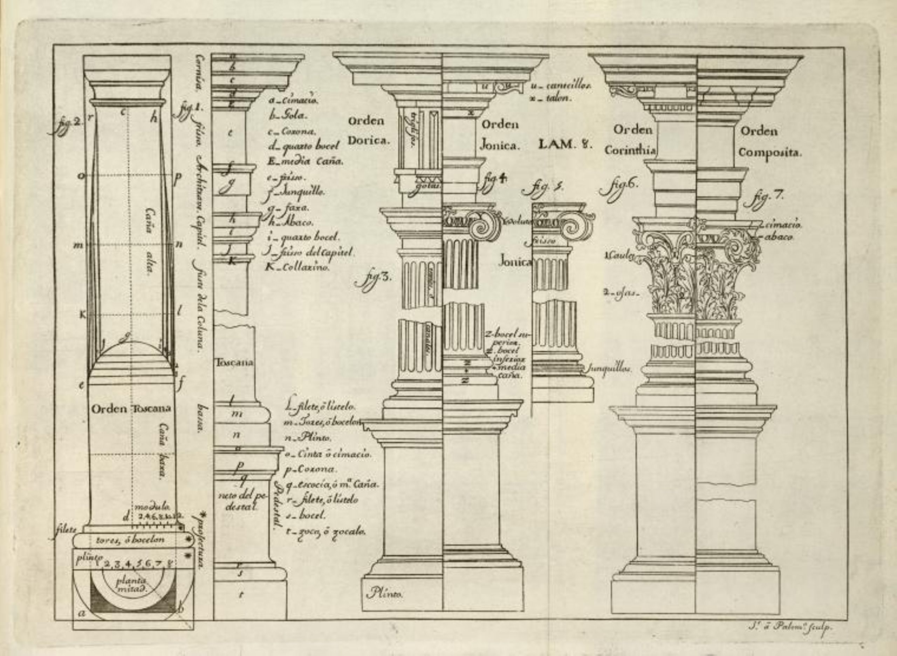
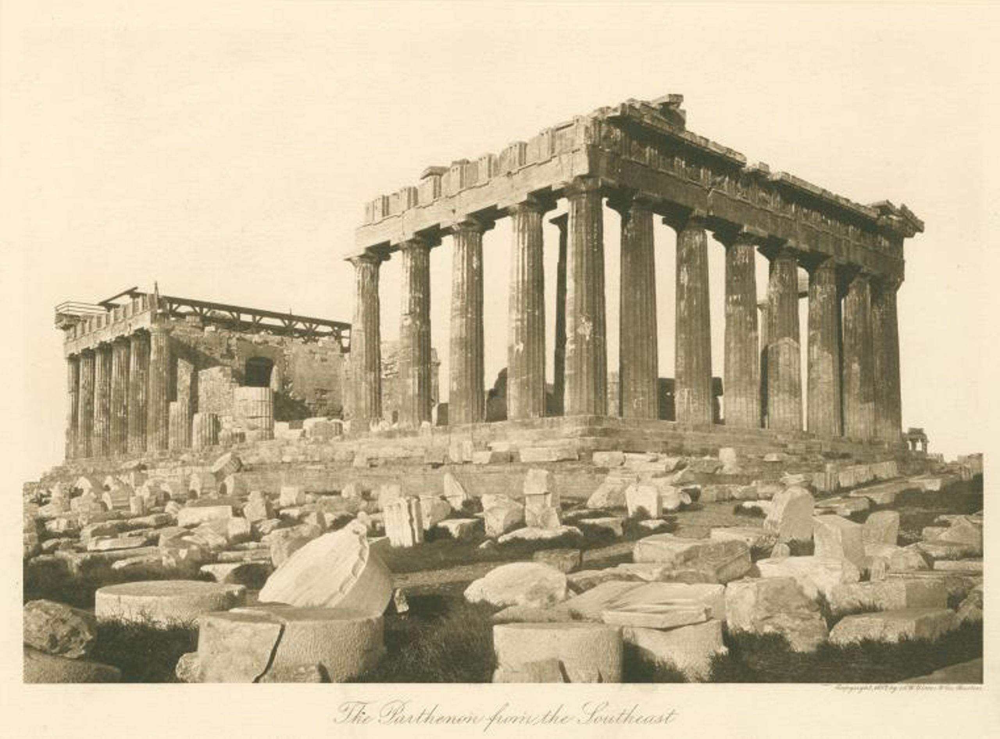

To appropriate means to take something for your own and as often synonymous with theft, stealing, taking, or poaching.[^cambridge-appropriation] It can also mean a specific amount of money set aside for a specific use such as Appropriations or Budget Bills in Congress.[^cbo] In both cases appropriation has connotations of acquiring and or use of a thing, sometimes with permission and sometimes without.

In a 1982 article in _The New York Times_, Andy Grudberg describes appropriation, or using someone else's work, and says it may call "...into question modernist orthodoxy concerning originality as well as the entire notion of an avant-garde ..." but also might just be theft.[^grundberg]

Do internet memes appropriate culture or steal it? Are memes [fair use](../copyright/fair-use.md)? That depends. Getty images sent a letter to the site [getdigital.de] demanding payment for aleged unauthorized use of the "Socialy Awkward Penguin" meme since the penguin photo in the original meme was taken from a photograph by National Geographic photographer,

[text](https://knowyourmeme.com/memes/socially-awkward-penguin#.TfqrHT9H4WM)

## Appropriation vs Reference vs Influence

The Romans appropriated Greek column orders. The Romans did't steal the Greek column designs but merely referenced them. The Romans were influenced by Greek column construction and modified the basic concepts into their own visual language. All of these statements are essentially true but have different connotations about Roman column construction.

<figure>

<figcaption>

Lam. 8. [Diagram of column orders.], Juan Bernabé Palomino, (Engraver) [^palomino-columns]

</figcaption>
</figure>

<figure>

<figcaption>

The Parthenon from the southeast, A.W. Elson & Co. (Publisher), 1897. [^parthenon]

</figcaption>
</figure>

## Is all Copying Appropriation?

If you see an interesting concept and then modify it to use in a project is that appropriation? Is it copying? Is it neither?

## Cultural Pluralism vs Cultural Appropriation vs Racism

## Food Appropriation

| Old World to New World | New World to Old World |
| ---------------------- | ---------------------- |
| almond                 | avocado                |
| apple                  | cassava                |
| cabbage                | chili pepper           |
| coffee                 | cotton                 |
| soybean                | tomato                 |

Many more foods, diseases, and animals were transferred during a period beginning in the 15th century called the Columbian Exchange. The selected foods in the table are from a larger list on Wikipedia.[^columbian-exchange]

## Time Melts Appropriation into Common Culture

English speakers use the French _déjà vu_ rather than the longer "feeling like something happen before" because it is short, efficient and understandable. The word is clearly _taken_ or _appropriated_ from French but it seems more a part of the English language with the passing of time from the word's original coining in 1876 by Émile Boirac. [^deja-vu]

Juliet says, "A <del>rose</del> _tub of buttery goodness_ by any other name would smell as sweet". Think about that often yellow plant that makes fluffy stuff to eat while watching movies. If you are American you likely call it corn while, with a few exceptions, the rest of the world calls it maize. The Native American word _maiz_ derives from the Taíno word _mahiz_ meaning "life giving seed".[^corn-america] Does that mean the Spanish word _panizo_, or the Italian word _polenta_ are wrong? Corn might considered less "good" since it stems from the French term _Turcicum frumentum_ that the British translated to "Turkey Wheat/Indian Corn" to classify it as a "savage" or uncivilized grain, which Americans shortened to just corn.[^maize-corn] It could also be seen as part of genuine American and English speaking culture, ready to be appropriated by others.

## Articles

- [Appropriation](https://www.moma.org/collection/terms/appropriation)
- [Should We Retire the Concept of Appropriation in Art?](https://whitehotmagazine.com/articles/concept-appropriation-in-art-/5467)
- [The Art of Copying](https://www.artsy.net/article/artsy-editorial-the-art-of-copying-ten-masters-of-appropriation)
- [Cultural Appreciation vs. Cultural Appropriation: Why it Matters](https://greenheart.org/blog/greenheart-international/cultural-appreciation-vs-cultural-appropriation-why-it-matters/)

## References

[^cambridge-appropriation]: [Cambridge Dictionary](https://dictionary.cambridge.org/us/dictionary/english/appropriation)
[^cbo]: [Common Budgetary Terms Explained](https://www.cbo.gov/publication/57660) Congressional Budget Office Publication 57660 [PDF](https://www.cbo.gov/system/files/2021-12/57420-Budgetary-Terms.pdf)
[^grundberg]: Grundberg, Andy. [PHOTOGRAPHY VIEW; IN TODAY'S PHOTOGRAPHY, IMITATION ISN'T ALWAYS FLATTERY](https://www.nytimes.com/1982/11/14/arts/photography-view-in-today-s-photography-imitation-isn-t-always-flattery.html) _The New York Times_. November 14, 1982, Section 2, Page 31.
[^deja-vu]: (https://www.psu.edu/news/research/story/probing-question-what-causes-deja-vu)
[^palomino-columns]: The Miriam and Ira D. Wallach Division of Art, Prints and Photographs: Art & Architecture Collection, The New York Public Library. "Lam. 8. [Diagram of column orders.]" [The New York Public Library Digital Collections](https://digitalcollections.nypl.org/items/340eeea0-c6df-012f-6558-58d385a7bc34). 1715 - 1724.
[^parthenon]: The Miriam and Ira D. Wallach Division of Art, Prints and Photographs: Picture Collection, The New York Public Library. "The Parthenon from the southeast" [The New York Public Library Digital Collections](https://digitalcollections.nypl.org/items/d5ad3560-c5bf-012f-d5ec-58d385a7bc34). 1897.
[^maize-corn]: Fussel, Betty. “Translating Maize into Corn: The Transformation of America’s Native Grain.” Social Research, vol. 66, no. 1, 1999, pp. 41–65. (page 42) JSTOR, [http://www.jstor.org/stable/40971301](http://www.jstor.org/stable/40971301).
[^corn-america]: Espinoza, Mauricio. [‘All Corn Is the Same,’ and Other Foolishness about America’s King of Crops](https://cfaes.osu.edu/news/articles/%E2%80%98all-corn-is-the-same%E2%80%99-and-other-foolishness-about-america%E2%80%99s-king-crops). College of Food, Agricultural, and Environmental Sciences. OSU. April 1, 2015.
[^columbian-exchange]: [Columbian Exchange](https://en.wikipedia.org/wiki/Columbian_exchange) Wikipedia.

- [The copy is the original](https://aeon.co/essays/why-in-china-and-japan-a-copy-is-just-as-good-as-an-original) Examines how copying and the concept of the original may be different in China and other countries.
- [Citation, Appropriation, and Fair Use: News Genius Picks Up Again Where Failures Left Off](https://glog.glennf.com/blog/2016/3/25/citation-appropriation-and-fair-use)
- [Just What is Appropriation in Art? An Historical Overview](https://www.invaluable.com/blog/what-is-appropriation-in-art/)
- [Appropriation (art)](<https://en.wikipedia.org/wiki/Appropriation_(art)>)
- [Cultural Appropriation vs. Appreciation](https://www.muddycolors.com/2019/02/cultural-appropriation-vs-appreciation/)
- [Appropriation! When Art (very closely) Inspires Other Art](https://magazine.artland.com/appropriation-when-art-very-closely-inspires-other-art/)
- [Early Examples in Modern Art](https://www.markpennerhowell.com/?page_id=555)
- [Appropriated Art of the 21st century](https://www.tumblr.com/mediadesireappropriatons)
- [Art Appropriation and Cultural Appropriation](https://minnstate.pressbooks.pub/appropriation/chapter/chapter-1/)
- [Reddit](https://www.reddit.com/r/ContemporaryArt/comments/bdiufp/appropriation/)
- [Appropriation in Contemporary Art](http://www.inquiriesjournal.com/articles/1661/appropriation-in-contemporary-art)
- [11 Historical Appropriation Art that Redefining Meaning and Challenging Conventions](https://abirpothi.com/11-historical-appropriation-art-that-redefining-meaning-and-challenging-conventions/)
- [Seeking references on the ontological basis of 'cultural appropriation' to cure my confusion](https://philosophy.stackexchange.com/questions/103490/seeking-references-on-the-ontological-basis-of-cultural-appropriation-to-cure)
