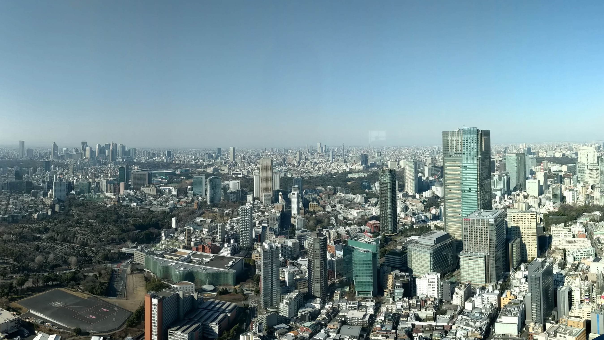
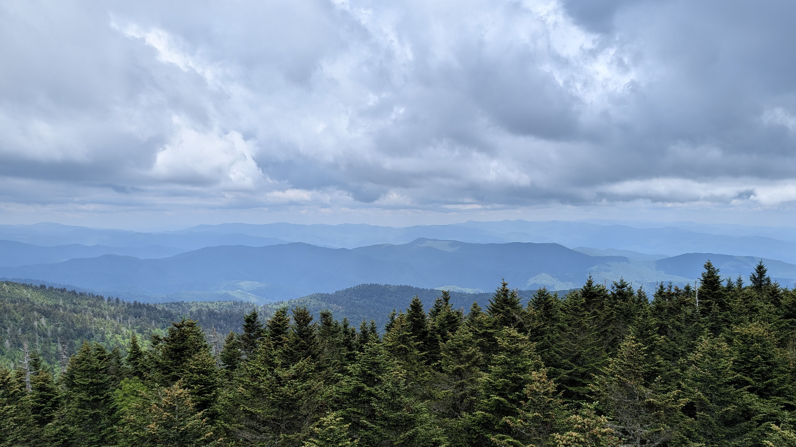
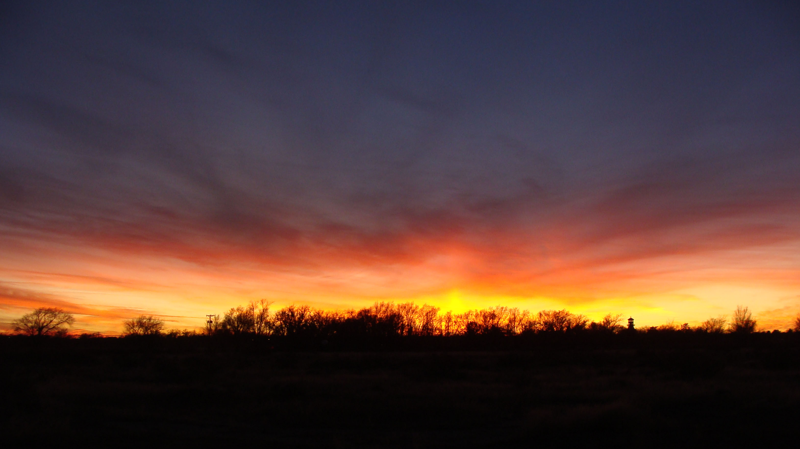
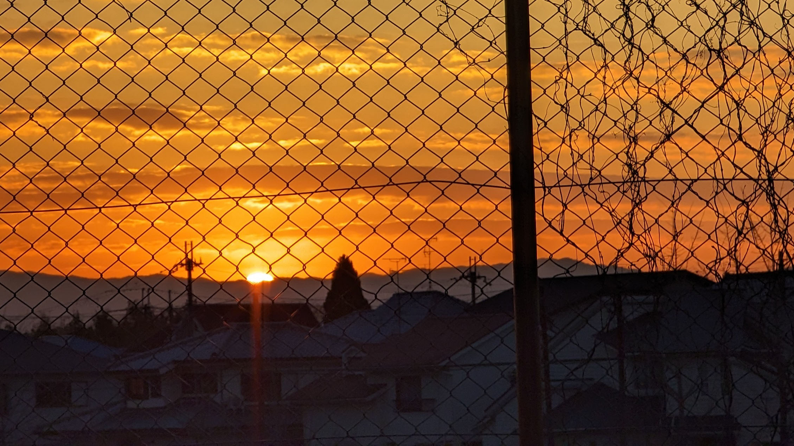

There are several visual clues we use every day to judge the distance or [depth](depth.md) of an object. The illusion of depth can be created in two-dimensional art by mimicking the way objects appear in real life when they recede into three-dimensional space. You can adjust the color saturation, the contrast in value and the sharpness of individual elements to mimic Atmospheric Perspective in order to create the illusion of depth in your work.

<figure>

<figcaption>

Tokyo Buildings Atmospheric Perspective

</figcaption>
</figure>
<figure>

<figcaption>

Great Smoky Mountains Atmospheric Perspective

</figcaption>
</figure>

## Atmospheric Perspective Visual Cues

### Things that are closer have...

- More detail and sharper focus
- More vivid (saturated) colors
- Darker darks and lighter highlights (a greater range of value)
- Are larger than objects in the distance
- Often overlap smaller objects in the distance

### Things that are further back...

- Lose saturation in color
- Lose the extremes of value (both dark and light) ... low contrast
- Become blurrier or less sharp
- Are smaller than objects that are closer
- Often are visually obscured by objects that are closer

## Why does this happen?

We live on a planet that has a thick atmosphere with lots of small particles floating in the air. Sunlight hits the atmosphere a a full spectrum of light with varying wavelengths. To human vision perceptions shorter wavelengths appear blue and longer wavelengths appear red. Gas molecules are smaller than the wavelength of visible light and scatter the colors of visible light through a process called Rayleigh scattering. Since shorter wavelengths of light are more easily scattered through this process, the violet and blue wavelengths are scattered the most. Violet wavelengths are shorter than blue wavelengths but the combination of the sun emitting more blue light than violet, and the human eye's greater sensitivity to blue than violet, means that we generally perceive the daytime sky as blue. [^nws]

Objects that are further away have more “air stuff” to contribute to this scattering in between them and your eyes. That means more light particles are bounces in random directions and do not reach your eye’s rods and cones. Therefore, less information is available and our brains perceives these distant objects as fuzzy, less colorful and dull. This natural phenomenon can be used to your benefit in your creative projects.

### What About Red Sunsets and Sunrises?

<figure>

<figcaption>

Sunset in Roswell, New Mexico

</figcaption>
</figure>
<figure>

<figcaption>

New Year Sunrise in Nara, Japan

</figcaption>
</figure>

If the sky is blue because all of the blue light is scattered around more than the red and orange light, then why are sunrises and sunsets orange, pink, and red? When the sun is lower on the horizon, its light must pass through more of the atmosphere than in the middle of the day to reach your eyes. Since blue light is scattered more than red light, during the trip through the extra particles, blue light has more opportunity to bounce away in a random direction and not make it into your camera or your eye. The longer wavelengths of red and orange, scatter away less and make it to your eyes so you can enjoy stunning sunsets and sunrises.

Remember to also consider shifting the color to the red end of the spectrum for creative looks with atmospheric perspective.

## Examples in Art

<figure>

<figcaption>

_The Harvesters_, Pieter Bruegel the Elder, Oil on wood, 1565 [^harvesters]

</figcaption>
</figure>

## References

[^nws]: National Weather Service, Flagstaff, AZ Weather Forecast Office. [Why is the Sky Blue?](https://www.weather.gov/fgz/SkyBlue)
[^harvesters]: [The Harvesters](https://www.metmuseum.org/art/collection/search/435809) The Metropolitan Museum of Art
