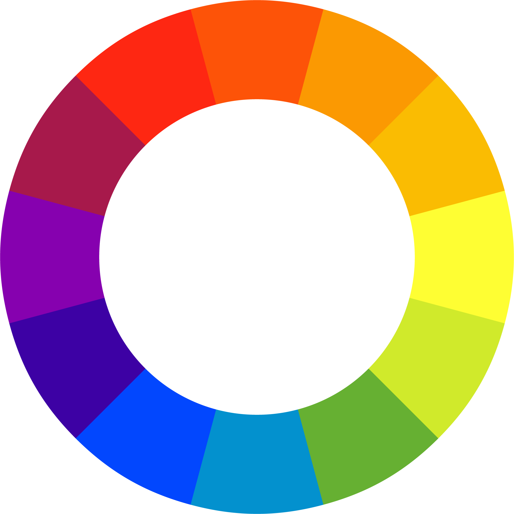

## Color Harmonies

Analogous Colors are colors that are near each other on the color wheel.

Complementary Colors are colors directly across from each other on the color wheel.

Split Complimentary has one color accompanied by two other colors that are each equally spaced, one space
over on each side, from its complement.

Tetradic or Double/Split Complimentary uses two separate complementary color pairs, two spaces apart on the color wheel.

Monochromatic Color involves variations of a single hue. It only varies in value. These examples would be an all blue
hue or an all red hue, even though the values change.

Triadic features three colors spaced equally around the color wheel.
