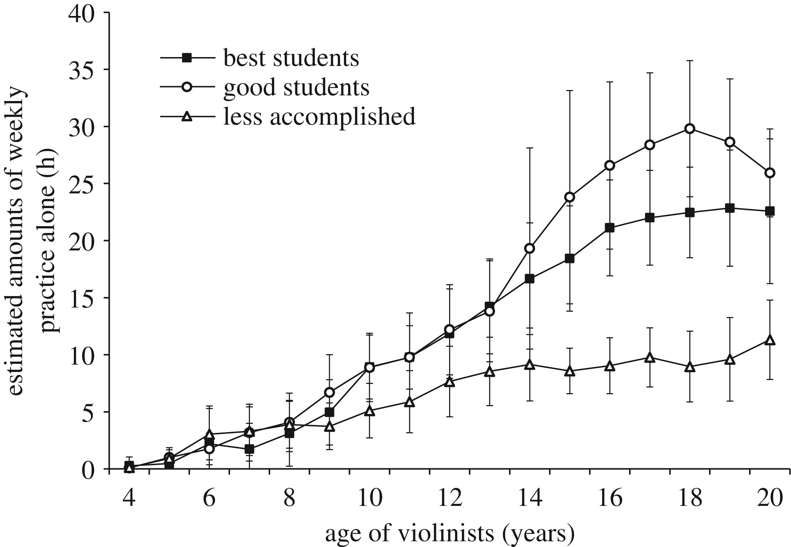

## What is a Critique?

Many [forms of critique](critique-methods.md) exist but for now we will discuss the formal group critique found in many art schools around the world. It is essential to your training as creative professionals and will take time to master.

"A critique happens when a group of people convenes in an art studio or critique room to discuss and evaluate works of art. Depending on the class level, the school's resources, and the area of study, the group is comprised of a combination of students, one or several instructors, and sometimes other invited participants, usually thought of as experts." [^1]

We fall into that listing. We have students and instructors - “the experts.” We could also travel outside of that narrow definition as we explore the full range of creative pursuits but in the beginning we will follow more traditional models in order to know what to change.

### Why is this important?

In order to grow and improve we must know what we accomplish well and what we do not. In a meta analysis that analyzed "deliberate practice" and its relationship to achievement in athletics, found that practice counted for about 18% on average of an athletes performance gains. [^2] That means that practice is necessary. If you had $82.00 and saw $18.00 would you think, "I have enough, no need to pick that up." or if you had $100, would you be ok casually tossing $18.00 in the trash? That is what it is like to "throw away" gains by not practicing. In the creative fields, a great way to focus one's practice is with critique.

Malcolm Gladwell popularized “deliberate practice” and the idea that it takes 10,000 hours of practice to be great. While there is no magic number for practice, it is still important. Brook Macnamara and Megha Maitra replicated the findings of a previous study about the corelation of the amount of practice of elite violin players. They found that while practice is important and quite signifigant, especially starting out and at lower skill levels, it is not as large as a determining factor as has been popularized. [^3] Nevertheless, if we do not evaluate our progress with an aim towards improvement then we participate in a hobby, which is not a problem unless we want to achieve the best that we can.

<figure>

>)

<figcaption>

"Figure 3. Estimated amounts of weekly teacher-designed practice with the violin as a function of age. Error bars represent 95% confidence intervals." by [The Royal Society](http://royalsocietypublishing.org/) is licensed under [CC BY 4.0](https://creativecommons.org/licenses/by/4.0/) [^3]

</figcaption>

</figure>

Discussing work as a group fosters community and an environment for discourse. You will rise with your peers and must develop relationships in order to succeed.

The critique also allows us to objectively evaluate a work without personal biases interfering. Although absolute objectivity is not possible we must remember to leave ourselves at the door. Always remember that the discussion is about an inanimate object and not about the person that created the object. Do not take comments either positive or negative as judgment of you.

## How do we critique?

Critiques in a class setting take various forms but will usually involve a group of students and the instructor verbally discussing work produced for assigned prompts and problems. Therefore there will be outside criteria available to evaluate the work in relation to the stated goals of an assignment. As you move through your coursework these arbitrary measures of a work’s success may become less clear.

The success of the critique requires everyone’s participation both verbally and through written word. In order to become fully developed creative professionals you must develop both your listening skills as well as your ability to analyze your peers’ work. Failure to listen is a common shortcoming as is the failure to engage your peers. This is hard work and you must practice.

### Essential Elements of a Critique Statement

1. What do you see / hear / feel?
2. What do you think about it?
3. Why do you think that?

### Objectives

- Develop a vocabulary for discussing and evaluating visual artifacts in the world
- Improve our skills at making through critical analysis of progress
- Build a community of peers to create a safe environment of inquiry, experimentation and risk taking
- Learn how to communicate complex visual concepts through both verbal and written form

## Critique Etiquette

[This](./art-school-critique-no-nos.md) is a list of [art critique, do's and don'ts](./art-school-critique-no-nos.md) assembled by faculty and students from real critique experiences.

[^1]: Kendall Buster and Paula Crawford, The Critique Handbook: A Sourcebook and Survival Guide. Upper Saddle River: Pearson Education, 2007, 93.
[^2]: Macnamara, B. N., Moreau, D., & Hambrick, D. Z. (2016). The Relationship Between Deliberate Practice and Performance in Sports: A Meta-Analysis. _Perspectives on Psychological Science, 11_(3), 333-350. [https://doi.org/10.1177/1745691616635591](https://doi.org/10.1177/1745691616635591)
[^3]: Macnamara Brooke N. and Maitra Megha 2019The role of deliberate practice in expert performance: revisiting Ericsson, Krampe & Tesch-Römer (1993)R. Soc. open sci. 6.190327. 190327. [http://doi.org/10.1098/rsos.190327](http://doi.org/10.1098/rsos.190327)
