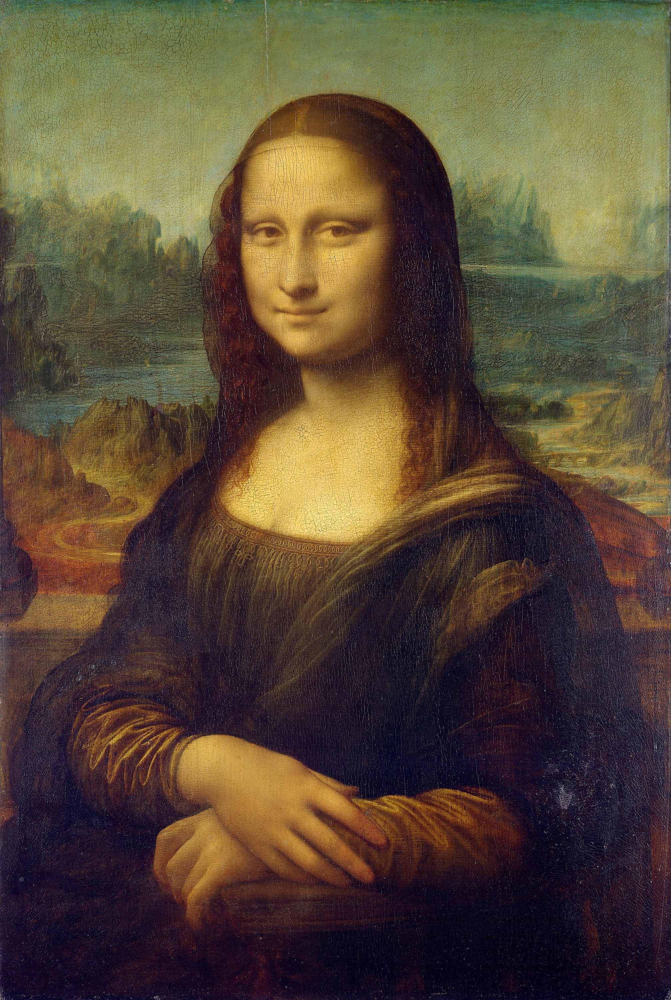

What is reproducibility? Does the original matter? Is a "reproduced" reproduction just as valuable? Is a copy of a book still the book?

The Diamond Sutra is the earliest known reproduced book that has a recorded date printed on it from the year 868, almost 600 years before Guttenberg and his movable type printing press. The Diamond Sutra was hidden away in a secret cave library with an additional 40,000 other documents in 1000 to hopefully protect them from destruction during an invasion. [^smithsonian-mag-sutra] Which is more important, the woodblocks that printed the copies of the book, the knowledge that was reproduced in each copy, or the individual books, or in this case scrolls?

If this is the earliest know printed book with a date, and it was with 40,000 other documents that were also likely reproduced in some way, what does that mean for the spread of information and knowledge? Are only important texts reproduced? Who decides what is important enough to print and reproduce? A unique individually crafted scroll may only be affordable by a person with vast wealth, while multiple copies of a woodblock print may be more affordable by more people and therefore have its message spread farther. Is a single hand written scroll more important than the multiple disseminated copies of a woodblock print?

<figure>

<figcaption>

_The Diamond Sutra_, Wang Jie. China, 11th May, 868 AD Credit: From the British Library archive [^sutra-british-library]

</figcaption>
</figure>

We take for granted that writing is reproduced in physical books and in digital form. Generally if one reads and understands the content of a written piece, they do not feel they have gained less if there are other copies of the text in the world. Is the same true for visual imagery?

Printmaking's reproducibility was not limited to writing, it also helped the spread and proliferation of images beyond singular objects such as paintings and drawings. Albrecht Dürer is well know both for the aesthetics of his imagery and potentially more so because lots of copies of his works were printed. Dürer worked in many mediums including sculpture, printmaking, painting, and drawing, but his prints are most famous and recognizable due in part to the increased numbers of reproduced copies.

Look at the two Dürer works below. There is a good chance that one jumps out as something you have seen before while the other likely seems unfamiliar. The print of _The Four Housemen_ is a widely known print image while the _Virgin and Child with Saint Anne_, a masterwork on its own, is much less recognizable as it is a singular work of art. To be fair, there are lesser know prints of Dürer as well but the highly reproduced prints seem to have had a better opportunity to reach a wider audience than individual paintings by the same artist.

<figure>

<figcaption>

Albrecht-Dürer, _The Four Horsemen from "The Apocalypse"_, woodcut, 1498[^durer-met] Public Domain.

</figcaption>
</figure>
<figure>

<figcaption>

Albrecht-Dürer, _Virgin and Child with Saint Anne_, probably 1519[^durer-met-oil] Public Domain.

</figcaption>
</figure>

## Photographic Reproduction

Before "photographs" artists had already incorporated the ability of a lens to "reproduce" the world as a 2D image using a device called a camera obscura. The human eye has a hole in the front to let light in. Due to the properties of light waves passing through a tiny opening the image of the world in front of a person is flipped upside down as it is projected onto the rods and cones at the back of the eye to create the signals that the brain interprets as seeing stuff. A camera obscura can be as simple as a darkened tent with a hand sized circle cut out of one wall that lets daylight through. This produces an inverted image of the outside world projected onto the opposite wall of the tent.

An artist could put paper or a canvas in front of this inverted projection and trace the image. Portable camera obscura drawing boxes and tables were produced to simply the process. Once an image passes through a lens, other than the human eye, it alters how the image is produced on a 2D surface. A trip to a museum reveals which images are reproduced with the eye and which images are reproduced through the lens.

<figure>

<figcaption>

Johann Zahns kleine transportable Camera obscura, c. 1900 - in or before 1905, Public Domain. [^obscura]

</figcaption>
</figure>

Building upon the lens from the camera obscura, photography introduced a new level ease and speed of "reproducing" reality. Early photography relied on thick, physical glass plates to produce images. The invention of transparent film allowed for the the near infinite reproduction of photographic copies of an image.

## Which is the Original?

Why do museums care if their art objects were really made by famous artists or are copies? Money. The Cleveland Museum of Art spent time and resources restoring a painting that they claim was painted by Caravaggio. The museum even displayed their "real" painting next to a "fake" painting of the same composition to show how real their painting was. [^caravaggio-cma]

<figure>

<figcaption>

Black-Vega _Crucifixion of St Andrew_, identified as a copy after Caravaggio. Canvas, 198 x 149.5 cm. Spier Collection, London.

</figcaption>
</figure>
<figure>

<figcaption>

_The Crucifixion of Saint Andrew_, 1606–7. Caravaggio (Italian, 1571–1610). Oil on canvas; framed: 233.5 x 184 x 12 cm (91 15/16 x 72 7/16 x 4 3/4 in.); unframed: 202.5 x 152.7 cm (79 3/4 x 60 1/8 in.). The Cleveland Museum of Art, Leonard C. Hanna Jr. Fund 1976.2

</figcaption>
</figure>

<figure>

<figcaption>

Installation view of _Seeing Double at the CMA: Caravaggio’s Crucifixion of Saint Andrew and the “Back-Vega” Copy_ at the [Cleveland Museum of Art](https://www.clevelandart.org/). Photo by Jimmy Kuehnle.

</figcaption>
</figure>

When making a print, which is the original, the block or plate? The first print? The best print? Does it matter? Would you pay more money for the fist print edition or for the ten-thousandth print edition if both were identical except for their order in the sequence of production.

### Reproduction and Appropriation Legal or Illegal?

Andy Warhol used photography, printmaking, and methods of mass production to make multiples to examine concepts of [appropriation](../art-faq/appropriation.md), originality, media, celebrity, and pop culture. Warhol seemed to identify with the phrase circulating around that "art is what you can get away with."[^warhol-foundation-quote] True to the spirit of the phrase the exact origins are unclear. Sture Johannesson painted an oil on canvas titled _Art is anything you can get away with_ around 1967 - 1971 [^sture-johannesson] but the first time the words were published was likely in 1967 in "The Medium is the Massage" by Marshall Mcluhan and Quentin Fiore. [^quoteinvestigator]

<figure>

<figcaption>

Andy Warhol, _Marilyn x 100_, Screenprint ink and synthetic polymer paint on canvas, Framed: 210.2 x 573.2 x 6.4 cm (82 3/4 x 225 11/16 x 2 1/2 in.); Unframed: 205.7 x 567.7 cm (81 x 223 1/2 in.) Leonard C. Hanna Jr. Fund, and Anonymous Gift 1997.246 © The Andy Warhol Foundation for the Visual Arts, Inc., _(This image is included on the basis of fair use.)_ [^cma-warhol]

</figcaption>
</figure>

Sometimes the choice of media of a work can be a source of originality but not always. Jeff Koons made a 3D sculpture of a postcard of two people holding a group of puppies. The original postcard was a 3D photograph by professional photographer, Art Rogers, and Koon's sculpture was a false color 3D object based on the photo. Koons did not acquire rights to use the image. US courts decided that the work was not fair use and the artist violated the [copyright](../copyright/copyright-for-artists.md) of Art Rogers regardless of the media used to create or transform the work into a new form.[^koons-fair-use]

<figure>

<figcaption>

Art Rogers' photograph (left), Jeff Koons' work (right) _(This image is included on the basis of fair use.)_[^wiki-rogers-koons]

</figcaption>
</figure>

### Duchamp Forever

Although not the first nor the only, Marcell Duchamp engaged in the appropriation and commodification of images by reproducing and modifying known images. Duchamp also created multiple ways to reproduce [found objects](../sculpture/found-objects.md). A straight forward way was by authorizing curators to purchase new "versions" of his signature readymade _Fountain_ urinal. Later he commissioned handmade copies of previously lost readymades based on photos. A handcrafted urinal made from clay was then cast and enameled at a factory to create editions of multiple reproductions. Some of these reproductions are signed R. Mutt while others are blank. Is only the "chosen" urinal by Duchamp the real artwork? Is any urinal made at the same time as the original the artwork? Is the clay reproduction the artwork? What about the casts?

Duchamp chose a mass produced postcard of the _Mona Lisa_ to be a readymade. He taped the postcard to a piece of paper, added a drawn on mustache to the image, taped on the letters L H O O Q, and signed it "TABLEAU DADA PAR MARCEL DUCHAMP". Is the painting famous because of all the cheap reproduced souvenir merchandise or do the cheap souvenirs appear once the painting is famous? If the image had not been so mass-produced it would not have been able to be selected as a readymade found object by Duchamp.

Most humans have not and will not see the _Mona Lisa_ in person, but the image is ubiquitous across the globe. Numerous remixes of the image have been created. What happens to and artwork or an image with so much reproduction?

<figure>

<figcaption>

Leonardo da Vinci, _Mona Lisa_, oil on poplar panel, 77cm H x 53cm W, between circa 1503 and circa 1506, Public Domain.

</figcaption>
</figure>
<figure>

<figcaption>

Marcel Duchamp, _L.H.O.O.Q._, 1919, originally published in 391, n. 12, March 1920, Public Domain.

</figcaption>
</figure>

<figure>

<figcaption>

Flag of Mona Lisa smoking a joint next to a flag Alice and a hooka smoking caterpillar as seen through the window of a smoke shop. 2025. Photo by Jimmy Kuehnle.

</figcaption>
</figure>

## Digital Reproducibility

Digital technology has made copying and reproducing image, music, and video content easy, nearly instantaneous, automatic, and a common part of everyday life. Copying on the internet is so prevalent that it appears the public's common understanding of copyright law has shifted away from the actual text and meaning of the law.

### Digital 3D Objects

[Digital fabrication](../digital-fabrication/digital-fabrication.md) technologies continue to make it easier to reproduce physical, 3D objects as well as semi 2D objects such as paintings. A 3 axis [CNC](../digital-fabrication/cnc/cnc-basics.md) machine can mimic the dimensional and physical brush marks of a painting, to make a convincing reproduction beyond simple color and image copying. [3D printing](../digital-fabrication/3d-printing/3d-printing.md) produces basically identical copies of any single material 3D object from rocket engines to character statues, to weapons.

## References

[^sutra-british-library]: [The Diamond Sutra: British Library Images Archive](https://www.imagesonline.bl.uk/asset/155339/)
[^smithsonian-mag-sutra]: Daley, Jason. [Five Things to Know About the Diamond Sutra, the World’s Oldest Dated Printed Book](https://www.smithsonianmag.com/smart-news/Five-things-to-know-about-diamond-sutra-worlds-oldest-dated-printed-book-180959052/). The Smithsonian Magazine. May 11, 2016.
[^durer-met]: [Metropolitan Museum of Art](https://www.metmuseum.org/art/collection/search/336215) Object Number: 19.73.209
[^durer-met-oil]: [Metropolitan Museum of Art](https://www.metmuseum.org/art/collection/search/436244) Object Number: 14.40.633
[^caravaggio-cma]: [Seeing Double at the CMA: Caravaggio’s Crucifixion of Saint Andrew and the “Back-Vega” Copy](https://www.clevelandart.org/events/seeing-double-cma-caravaggios-crucifixion-saint-andrew-and-back-vega-copy) [(Web Archive)](https://web.archive.org/web/20240622233249/https://www.clevelandart.org/events/seeing-double-cma-caravaggios-crucifixion-saint-andrew-and-back-vega-copy)
[^osorio-1]: Osorio, Luiz Camillo. [Shifts in Reproducibility in Art: More on Duchamp](https://www.pipaprize.com/2022/07/shifts-in-reproducibility-in-art-more-on-duchamp-by-luiz-camillo-osorio/) PIPA Institute. July 13, 2022. [(Web Archive)][text](https://web.archive.org/web/20221002191749/https://www.pipaprize.com/2022/07/shifts-in-reproducibility-in-art-more-on-duchamp-by-luiz-camillo-osorio/)
[^spear-1]: Spear, Richard E. Caravaggio’s ‘Crucifixion of St Andrew’ and the problem of autograph replicas. The Burlington Magazine 160, June 2018.
[^koons-fair-use]: [Rogers v. Koons, 960 F.2d 301 (2d Cir. 1992)](https://www.copyright.gov/fair-use/summaries/rogers-koons-2dcir1992.pdf) US Copyright Office Fair Use Summaries
[^wiki-rogers-koons]: [File:Rogers v. Koons.jpg](https://en.wikipedia.org/wiki/File:Rogers_v._Koons.jpg) Wikipedia
[^obscura]: [Johann Zahns kleine transportable Camera obscura](https://id.rijksmuseum.nl/200676905) Rijks Museum
[^cma-warhol]: [Marilyn x 100](https://www.clevelandart.org/art/1997.246) Cleveland Museum of Art
[^warhol-foundation-quote]: [The Andy Warhol Foundation for the Visual Arts](https://warholfoundation.org/warhol/licensing/)
[^sture-johannesson]: [Art is anything you can get away with](https://sis.modernamuseet.se/en/objects/3913/art-is-anything-you-can-get-away-with) by Sture Johannesson, Modern Museet, Object Number NM 6436
[^quoteinvestigator]: quoteresearch. [Quote Origin: Art Is Anything You Can Get Away With](https://quoteinvestigator.com/2022/08/10/art-anything/) quoteinvestigator.com, August 10, 2022.
